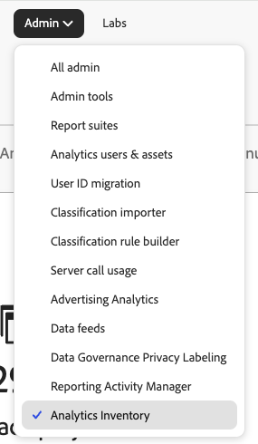

# Analytics 庫存 {#analytics-inventory}

<!-- markdownlint-disable MD034 -->

>[!CONTEXTUALHELP]
>id="analytics-inventory"
>title="Analytics 庫存"
>abstract="此頁面提供您 Adobe Analytics 環境的全面概觀，包括專案和元件的數量、報告套裝、使用者等資訊。當您開始準備升級至 Customer Journey Analytics 時，這些資訊能提供極大幫助。"

<!-- markdownlint-enable MD034 -->

「Analytics詳細目錄」提供您Adobe Analytics環境的完整總覽，包括專案和元件、報表套裝、使用者等數量。 當您開始準備升級至 Customer Journey Analytics 時，這些資訊能提供極大幫助。

Analytics詳細目錄的目標是協助您回答下列問題：

* 對於您的組織，哪些資產（例如報表套裝、區段、使用者、工作區專案等）需要移轉，以及哪些資產可留下？

* 決定需要移轉的資產後：

   * 您應該在此升級之前進行一些資產清理嗎？

   * 您應該將某些資產合併作為流程的一部分嗎？

   * 資產的升級順序應該為何？

   * 您應該先升級或最後升級哪些報表套裝？

## 權限

在[Adobe Admin Console](https://experienceleague.adobe.com/en/docs/analytics/admin/admin-console/admin-roles-in-analytics)中擁有Adobe Analytics產品管理員許可權的使用者可以使用Analytics詳細目錄。

## 存取Analytics詳細目錄

1. 在&#x200B;**[!UICONTROL 管理員]**&#x200B;功能表中按一下&#x200B;**[!UICONTROL 分析詳細目錄]**。 或前往&#x200B;**[!UICONTROL 所有管理員]** > **[!UICONTROL 分析詳細目錄]**。

1. 主畫面會顯示Adobe Analytics環境的完整清查：

   

   此畫面會特別顯示：

   * 此組織下所有使用者中作用中的Analysis Workspace和行動計分卡專案總數。
   * 此組織下所有使用者中有效的區段和計算量度總數。
   * 已定義的基本報表套裝總數。 不包含虛擬報表套裝。
   * 如果Media Analytics功能作用中，而且如果有，會在什麼模式中。
   * 此組織下定義的使用者總數。

## 元件 {#components}

<!-- markdownlint-disable MD034 -->

>[!CONTEXTUALHELP]
>id="analytics-inventory-components"
>title="元件"
>abstract="此區段顯示您 Adobe Analytics 環境中存在的專案、區段和計算量度的數量。專案和元件可以遷移至 Customer Journey Analytics。"

<!-- markdownlint-enable MD034 -->

在此初始版本中，您可以檢視Workspace專案、區段和計算量度的摘要詳細目錄編號。 後續版本將可讓您分析這些元件。

## 資料設定和彙集 {#data-config}

<!-- markdownlint-disable MD034 -->

>[!CONTEXTUALHELP]
>id="analytics-inventory-data-config"
>title="資料設定和彙集"
>abstract="此區段會顯示您 Adobe Analytics 環境中的報告套裝數量，以及您對串流媒體服務的存取權。"

<!-- markdownlint-enable MD034 -->

### 報告套裝

報表套裝檢視會顯示某個組織下定義的所有報表套裝。 它可讓您回答以下問題：

* 哪些報表套裝在過去90天內收到的點選次數最多？
* 哪些報表套裝在過去90天內未收到點選？
* 哪些報表套裝定義的維度數量最多？
* 哪些報表套裝定義的量度數量最多？

這些問題的答案可讓您對於哪些報表套裝最適合移轉有一個不錯的想法。

>[!NOTE]
>
>此表格一次緩慢填入一個儲存格值。

1. 若要分析報表套裝，請瀏覽至&#x200B;**[!UICONTROL 資料組態與集合]** > **[!UICONTROL 報表套裝]**，然後按一下&#x200B;**[!UICONTROL 分析]**。

   

   | 元素 | 說明 |
   | --- | --- |
   | 名稱 | 報表套裝的名稱 |
   | ID | 報表套裝ID (rsid)。 指定僅能含英數字元的不重複 ID。此 ID 在建立後即無法變更。由 Adobe 設定必要的 ID 首碼，此值無法變更。 |
   | 發生次數 (過去 90 天) | 「發生次數」量度會顯示指定的維度經設定或持續存在的點擊次數。此報表套裝在過去90天內收到多少點選？ |
   | 量度 | 此報告套裝中定義了多少量度？ |
   | 維度 | 此報告套裝中已定義多少維度？ |
   | Analytics for Target (A4T) 已啟用 | [預設為隱藏]是否已為[Analytics for Target](https://experienceleague.adobe.com/en/docs/target/using/integrate/a4t/a4t)啟用此報表套裝？ |
   | 行銷管道已啟用 | [預設為隱藏]此報表套裝是否已為[行銷管道](https://experienceleague.adobe.com/zh-hant/docs/analytics/components/marketing-channels/c-getting-started-mchannel)啟用？ |
   | 來源連接器已啟用 | 在Adobe Experience Platform中，此報表套裝是否已針對報表套裝資料[啟用](https://experienceleague.adobe.com/zh-hant/docs/experience-platform/sources/connectors/adobe-applications/analytics)Adobe Analytics Source Connector？ 換言之，此報表套裝可以使用Analytics Source Connector移轉至Customer Journey Analytics嗎？ |
   | 行事曆類型 | [預設為隱藏]如需詳細資訊，請參閱[自訂行事曆](https://experienceleague.adobe.com/en/docs/analytics/admin/admin-tools/manage-report-suites/edit-report-suite/report-suite-general/custom-calendar#) |

#### 分析維度

此畫面提供針對特定報表套裝定義的所有維度的詳細檢視。 從這個檢視中，您可以回答下列問題：

* 此報告套裝已啟用哪些維度？
* 此維度過去90天的前十個維度專案為何？

1. 按一下報表套裝頁面上的&#x200B;**[!UICONTROL 維度]**&#x200B;連結。

   | 元素 | 說明 |
   | --- | --- |
   | 名稱 | 維度的名稱 |
   | ID | 維度識別碼。 |
   | 類型 | 維度的型別。 可能的值包括轉換、流量、導覽、流量來源、客戶、日期或Adobe產品特定的維度，例如AEM、受眾、Adobe Campaign、行動應用程式等。 |
   | 說明 | 並非所有維度都有說明。 |
   | 來源連接器已啟用 | 在Adobe Experience Platform中，是否針對報表套裝資料[的](https://experienceleague.adobe.com/zh-hant/docs/experience-platform/sources/connectors/adobe-applications/analytics)Adobe Analytics Source Connector啟用此維度？ 換言之，此維度可以使用Analytics Source Connector移轉至Customer Journey Analytics嗎？ |

1. 決定哪些維度適合移轉至CJA。

#### 分析量度

此畫面提供針對特定報表套裝定義之所有度量的詳細檢視。 從這個檢視中，您可以回答下列問題：

* 此報告套裝已啟用哪些量度？
* 過去90天的前十個量度為何？

1. 按一下報表套裝頁面上的&#x200B;**[!UICONTROL 量度]**&#x200B;連結。

   | 元素 | 說明 |
   | --- | --- |
   | 名稱 | 量度的名稱 |
   | ID | 量度ID。 |
   | 類型 | 量度型別。 可能的值包括轉換、流量、導覽、流量來源、客戶、日期或Adobe產品特定的維度，例如AEM、受眾、Adobe Campaign、行動應用程式等。 |
   | 說明 | 並非所有維度都有說明。 |
   | 來源連接器已啟用 | 在Adobe Experience Platform中，是否針對報表套裝資料[的](https://experienceleague.adobe.com/zh-hant/docs/experience-platform/sources/connectors/adobe-applications/analytics)Adobe Analytics Source Connector啟用此量度？ 換言之，此量度可以使用Analytics Source Connector移轉至Customer Journey Analytics嗎？ |

1. 判斷哪些量度適合移轉至CJA。

### 匯出至 CSV

1. 若要將報表套裝清單、維度或量度匯出至.csv檔案，請按一下[匯出至CSV] **&#x200B;**。

1. .csv檔案將會顯示在您的「下載」資料夾中。

1. 在裝置上使用試算表應用程式開啟並儲存。

>[!NOTE]
>
>篩選掉的專案和欄不會匯出至.csv檔案。

### 篩選、搜尋、排序和導覽

* 您可以搜尋表格。
* 在左側欄中按一下「篩選」圖示，依「型別」篩選。 或按一下&#x200B;**[!UICONTROL 隱藏篩選器]**。
* 您可以以遞增/遞減順序來排序所有欄（僅限單一欄排序）。
* 您可以按一下階層連結中的專案，導覽至其他畫面。

## 使用者管理 {#user-management}

<!-- markdownlint-disable MD034 -->

>[!CONTEXTUALHELP]
>id="analytics-inventory-user-management"
>title="使用者管理"
>abstract="此區段顯示您 Adobe Analytics 環境中的使用者數量。"

<!-- markdownlint-enable MD034 -->

使用者管理將可在Analytics詳細目錄的最新版本中使用。

## 移轉元件

使用[元件移轉](/help/admin/admin/component-migration/component-migration.md)，Adobe Analytics管理員可以將Analytics專案及其相關元件移轉到Customer Journey Analytics。

移轉過程包括：

* 在 Customer Journey Analytics 中重新建立 Adobe Analytics 專案。

* 將 Adobe Analytics 報表套件中的維度和指標對應到 Customer Journey Analytics 資料視圖中的維度和指標。