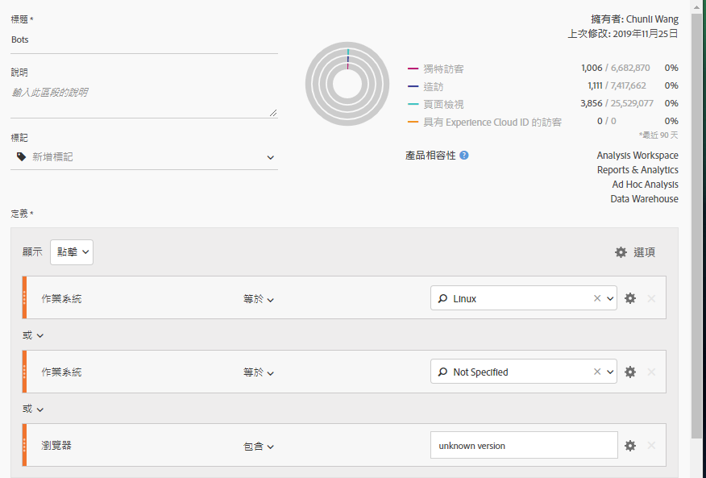
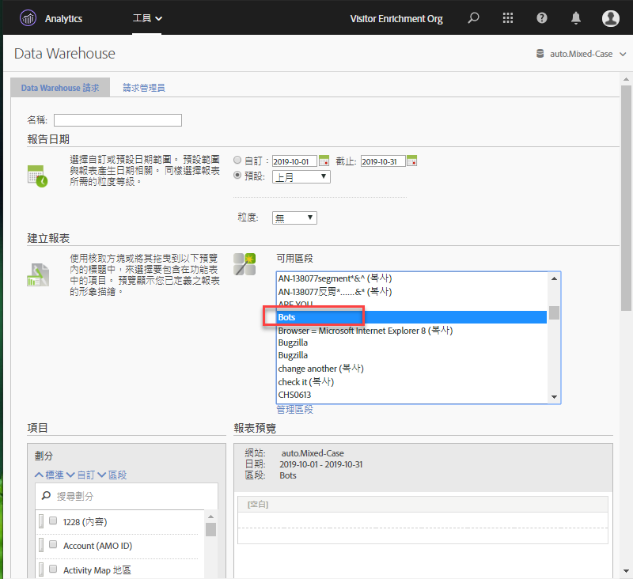
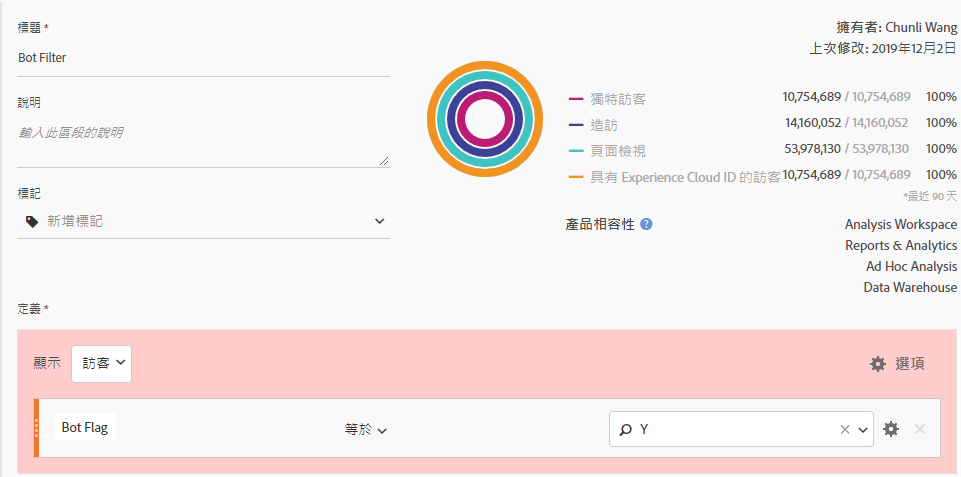
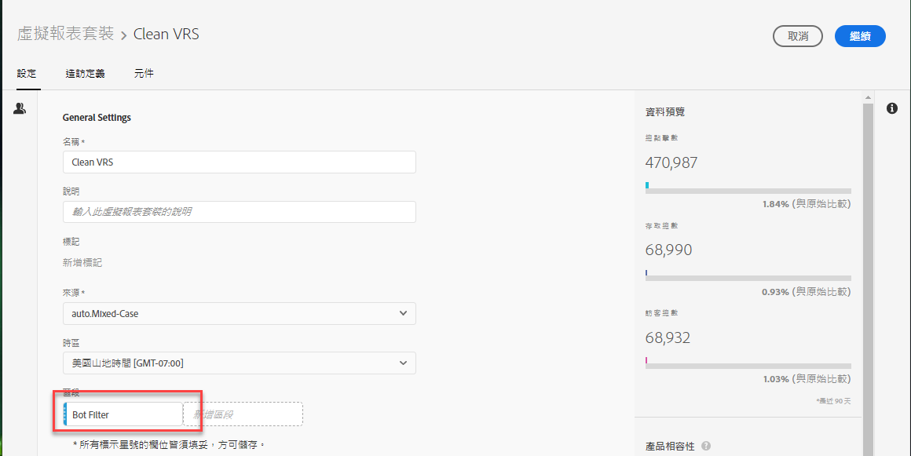

# 在 Adobe Analytics 移除機器人

在 Adobe Analytics 中，您有多個選項可移除報表中的機器人流量:

## 使用機器人規則

前往&#x200B;**[!UICONTROL 「Analytics]** &gt; **[!UICONTROL 管理員]** &gt; **[!UICONTROL 報表套裝]** &gt; **[!UICONTROL 編輯設定]** &gt; **[!UICONTROL 一般]** &gt; **[!UICONTROL 機器人規則」]**，即可設定標準與自訂機器人篩選方式:

| 規則類型 | 說明 |
|--- |--- |
| 標準 IAB 機器人規則 | 選取&#x200B;**[!UICONTROL 「啟用 IAB 機器人篩選規則」]**，系統會使用 [IAB](https://www.iab.com/) (International Advertising Bureau) 的「國際編目程式與機器人清單」來移除機器人流量。多數客戶至少都會選取此選項。 |
| 自訂機器人規則 | 您可以根據使用者代理、IP 位址或 IP 範圍來定義與新增自訂機器人規則。 |

如需詳細資訊，請參閱[機器人規則概觀](/help/admin/admin/bot-removal/bot-rules.md)。

## 使用 `hitGovernor` 實施外掛程式

有些訪客每分鐘會傳送數十或數百次點擊，如要移除這些行為類似機器人的訪客，可使用 [s.hitGovernor 實施外掛程式](https://docs.adobe.com/content/help/zh-Hant/analytics/implementation/javascript-implementation/plugins/hitgovernor.html)。

## 使用 Adobe 工具組合

此外，由於機器人會快速變形，Adobe 為此提供數種其他強大功能，只要定期適當地組合使用，有助於加強清除這些危及資料品質的來源。這些功能包括: Experience Cloud ID 服務、分段、Data Warehouse、客戶屬性和虛擬報表套裝。以下為工具運用方式概觀。

### 步驟 1: 將訪客的 Experience Cloud ID 傳遞至新宣告的 ID

開始之前，建議您在 [People 核心服務](https://docs.adobe.com/content/help/zh-Hant/core-services/interface/audiences/audience-library.html)中建立新宣告 ID。您必須將訪客的 Experience Cloud ID 傳遞至此新宣告的 ID，這項操作透過 [Adobe Experience Platform Launch](https://docs.adobe.com/content/help/zh-Hant/launch/using/implement/solutions/idservice-save.html) 即可快速輕鬆地完成。將已宣告 ID 命名為「ECID」。


以下為透過「資料元素」擷取此 ID 的方式。請務必在「資料元素」中正確填入您的 Experience Cloud OrgID。

```return Visitor.getInstance("REPLACE_WITH_YOUR_ECORG_ID@AdobeOrg").getExperienceCloudVisitorID();```

設定這個「資料元素」後，請按照[此連結的指示](https://docs.adobe.com/content/help/zh-Hant/launch/using/implement/solutions/idservice-save.html)，將已宣告 ID 傳遞到 Launch 的 ECID 工具中。

### 步驟 2: 使用分段來識別機器人

您已將訪客的 ECID 傳到宣告的 ID 中了，接下來您可以使用 [Analysis Workspace 的分段功能](https://docs.adobe.com/content/help/zh-Hant/analytics/analyze/analysis-workspace/components/t-freeform-project-segment.html)來識別疑似機器人的訪客。機器人經常會有下列行為: 單次存取造訪、異常使用者代理、未知的裝置/瀏覽器資訊、無反向連結、新訪客、異常登陸頁面等。借助 Workspace 下鑽和分段功能的力量，即可識別逃過 IAB 篩選及報表套裝機器人規則的機器人。舉例來說，您可以參考以下螢幕擷圖使用區段:



### 步驟 3: 透過「Data Warehouse」匯出所有區段中的 [!DNL Experience Cloud IDs]

您已經透過區段找出機器人了，下一步就是利用 Data Warehouse 擷取所有與此區段關聯的 Experience Cloud ID。以下為設定 [Data Warehouse](https://docs.adobe.com/content/help/zh-Hant/analytics/export/data-warehouse/data-warehouse.html) 請求的方法:



請記得將 Experience Cloud 訪客 ID 設為維度並套用機器人區段。

### 步驟 4: 將此清單傳回 Adobe 作為客戶屬性

收到 Data Warehouse 報表後，您就取得需要從歷史資料中篩選掉的 ECID 清單了。複製這些 ECID 並貼到空白的 .CSV 檔案，檔案中只需包含「ECID」和「機器人標幟」兩欄。

* **ECID**: 此欄的標題務須符合您為上述新宣告 ID 所設的名稱。
* **機器人標幟**: 將此欄新增為「客戶屬性」結構維度。

將這份 .CSV 檔案匯入為「客戶屬性」，然後依照這篇[部落格文章](https://theblog.adobe.com/link-digital-behavior-customers)所述，使報表套裝訂閱「客戶屬性」。


### 步驟 5: 建立可運用新「客戶屬性」的區段

在系統處理完您的資料集並整合至 Analysis Workspace 後，請建立另一個區段，區段中採用新的「機器人標幟」客戶屬性維度和「[!UICONTROL  排除」]容器: 



### 步驟 6: 將此區段設為虛擬報表套裝篩選條件

最後，請建立[虛擬報表套裝](/help/components/vrs/vrs-about.md)，並套用此區段來篩除已知機器人:



這個建立新區段的虛擬報表套裝所產生的資料集已完全移除已識別的機器人，會乾淨不少。

### 步驟 7: 定期重複步驟 2、3 和 4

提醒自己至少每月識別與篩除新機器人一次，盡可能在定期排程分析之前完成。
