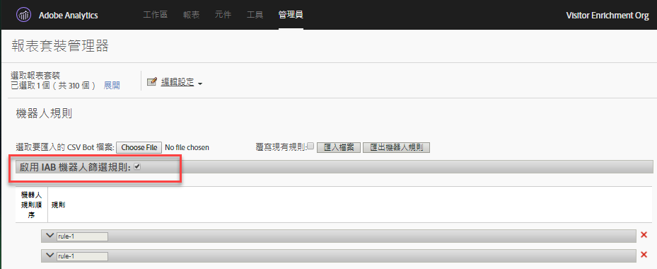

# 機器人規則概觀

機器人規則可讓您移除報表套裝中，由已知編目程式和機器人產生的流量。移除機器人流量可讓您更精確地測量網站上的使用者活動。

定義機器人規則後，所有傳入流量都會與定義的規則進行比較。 符合上述任一規則的流量不會收集在報表套裝中，也不會納入流量度量。

若要更新或上傳機器人規則，請導覽至 **[!UICONTROL Analytics]** > **[!UICONTROL Admin]** > **[!UICONTROL Report Suites]**。 選取正確的報表套裝，然後前往 **[!UICONTROL Edit Settings]** > **[!UICONTROL General]** > **[!UICONTROL Bot Rules]**。

移除機器人流量通常會減少流量和轉換度量的量。 許多客戶發現移除機器人流量會提高轉換率，並增加其他可用性度量。 在移除機器人流量之前，請與相關單位溝通，以確定他們能夠因此次變更而對關鍵績效指標進行必要的調整。 如果可行，建議先移除小型報表套裝中的機器人流量，評估可能造成的影響。

機器人流量資料儲存在單獨的儲存庫中，以便顯示在機器人和機器人頁面報表中。啟用機器人篩選的選項有兩種：

| 規則類型 | 說明 |
|--- |--- |
| 標準 IAB 機器人規則 | Selecting [!UICONTROL Enable IAB Bot Filtering Rules] uses the [IAB&#39;s](https://www.iab.com) (International Advertising Bureau&#39;s) International Spiders &amp; Bots List to remove bot traffic. 多數客戶至少都會選取此選項。 |
| 自訂機器人規則 | 您可以根據使用者代理、IP 位址或 IP 範圍來定義與新增自訂機器人規則。 |

## 標準 IAB 機器人規則

勾選核取核取方塊，即可開啟標準IAB機器人 [!UICONTROL Enable IAB Bot Filtering Rules] 規則。 這個選項會移除 IAB (國際廣告局) 國際編目程式與機器人清單中的機器人，藉此移除機器人流量。IAB 每月都會更新這份清單。



Adobe 無法提供詳細的 IAB 機器人清單給客戶，但您可使用「機器人報表」來檢視曾存取您網站之機器人的清單。若要提交機器人給 IAB 清單，請造訪 [IAB](https://www.iab.com)。

## 自訂機器人規則

>[!N注意] 使用者介面可供手動定義 500 個規則。達到上限之後，必須透過「匯入檔案」和「匯出機器人規則」選項來大量管理規則。

自訂機器人規則可讓您篩選您定義的流量條件。

自訂機器人規則是使用下列條件類型來定義：

* 使用者代理
* IP 位址
* IP 範圍

可為單一規則定義多個條件。 使用「or」可比對多個條件。 例如，如果您提供「使用者代理」和「IP位址」的值，則符合任一條件時，流量即視為機器人流量。

### 使用者代理

A User Agent condition checks the user agent value to see if it **[!UICONTROL starts with]** or **[!UICONTROL contains]** the specified string. If **[!UICONTROL contains]** is selected, the substring is matched if it occurs anywhere in the user agent.

Optional values can be included in the **[!UICONTROL does not contain]** list to define values that the user agent must not contain for a successful match. 可透過每行包含一個值來指定多個值。 如果使用者代理符合相符字串中指定的條件，但同時包含不包含清單上的字串，則不會視為相符。

The **[!UICONTROL contains]** field is limited to 100 characters. 不包含清單的限制為每個新行的255個字元減去分隔符號字元。 (這等於字串數- 1。 如果您指定4 *個不包含字串* ，則需要3個分隔字元。)所有字串比對皆不區分大小寫。

### IP 位址 (包括萬用字元符合)

使用萬用字元(*)比對相同區塊中的IP位址或多個位址。 提供您要比對之IP位址的數值。 使用*取代您要使用萬用字元來比對的任何值。 下表包含 IP 位址符合字串的範例：

```
10.10.10.1
10.10.10.*
```

### IP 位址範圍

提供要符合的IP位址的開始和結束範圍。 使用*取代您要使用萬用字元來比對的任何值。

### 定義自訂機器人規則

1. 前往> **[!UICONTROL Analytics]** ，選 **[!UICONTROL Admin]**&#x200B;取一或多個報表套裝，然後按一下 **[!UICONTROL General]** > **[!UICONTROL Bot Rules]**。
1. Click **[!UICONTROL Add Rule]** and define one or more match conditions.
1. 按一下 **[!UICONTROL Save]**. 30 分鐘內變更就會生效。

## 上傳機器人規則

若要大量匯入機器人規則，您可以上傳定義規則的CSV檔案。

建立 CSV 檔案，依下列順序加入以下各欄：

| 欄目 1 | 欄目 2 | 欄目 3 | 欄目 4 | 欄目 5 |
|--- |--- |---|---|---|
| 機器人名稱 | IP 開頭 | IP 結尾 | 代理符合規則 <br>(包含或開頭為)</br> | 代理排除 <br>(255 字元上限)</br> |

您可以定義 3 種機器人規則：

* 使用者代理包含或開頭為
* 單一IP位址或萬用字元符合
* IP範圍符合

匯入檔案中每一列都只能包含下列其中一種機器人定義：

* **使用者代理包含或開頭為**：提供單一使用者代理字串，與「代理包含」欄比對。在「代理符合規則」欄位中 *放置**contains* 或starts with，指定您要執行的符合類型。 可以在「代理排除」欄中加上選用值，定義代理不可包含的一或多個垂直號分隔 (`|`) 字串。字串比對不區分大小寫。 「IP開始」和「IP結束」欄都必須為空。

* **單一 IP 位址或萬用字元符合**：若要比對單一 IP 位址 (`10.10.10.1`) 或萬用字元 IP 位址 (`10.10.*.*`)，請在「IP 開頭」和「IP 結尾」欄中放置相同的值。「符合規則」、「代理包含」和「代理排除」必須為空。

* **IP 範圍符合**：使用「IP 開頭」和「IP 結尾」欄，定義 IP 位址的範圍。您可以使用萬用字元來比對 IP 範圍，例如 `10.10.10.*` 到 `10.10.20.*`。「符合規則」、「代理包含」和「代理排除」必須為空。

### 多個規則結合 OR

若要使用與OR（例如，使用者代理或IP位址）連結的規則組合來比對機器人，請在機器人名稱欄位中為所有要結合的規則提供相同的名稱。 不支援AND符合。

### 以上傳檔案覆寫所有規則

Select the **[!UICONTROL Overwrite existing rules]** checkbox to delete all existing rules and replace them with the rules defined in the upload file.

### 匯出規則

The **[!UICONTROL Export Uploaded Bot File]** button exports all rules defined in the UI in a CSV format.


## 機器人規則對資料收集的影響 {#section_F01A3130E7A04A9993371CF26F6586F2}

「機器人規則」會套用至所有分析資料。「機器人規則」移除的資料只會顯示在「機器人」和「機器人頁面」報表中。

VISTA 規則是在機器人規則之後套用 (請參閱[處理順序](/help/admin/admin/c-processing-rules/c-processing-rules-configuration/processing-rule-order.md))。

**高點擊瀏覽處理：**&#x200B;如果一次瀏覽中超過 100 次點擊，報告會判斷瀏覽的秒數是否小於或等於瀏覽的點擊數。在此情況下，由於處理長時間密集瀏覽的成本，報告會從新瀏覽開始。 高點擊瀏覽通常是由機器人攻擊所造成，不被視為正常訪客瀏覽。

>[!NOTE] 標示為 *`bots`* 的點擊會在帳單中計為[伺服器呼叫](/help/admin/c-server-call-usage/overage-overview.md)。

## IP 模糊化對機器人篩選的影響 {#section_92E60B95BE8940D983F28C79E0CD6B12}

IAB機器人清單僅以使用者代理為基礎，因此根據該清單進行篩選不會受IP模糊化設定影響。 對於非IAB機器人篩選（自訂規則）,IP可能是篩選條件的一部分。 如果使用IP篩選機器人，機器人篩選會在最後一個八位元組移除後（如果啟用了該設定），但在其他IP模糊化選項之前（例如刪除整個IP或以某些唯一ID取代它）進行。

如果啟用IP模糊化，則會在IP位址被模糊化之前排除IP，因此客戶在啟用IP模糊化時不需要變更任何項目。

如果最後八位數字被移除，則會在IP篩選前完成。 因此，最後八位元組會取代為0，而且應更新IP排除規則，以比對結尾為零的IP位址。 符合 * 應符合 0。
