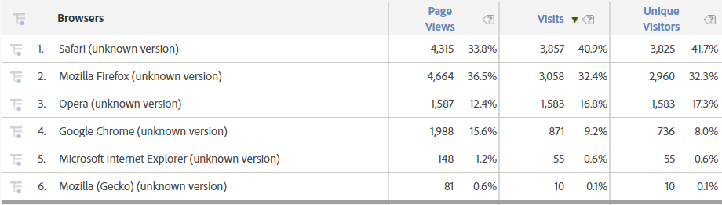
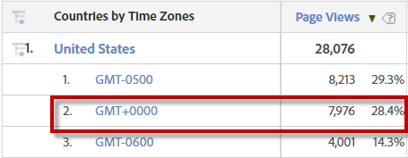

# 常見機器人簽名

雖然識別資料集中的機器人程式會視環境而有所不同，但以下是識別機器人程式的常見方式。

## 每次瀏覽的頁面檢視次數高

您可以提取含有IP位址、頁面檢視和獨特訪客的「資料倉儲」報表。 然後在Excel中建&#x200B;立每次&#x200B;瀏覽頁面檢視的計算，並從最高到最低排序。 機器人通常每次瀏覽的頁面檢視次數很高（數百到數千）。 當您進入實際流量時，將會看到急劇下滑。

## 無反向連結

機器人通常沒有反向連結URL。 在分段中，可將其篩選為 `Referring Domain equals Typed/Bookmarked`。

## 奇怪的用戶代理

機器人程式通常會使用未在「瀏覽器」維度中分類或顯示為標準瀏覽器 `unknown` 版本的自訂使用者代理。 未知的Safari和未知的Opera都極有可能成為機器人。

## Linux或「未指定」作業系統

我們並不是想破壞大型開放原始碼Linux作業系統的信譽，但顯然機器人會將它設為其作業系統。 但是，請小心排除來自Linux使用者的合法流量。 機器人也不會設定作業系統，作業系統可分段為 `Operating System &#x200B;equals Not Specified`。

## 頁面檢視=瀏覽次數=獨特訪客

這尤其適用於使用者代理報表。 如下方的螢幕擷取所示，這些瀏覽器的「未知版本」的訪客數量幾乎與獨特訪客相同（以及幾乎相同的頁面檢視次數）。 您可以建立或的「包含」容器，以 [!UICONTROL 在分段中] 隔離此項 `Single Page Visits equals Enabled``Hit Depth is less than 2`。

## 瀏覽次數1

機器人通常在每次執行時都會取得新的訪客ID，因此每次只會產生一次瀏覽，而其所有流量都會包含1次瀏覽。

## 降低螢幕解析度

現代用戶的解析度監視器比以前要高得多。 具有下列解析度的點擊似乎很受機器人程式的歡迎：

* 1024 x 768&#x200B;&#x200B;
* 1366 x 768
* 1600 x 864
* 800 x 600
* 1600 x 1200
* 未指定
* 1024 x 667

## 國家／地區+時區不符

原始國家／地區和時區之間會有不相符之處。 例如，美國的某個位置，但有GMT時區。

## 未登入

使用者在瀏覽中的任何時間點都不會登入，而且其使用者識別eVar不會在先前的瀏覽中持續存在。 雖然有些機器人可以設定為驗證，但大部分機器人並不聰明。

## 瀏覽中無KPI

機器人通常不會將產品新增至購物車或結帳。 大部分時候，他們不會提交潛在客戶表單或其他成功事件，但有些機器人會提交簡單的HTML表單。&#x200B;

## 存在特定查詢字串

有時機器人會嘗試中斷快取或中斷網站，方法是點擊不存在的格式錯誤的URL或URL（例如一般的LAMP或Wordpress管理頁面），或附加特定查詢字串。

## 源自分佈式計算平台的IP地址

Amazon Web Services或Google Cloud等網站代管服務可能會被濫用為機器人農場。 這些IP位址極有可能成為機器人：&#x200B;
* [Google Cloud](https://cloud.google.com/compute/):IP位址以或開 `&#x200B;35.199` 頭 `35.194&#x200B;`
