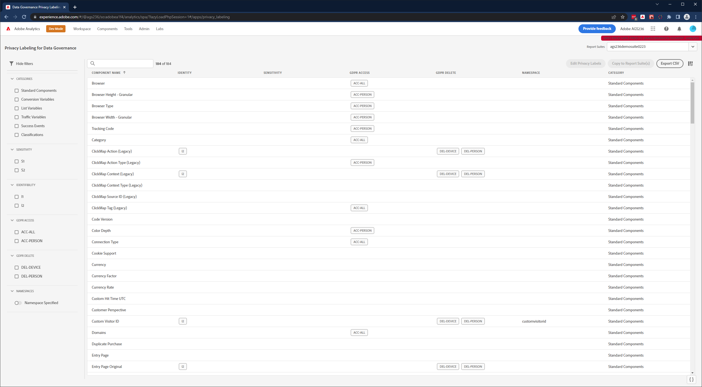

# 檢視/管理資料控管隱私標籤

「**[!UICONTROL 資料規範的隱私標籤]**」對話框概述了報表套裝的隱私標籤和命名空間。 您還可以從此處將設定匯出至 .csv 檔案。

## 檢視隱私權標籤 {#view-privacy}

1. 登入 Adobe Experience Cloud。
2. 導覽至 **[!UICONTROL Analytics]** > **[!UICONTROL 管理員]** > **[!UICONTROL 所有管理員]** > **[!UICONTROL 資料設定和收集]** > **[!UICONTROL 資料控管]**。

   >[!NOTE]
   >
   >如果您沒有看到此功能表專案，則需要將您新增至具有此功能許可權的Admin Console[&#128279;](https://experienceleague.adobe.com/docs/analytics/admin/admin-console/permissions/product-profile.html)中的產品設定檔，或您已獲得Admin Console中報表套裝的存取權。

3. 在右上角，選擇您要檢視或管理其隱私權標籤的報表套裝。

   

| 設定 | 說明 |
| --- | --- |
| **[!UICONTROL 元件名稱]** | 此欄會列出屬於此報表套裝的所有元件 (維度、量度)。 |
| **[!UICONTROL 身分]** | 身分資料「I」標籤可用來分類可識別身分或聯絡特定人員的資料。[了解更多](https://experienceleague.adobe.com/docs/analytics/admin/data-governance/data-labels/gdpr-labels.html#data-privacy-identity-labels) |
| **[!UICONTROL 敏感度]** | 系統會使用敏感資料「S」標籤，將地理資料等敏感資料加以分類。未來將會引入其他敏感資料標籤，以識別其他類型的敏感資訊。[了解更多](https://experienceleague.adobe.com/docs/analytics/admin/data-governance/data-labels/gdpr-labels.html#sensitive-data-labels) |
| **[!UICONTROL GDPR 存取]** | 資料控管標籤讓使用者能夠分類資料，這些資料會反映隱私權相關考量事項，以及遵循法規和公司政策的合約條件。[了解更多](https://experienceleague.adobe.com/docs/analytics/admin/data-governance/data-labels/gdpr-labels.html#data-privacy-access-labels) |
| **[!UICONTROL GDPR 刪除]** | 只有在欄位包含允許點擊與資料主體建立關聯的值時 (亦即允許辨識資料主體的身分)，才需要使用刪除標籤。 [了解更多](https://experienceleague.adobe.com/docs/analytics/admin/data-governance/data-labels/gdpr-labels.html#data-privacy-delete-labels) |
| **[!UICONTROL 命名空間]** | 當您將變數標示為 ID-DEVICE 或 ID-PERSON 時，系統會提示您提供命名空間。您可以使用先前定義的命名空間或定義新的命名空間。[了解更多](https://experienceleague.adobe.com/docs/analytics/admin/data-governance/data-labels/gdpr-labels.html#provide-namespace) |
| **[!UICONTROL 類別]** | 參考元件類型，如標準元件、轉換變數等。 |

{style="table-layout:auto"}

## 將隱私權標籤複製到報表套裝  {#copy-to-rs}

若您想將相同的資料隱私權設定套用至多個報表套裝，請依照以下步驟操作：

1. 選取想要複製的變數。 請注意，您一次只能複製一個變數的標籤。
1. 在「資料控管」對話方塊下方，按一下&#x200B;**[!UICONTROL 「複製到報表套裝」]**。

   

1. 最後產生的螢幕會顯示變數名稱、您嘗試複製且目前套用的標籤、報表痮裝及其 ID，以及目標報表套裝中的設定是否匹配。

   

   >[!IMPORTANT]
   >
   >請記住，您選取的所有報告套裝都必須對應至您的 Experience Cloud 組織。

   將一個變數或一組變數的標籤複製到不同的報告套裝時，複製的標籤會出現在目標報告套裝中對應位置的變數。若是標準元件、清單變數、成功事件，系統會將標籤複製到目標報表套裝中&#x200B;**名稱相同**&#x200B;的變數。

   但是，對於轉換變數 (eVar) 和流量維度 (prop)，系統會將標籤複製到目標報告套裝中&#x200B;**數字相同**&#x200B;的變數。 例如，系統會將 eVar12 複製到所有目標報表套裝中的 eVar12。在判斷複製目標時，系統會忽略這些變數的名稱。如果目標報表套裝未啟用對應的變數，該變數的複製作業將會失敗。

   在複製為變數定義的分類標籤時，系統會在目標報表套裝的對應變數中尋找名稱與來源分類相同的分類，再將標籤複製到該分類 (如 eVar7 到 eVar7)。否則，該分類標籤的複製作業將會失敗。

1. 勾選符合設定的一個或多個報表套裝旁邊的方塊。
1. 按一下&#x200B;**[!UICONTROL 套用]**。

   在套用標籤後，系統會顯示狀態訊息。 狀態訊息包含任何目標變數或分類的名稱，以及複製失敗的報告套裝。

   >[!IMPORTANT]
   >
   >每次都應該要檢查目標報告套裝，確認複製過去的標籤正確無誤。這點對於含有 ID 或 DEL 標籤的變數來說尤其重要。

## 匯出至 .csv 檔案 {#export-csv}

您可以下載一個 CSV 檔案，其中包含所選取報告套裝之所有變數的全部目前標籤定義。我們建議您的法律團隊審閱您的標籤選擇，此選項有助於此審閱。 您可以將 .CSV 檔案分享給他們，而不必在登入資料控管 UI 的情況下執行審核程序。

1. 在右上角按一下 **[!UICONTROL Export CSV]**，會顯示以下對話框：

   

1. 選取您要為其匯出所有資料控管設定的一個或多個報表套裝。

## 編輯隱私權標籤 {#edit}

參考[指派或編輯報表套裝標籤](/help/admin/admin/c-data-governance/data-labeling/gdpr-setup-reportsuite.md)。
