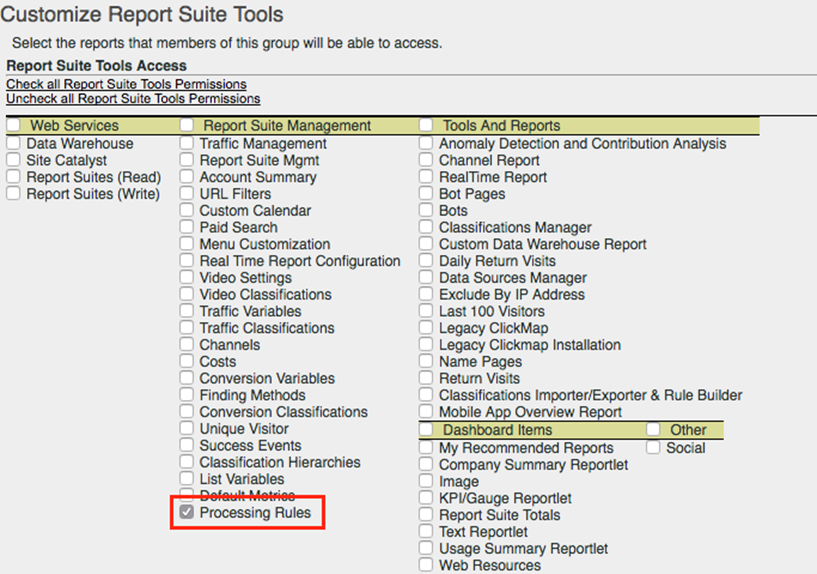

# 處理規則總覽

處理規則可簡化資料收集，以及管理傳送至報告的內容。處理規則可以簡化與 IT 團隊以及網頁開發人員之間的互動，提供介面給您進行下列工作：

* 在產品概述頁面中設定事件
* 以查詢字串參數填入行銷活動
* 在 prop 中串連類別和頁面名稱，以進行更簡易報告
* 將 eVar 複製至 Prop 以查看路徑
* 清除拼寫錯誤的網站區段
* 從查詢字串提取內部搜尋詞或行銷活動 ID 以填入 eVar

>[!VIDEO](https://video.tv.adobe.com/v/26124/?quality=12&learn=on)

## 處理規則權限 {#section_8A4846688050453784DAE4D89355169A}

**根據預設**，管理員有權使用處理規則。 管理員也可透過「管理工具」介面將這些權限授與非管理員。 如需指示，請參閱 []



## 使用內容資料簡化資料收集 {#section_09EEA03612D24C15839631AA9E9668D8}

內容資料變數是僅供處理規則使用的變數類型。 若要使用內容資料變數，需透過實作傳入重要/值資料配對，並使用處理規則擷取標準分析變數中的這些數值。如此可省去程式設計師花時間瞭解哪些 prop 和/或 eVar 應包含哪些值。

```js
s.contextData['author'] = "Robert Munch";
s.contextData['section'] = "Books";
s.contextData['genre'] = "Youth";
```

在程式碼中設定之後，您就可以設定處理規則，以便為變數指派值。 例如：

1. 將 `author` 對應到 `eVar2`
2. 將 `section` 對應到 `prop1` 和 `eVar3`
3. 如果 `author` 和 `section` 存在，則設定 `event5`

如需詳細資訊，請參閱「實作」使用手冊中的 [contextData](/help/implement/vars/page-vars/contextdata.md)。

## 使用處理規則來轉換點擊資料和觸發事件 {#section_8284E72E999244E091CD7FB1A22342B6}

處理規則可以監控傳入值，轉換常見的打字錯誤並根據報告資料設定事件。可以複製 prop 至 eVar、可以串連值以用於報告，並可設定事件。

## 在報告中使用內容資料變數 {#section_BD098BC503024A0B8703596628071134}

在實作中定義內容資料變數後，必須將其複製至 eVar 等變數，才能用於報告中。

如需詳細資訊，請參閱[複製內容資料變數至 eVar](/help/admin/admin/c-manage-report-suites/c-edit-report-suites/general/c-processing-rules/processing-rules-examples/processing-rules-copy-context-data.md) 和[使用內容資料變數設定事件](/help/admin/admin/c-manage-report-suites/c-edit-report-suites/general/c-processing-rules/processing-rules-examples/processing-rules-copy-context-data-event.md)。

## 已知限制

**在處理規則中使用克拉符號 (^)。**&#x200B;如果要在處理規則中使用克拉號作為分隔符號或用於其他目的，則單一的克拉必須以兩個克拉來表示。 比如單一的克拉表示為 ^^，兩個克拉表示為 ^^^^ 等。