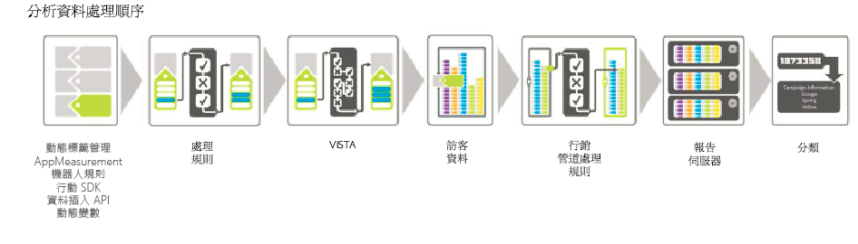

# 處理順序

若要有效使用處理規則，請務必瞭解它們在資料收集期間的套用時機。

下表列出套用處理規則之前和之後通常可用的資料:

## 處理規則之前

| 維度 | 說明 |
|--- |--- |
| 動態變數查閱 | 從 HTTP 標題或其他變數提取資訊，進而動態填入變數。例如，`s.eVar5="D=c1"` 會將 prop1 的值放入 eVar5 中。 |
| AppMeasurement | AppMeasurement 中使用的函數和外掛程式會在瀏覽器或用戶端應用程式中執行。 |
| Dynamic Tag Management | 「Dynamic Tag Management」中定義的規則會依定義執行。 |
| 機器人規則 | [機器人規則](/help/admin/admin/bot-removal/bot-rules.md)可讓您移除報表套裝中，由已知編目程式和機器人產生的流量。 |

## 處理規則之後

| 維度 | 說明 |
|--- |--- |
| VISTA 新增的資料 | 處理規則的套用時機早於 VISTA。 |
| 瀏覽頁碼 | 一般來說，處理規則只會知道目前點擊包含的資料。瀏覽頁碼是在套用處理規則之後才進行編譯的。 |
| 若未設定頁面名稱，則會新增「簡潔 URL」作為頁面名稱 | 套用處理規則和 VISTA 後，若未設定頁面名稱，則會新增簡潔 URL 作為頁面名稱。由於這發生在套用處理規則之後，因此建議新增條件來檢查頁面名稱是否空白。如果您執行「網站內容 &gt; 頁面報表」並看到頁面名稱的值為 https://，則頁面名稱很可能為空白，系統就會使用 URL。您可以設定條件來測試空白的頁面名稱，或測試頁面名稱或頁面 URL 是否包含特定值。接著就可以視需要設定頁面名稱。 |
| 行銷管道處理規則 | 您可以使用處理規則來準備資料，以供[「行銷管道處理規則」](https://marketing.adobe.com/resources/help/en_US/mchannel/c_rules.html)處理。 |
| GEO 查閱 | 這包括「訪客狀態」和「訪客郵遞區號」值。 |
| eVar 保存 | 前次點擊中包含的 eVar 在規則處理期間不會保存給每個點擊。只有設定給正在處理之目前點擊的 eVar 可供使用。 |

## 使用 VISTA 複製點擊時處理規則的套用方式 {#section_576EE8C240A24CBA979BD614E8D5338D}

如果您有設定 VISTA 規則用來複製點擊至其他報表套裝，則會透過該報表套裝上的處理規則來傳送點擊。

如果原始報表套裝上有定義處理規則，這些處理規則可能會套用也可能不會套用，端視工程技術服務對 VISTA 規則的設定而定。若想得知，請詢問您的實施專家 VISTA 規則是複製「前」或「後」值至其他報表套裝。如果是複製「前」值，則不會套用原始報表套裝上定義的處理規則。如果是複製「後」值，則會在複製點擊之前套用處理規則。
