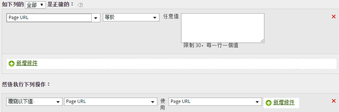

# 清除報表中的值

您可以比對值是否有常見的拼寫錯誤，並加以更新以便在報告中正確顯示。

為了確保不會不慎比對到其他值，請使用限制最嚴格的可用符合選項。您可對變數 (以下範例使用 prop1) 執行報告，然後搜尋您選取來進行取代的字詞，以確定不會符合非預期的值。字串比較不分大小寫。

| 規則集 | 值 |
|---|---|
| 條件 | 如果 prop1 開頭為 Shopping |
| 動作 | 將 prop1 的值覆寫為自訂值 Shopping |

例如：

