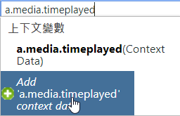
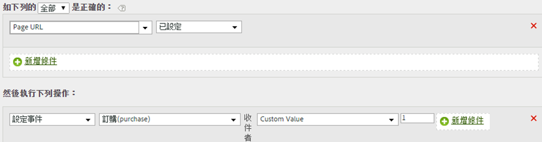

# 使用上下文資料變數設定事件

處理規則可以根據上下文資料變數觸發事件。

上下文資料變數需以下列格式，在 AppMeasurement 中指定：

```
 s.contextData['search_term']
```

[!UICONTROL 「上下文變數」]清單包含在最近 30 天內，傳送至報表套裝的所有變數。如果您知道上下文資料變數的名稱但尚未將它傳送至目前的報表套裝，則可輸入變數名稱並按一下&#x200B;**[!UICONTROL 「新增變數名稱上下文資料」]**：



下列規則定義會針對[「複製上下文資料變數至 eVar」](/help/admin/admin/c-processing-rules/processing-rules-examples/processing-rules-copy-context-data.md)規則展開，以便對每個包含特定上下文資料變數的點擊設定事件：

| 規則集 | 值 |
|---|---|
| 條件 | 如果設定 &#39;search_term&#39; 上下文資料 |
| 動作 | 設定 &#39;searches&#39; 事件 |

例如：



請參閱實作說明中的[上下文資料變數](https://marketing.adobe.com/resources/help/zh_TW/sc/implement/context_data_variables.html)。
