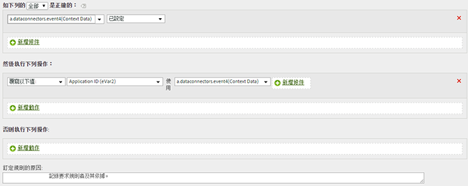

# 複製上下文資料變數至eVar

處理規則用於將上下文資料變數的值移至 prop 和 eVar。

上下文資料變數需以下列格式，在 AppMeasurement 中指定:

```
 s.contextData['search_term']
```

[!UICONTROL 「上下文變數」]清單包含在最近 30 天內，傳送至報表套裝的所有變數。If you know the context data variable name but have not sent it into the current report suite, you can add a value by typing the variable name and clicking **[!UICONTROL Add variable name context data]**:


每次點擊包含特定的上下文資料變數時，下列規則定義就會填入 eVar:

| 規則集 | 值 |
|---|---|
| 條件 | 如果設定 'search_term' 上下文資料 |
| 動作 | 將 eVar3 的值覆寫為 'search_term' |

例如:



請參閱實施說明中的[上下文資料變數](https://marketing.adobe.com/resources/help/en_US/sc/implement/index.html?f=context_data_variables)。
