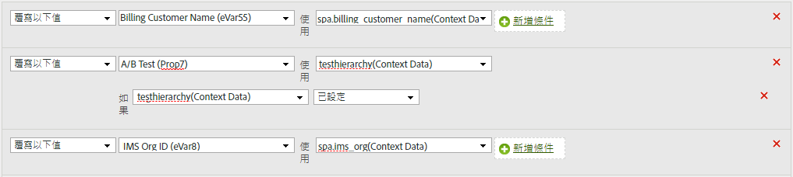

# 複製上下文資料變數至 eVar

處理規則可用來將值從上下文資料變數移至prop和eVar。 若沒有處理規則，上下文資料變數就毫無意義，且不會在Analytics中填入任何報表。

[!UICONTROL 「上下文變數」]清單包含在最近 30 天內，傳送至報表套裝的所有變數。If you know the context data variable name but have not sent it into the current report suite, you can add a value by typing the variable name and clicking **[!UICONTROL Add variable name context data]**:

下列範例會將上 `search_term` 下文資料變數放入其值中 `eVar3`:

上述範例在只有幾個eVar可填入時非常有效。 如果您的組織有數百個上下文資料變數，每個變數都需要自己的eVar，則可使用條件陳述式。 數十個條件陳述式可以符合單一處理規則，讓您的組織能夠在報表套裝中填入所有eVar，而不需符合150個規則的處理規則限制。

下列範例會填 `prop7` 入內容資料變數，但 `testhierarchy`僅在設定 `testhierarchy` 時：

如需實作上下文資料變數的詳細資訊，請參閱「實 [作使用指南」中的](/help/implement/js-implementation/c-variables/context-data-variables.md) 「上下文資料變數」。
