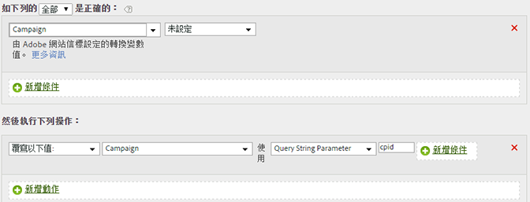

# 從查詢字串參數填入促銷活動 ID

您可以使用查詢字串參數填入變數。

在大多數情況下，可使用外掛程式以從查詢字串填入變數。如果發生打字錯誤或類似問題因而無法填入值，您可使用處理規則來填入值。

在覆寫值之前，請務必先檢查該值是否空白或已包含預期值。

| 規則集 | 值 |
|---|---|
| 條件 | 促銷活動未設定 |
| 動作 | 以查詢字串參數 cpid 覆寫促銷活動的值 |

例如:

