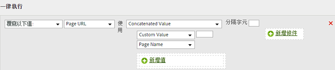

# 串連類別和頁面名稱以新增子類別

您可使用串連選項結合其他值，用來填入值。

<table id="table_FF761C2011CD456B9A466C054A54FC30"> 
 <thead> 
  <tr> 
   <th colname="col1" class="entry"> 規則集 </th> 
   <th colname="col2" class="entry"> 值 </th> 
  </tr> 
 </thead>
 <tbody> 
  <tr> 
   <td colname="col1"> 條件 </td> 
   <td colname="col2"> 無 (一律執行) </td> 
  </tr> 
  <tr> 
   <td colname="col1"> 動作 </td> 
   <td colname="col2">將子類別的值覆寫為串連值 
類別 
 
頁面名稱 
 </td> 
  </tr> 
 </tbody> 
</table>

例如：

