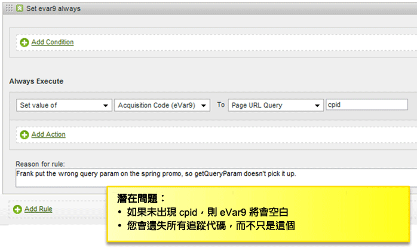
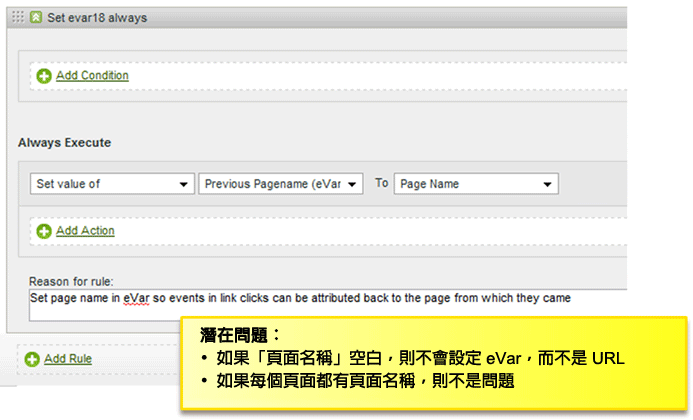
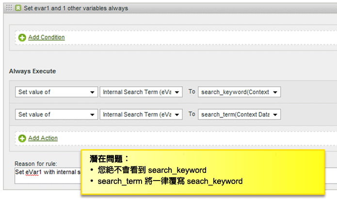
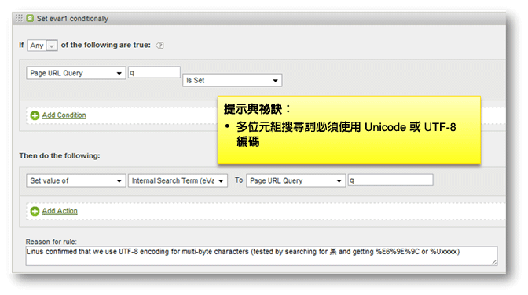
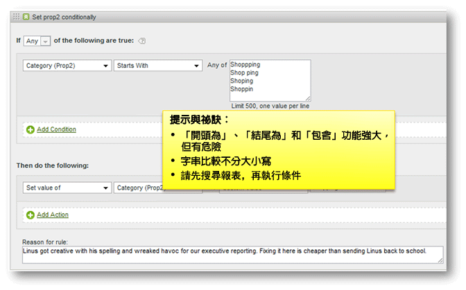

# 處理規則提示與秘訣

本章節包含測試處理規則的指引，以及應避免的常見錯誤清單。

## 測試處理規則 {#section_F092D2FECDE24082AE9FC6F8BE87F29F}

本章節包含在部署處理規則至生產環境前，測試處理規則的一些指引。

**測試讀取搜尋詞的規則**

針對根據搜尋的標準，例如如果 prop1 包含 "news"，前往 prop 1 報告並搜尋 "news"，查看是否有任何不想要的相符項目。

**測試讀取變數的規則**

Create a blank HTML page on your desktop, include the s_code from your site, and set the `s.account` variable to a dev report suite. 如果您的規則是根據反向連結、反向連結網域等，請從即時反向連結報告中取得一些範例 URL，將 `s.referrer` 變數設為其中一個值，並載入頁面。同樣，如果規則是根據頁面 URL 值，則可設定 `s.pageURL`。這套程序可對任何變數使用。

**使用開發報表套裝**

我們建議在開發報表套裝上設定處理規則，以便確保它們可以正常運作。如果可行，建議在廣泛部署前，先將規則複製至小型生產報表套裝。

## 檢查空白值 {#section_EE84A5525E26415787930723B0CAAE0F}

建立規則時，請考慮值為空白的狀況。如果您不增加檢查空白值的條件，可能會不小心以空白值覆寫變數。

也請務必考慮處理順序。在下列範例中，如果不存在頁面名稱 (Page Name) 的話，Previous Pagename 自訂 evar 會被設為 URL。但 URL 是在套用處理規則後才放入頁面名稱的，因此在此例中，如果頁面未設定頁面名稱，頁面名稱就會空白。

## 避免覆寫值 {#section_49FCCA31E31A433EA2EF5EAF91443DAF}

在下列範例中，網站上使用兩個上下文資料變數來擷取搜尋詞: search_keyword 和 search_term。不過，根據設定，search_keyword 值一律會被覆寫，即使 search_term 空白亦然。

應將此規則設定為在填入內部搜尋詞 (Internal Search Term) 之前，測試每個上下文資料變數是否有值，以及選擇性地在需要同時保留這兩個值時，串連兩個值。

## 將搜尋詞編碼為 UTF-8 或 Unicode {#section_3BBBE1FB8FEA48589362452DE51DB575}

從查詢字串提取的搜尋詞必須正確編碼，否則處理規則無法比對。

## 開頭為、包含和結尾為 {#section_80CE853244FC435B844A09EA51868D8D}

選取正確的比對條件，找到可以正確符合的最限縮條件。您可以在建立規則前，先搜尋報告中的值，確保沒有意外的相符項目。例如，您應在啟用規則前，先行搜尋 Prop2 報告，找出所有此條件符合的位置。

