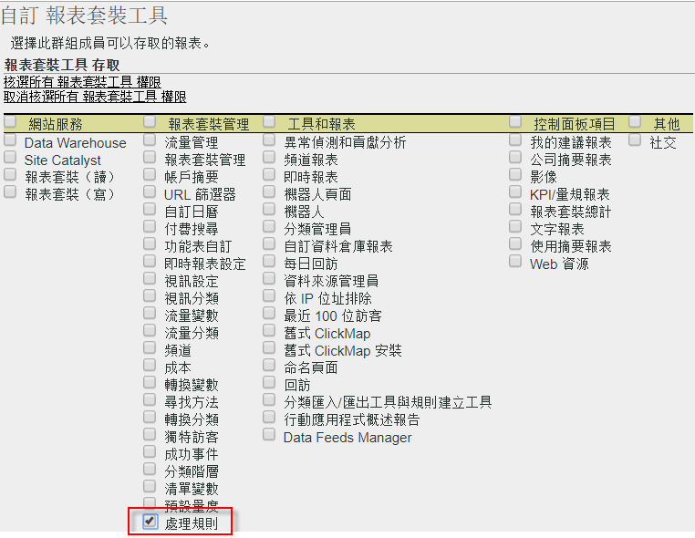
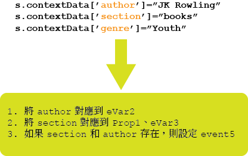

# 處理規則概觀

處理規則可簡化資料收集，以及管理傳送至報告的內容。處理規則可以簡化與 IT 團隊以及網頁開發人員之間的互動，提供介面給您進行下列工作：

* 在產品概述頁面中設定事件
* 以查詢字串參數填入促銷活動
* 在 prop 中串連類別和頁面名稱，以進行更簡易報告
* 將 eVar 複製至 Prop 以查看路徑
* 清除拼寫錯誤的網站區段
* 從查詢字串提取內部搜尋詞或促銷活動 ID 以填入 eVar

>[!VIDEO](https://tv.adobe.com/embed/1181/16506/)

*觀看處理規則概述和 Adobe Summit 訓練，瞭解您為何應該使用處理規則。*

## 取得授權以使用處理規則 {#section_8A4846688050453784DAE4D89355169A}

2017 年 4 月 20 日之前，所有使用者 (包括管理員) 都必須通過一項檢驗，並且必須獲得授權才可使用 Adobe 客戶服務提供的處理規則。

現在起，管理員&#x200B;**依預設**&#x200B;已有權使用處理規則。不再需要進行檢驗。管理員也可透過「管理工具」介面將這些權限授予非管理員。方法如下：

1. 若您還未這麼做，[請建立有權使用處理規則且僅包含非管理員的群組](/help/admin/user-management2/c-user-groups/groups.md)。
1. [將非管理員新增至該群組](/help/admin/user-management2/c-user-management/t-add-user-to-group.md)。
1. 接著，前往&#x200B;**[!UICONTROL 「Analytics]** > **[!UICONTROL 管理員]** > **[!UICONTROL 使用者管理]** > **[!UICONTROL 群組]** > **[!UICONTROL [群組名稱]]** > **[!UICONTROL 編輯]** > **[!UICONTROL 報表存取]** > **[!UICONTROL 報表套裝工具]** > **[!UICONTROL 自訂]** > **[!UICONTROL 報表套裝管理」]**。
1. 勾選[!UICONTROL 「處理規則」]旁的方塊，然後按一下&#x200B;**[!UICONTROL 「確定」]**。

>[!IMPORTANT]
>
>由於處理規則會永久影響 Analytics 資料，因此強烈建議處理規則管理員應先通過 Adobe Analytics 的認證訓練，同時熟悉報表套裝的所有資料來源 (標準網站、行動網站、行動應用程式、資料插入 API 等)。瞭解各種平台中的內容資料變數和標準變數，有助於避免意外刪除或資料修改等情形。

## 使用上下文資料簡化資料收集 {#section_09EEA03612D24C15839631AA9E9668D8}

內容資料變數是僅供處理規則使用的新型變數。若要使用內容資料變數，需透過實作傳入重要/值資料配對，並使用處理規則擷取標準分析變數中的這些數值。如此可省去程式設計師花時間瞭解哪些 prop 和/或 eVar 應包含哪些值。

請參閱實作說明中的[上下文資料變數](https://marketing.adobe.com/resources/help/zh_TW/sc/implement/context_data_variables.html)。

## 使用處理規則來轉換點擊資料和觸發事件 {#section_8284E72E999244E091CD7FB1A22342B6}

處理規則可以監控傳入值，轉換常見的打字錯誤並根據報告資料設定事件。可以複製 prop 至 eVar、可以串連值以用於報告，並可設定事件。

## 在報告中使用上下文資料變數 {#section_BD098BC503024A0B8703596628071134}

在實作中定義上下文資料變數後，必須將其複製至 eVar 等變數，才能用於報告中。

如需詳細資訊，請參閱[本文](/help/admin/admin/c-processing-rules/processing-rules-examples/processing-rules-copy-context-data.md)及[本文](/help/admin/admin/c-processing-rules/processing-rules-examples/processing-rules-copy-context-data-event.md)。
