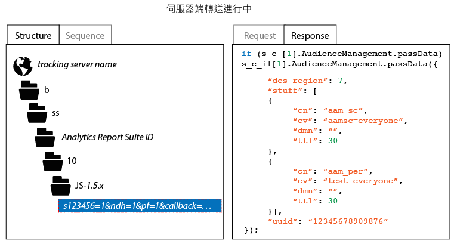

# 如何確認您的伺服器端轉送實作情形

若要確認伺服器端轉送是否正確啟用，您必須檢查 Analytics 追蹤請求的 HTTP 回應。您可以使用瀏覽器的開發人員工具，或者使用代理工具來完成此步驟，例如 Charles 網頁除錯工具。下列指示說明哪些指標必須出現，才可確保伺服器端轉送已正確啟用。

檢查伺服器端轉送狀態：

1. 載入包含已更新 AppMeasurement 程式碼的測試頁。
1. 使用瀏覽器的除錯工具或代理軟體，檢查 Analytics 追蹤請求中的 HTTP 回應 (您可以透過選取包含「b/ss」的任何路徑輕易篩選)。
1. 檢查 HTTP 回應。若回應中包含 Audience Manager 資料 (如下所示)，則伺服器端轉送正在執行。

>[!CAUTION]
>
>如果回應包含索引鍵值配對 `"status":"SUCCESS"` 或 2 x 2 影像，表示伺服器端轉送設定不正確。請確認身分識別服務已正確部署，且您已部署 App Measurement 模組，將適用的報表套裝對應到正確的 IMS 組織，並在 Analytics「Admin Console」中啟用了伺服器端轉送。

>[!MORELIKETHIS]
>
>* [Charles 網頁除錯工具](https://www.charlesproxy.com/)

