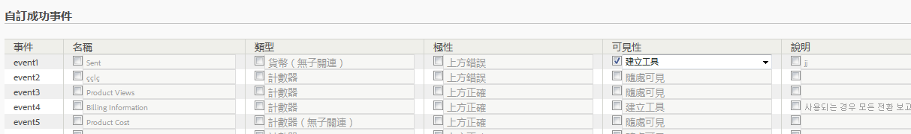

# 設定成功事件

說明如何設定成功事件的步驟。

1. 按一下&#x200B;**[!UICONTROL 「Analytics]** > **[!UICONTROL 管理]** > **[!UICONTROL 報表套裝」]**。
1. 選取報表套裝。
1.  按一下&#x200B;**[!UICONTROL 「編輯設定]** > **[!UICONTROL 轉換]** > **[!UICONTROL 成功事件」]**。

   

1.  在&#x200B;**[!UICONTROL 「名稱」]**&#x200B;欄中選取每個項目旁的核取方塊以啟用編輯，然後指定所要的名稱。
1.  在&#x200B;**[!UICONTROL 「類型」]**&#x200B;欄中選取每個項目旁的核取方塊以啟用下拉式清單，然後選取所要的類型。

   >[!NOTE]
   >
   >在變更事件類型之前，請先參閱[變更事件類型](/help/admin/admin/c-success-events/event-type.md)。

   如需這些元素的相關資訊，請參閱[成功事件頁面 - 說明](/help/admin/admin/c-success-events/success-event.md)。

1. 在&#x200B;**[!UICONTROL 「極性」]**&#x200B;欄中，指定此量度的趨勢上升是好事或壞事。
1. 在&#x200B;**[!UICONTROL 「可見性」]**&#x200B;欄中，您可以在功能表、量度選擇器、計算量度產生器及區段產生器中隱藏標準 (內建) 量度、自訂事件及內建事件。

   此設定不會影響該量度或事件的資料收集作業，只會影響其使用者介面的可見性。[更多...](/help/admin/admin/metric-visibility.md)
1. 提供說明。
1. 檢查是否一律記錄事件。
1. 啟用或停用[參與率度量](/help/components/c-variables/c-metrics/metrics-participation.md)。

   >[!NOTE]
   >
   >您可以啟用的參與率最多可達 100 個自訂事件。除此之外，您還可在[計算量度](https://marketing.adobe.com/resources/help/zh_TW/analytics/calcmetrics/participation_metric.html)產生器中建立參與率量度。

1. 按一下&#x200B;**[!UICONTROL 「儲存」]**。

