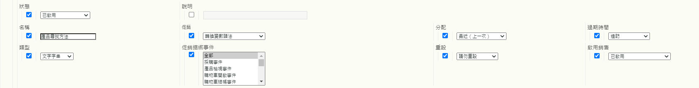

# 銷售eVar和產品尋找方法

本詳細檔案說明銷售eVar背後的概念，這些eVar的處理和配置資料的方式與標準eVar不同。 也說明銷售eVar與產品尋找方法的關聯。

雖然大部分的零售網站都有許多尋找產品的方式，但Adobe認為下列是每個零售客戶在Adobe Analytics中都應追蹤的基本產品尋找方法：

* 內部搜尋關鍵字
* 內部促銷活動追蹤代碼
* 銷售/瀏覽類別
* 交叉銷售連結

就本檔案而言，我們將幾個eVar對應至以下解決方案：

* eVar2:內部搜尋關鍵字
* eVar3:內部促銷活動追蹤代碼
* eVar4:銷售/瀏覽類別
* eVar5:交叉銷售連結

我們可以使用其他eVar來測量所有產品尋找方法彼此相對的效能。 除了上述尋找方法之外，eVar在比較中也包含其他尋找方法，例如從外部網站連結至產品詳細資料頁面。

* eVar1:產品尋找方法

將這些變數設為銷售eVar，而非標準eVar，而是將其設為銷售eVar。 使用銷售eVar可讓您將任何成功的活動分配給eVar在&#x200B;*per-product*&#x200B;層級擷取的值，而非&#x200B;*per-visit/per-order*&#x200B;層級。 本檔案釐清整個期間每個產品與每個訂單的分配之間的差異。

為了示範如何設定這些變數，以下範例說明訪客決定使用內部關鍵字搜尋「沙子」來在網站上尋找產品。 在關鍵字搜尋結果頁面上，您至少必須擷取兩個eVar中的資料：

* `eVar2` 等於搜尋中使用的關鍵字（「沙爾」）
* `eVar1` 等於使用的產品尋找方法（「內部關鍵字搜尋」）。

當您將這兩個變數設為等於這些特定值時，您知道訪客使用內部關鍵字搜尋辭彙「沙爾」來尋找產品。 同時，您也知道訪客沒有使用其他產品尋找方法來尋找產品（例如，訪客沒有在執行關鍵字搜尋的同時瀏覽產品類別）。 為確保每個產品進行正確分配，這些未使用的方法在尋找透過內部關鍵字搜尋找到的產品時不應獲得評分。 因此，您必須將邏輯插入程式碼（例如AppMeasurement、AEP Web SDK等）中，以自動將與這些其他尋找方法相關聯的eVar設為等於「非尋找方法」值。

例如，當使用者使用關鍵字「沙爾」搜尋產品時，Analytics程式碼的邏輯應在內部關鍵字搜尋結果頁面上將變數設為等於下列項目：

* eVar2=」桑達爾」：內部關鍵字搜尋中使用了關鍵字「沙爾」
* eVar1=」內部關鍵字搜尋」：已使用「內部關鍵字搜尋」尋找方法
* eVar3=」非內部促銷活動」：內部促銷活動未用於存取搜尋結果頁面
* eVar4=&quot;non-browse&quot;:未在搜索結果頁上訪問瀏覽類別
* eVar5=」非交叉銷售」：未在「搜尋結果」頁面上按一下交叉銷售連結

## 銷售eVar設定

繼續進行「沙片」範例之前，以下是您可搭配銷售eVar使用的不同設定。  以下螢幕擷取來自「報表套裝管理器」。 前往「Analytics >管理員>報表套裝>編輯設定>轉換>轉換變數>新增>啟用銷售」，即可存取。



表格下方各節包含這些設定的詳細資訊。

| 設定 | 說明 |
|--- | --- |
| 名稱 | 名稱，或該變數要關聯的報表維度。 如果`eVar1`是用來擷取產品尋找方法，則`eVar1`的「名稱」欄位應設為「產品尋找方法」。 |
| 銷售 | 用來擷取銷售eVar值的語法類型 |
| 配置 | 有助於判斷發生成功事件時，應接收評分的銷售eVar值。 |
| 過期時間 | 決定現有產品和銷售eVar系結何時不再有效。 |
| 類型 | 銷售eVar中收集的資料類型 |
| 銷售捆綁事件 | 決定產品何時應系結至銷售eVar值的事件 |
| 重設 | 觸發器，會在該時間點重設該eVar的所有後端資料 |
| 啟用銷售 | 須設為「已啟用」的標幟，可將eVar從標準eVar轉換為銷售eVar |

### 啟用銷售

當「啟用銷售」設定設為「已啟用」時，以下說明的所有設定都會顯示在「報表套裝管理器」中。 當「啟用銷售」設定設為「停用」時，僅可使用標準eVar設定。

### 銷售

此選項不適用於一般eVar。 [!UICONTROL 銷售]設定可讓您選擇[!UICONTROL 轉換變數語法]或[!UICONTROL 產品語法]作為擷取銷售eVar值的方法。

**[!UICONTROL 轉換變]** 數語法表示您在自己的變數中設定eVar值。例如，使用轉換變數語法，「內部關鍵字搜尋」的`eVar1`值在頁面代碼（或AppMeasurement代碼、AEP Web SDK代碼等）中的設定如下：

`s.eVar1="internal keyword search";`

但若使用&#x200B;**[!UICONTROL 產品語法]**，則eVar只會在Adobe Analytics產品變數內設定。 Analytics產品變數可依每項產品分為六個不同部分：

`s.products="[category];[productID];[quantity];[revenue];[events];[eVars]"`

*  Category是已棄用的功能，不建議再作為追蹤產品類別效能的可行選項使用。其存在性說明為何在大部分的產品變數實施中，變數值的productID部分前面都會加上單一分號。
*  在追蹤  產品購買時，「數量」和「收入」相當實用。
*  事件可用來記錄並非要計為收入的自訂增量或貨幣事件值（例如運送、折扣等）

設為使用產品語法的銷售eVar會設定在產品變數的最終部分內。 例如，假設訪客使用內部關鍵字搜尋來尋找產品ID「12345」。 在此範例中，設定eVar1的產品語法方式如下所示：

`s.products=";12345;;;;eVar1=internal keyword search";`

請注意，產品變數的數量、收入和事件部分仍以分號分隔的預留位置。  若沒有這些預留位置，內部關鍵字搜尋的`eVar1`設定將會完全忽略。

### 配置

銷售eVar的「配置」一詞具有誤導性，尤其是使用轉換變數語法的銷售eVar。 所有標準eVar都可以有各自的個別配置設定。 不過，具有轉換變數語法的銷售eVar只會使用「最近（最後一個）」配置設定，無論「報表套裝管理器」中的配置設定顯示什麼。

了解此設定的功用，就表示了解eVar配置和銷售eVar捆綁之間的差異。 對於銷售eVar，「銷售eVar系結」是此「配置」設定更適當的名稱。

**標準eVar配置設定**

每當從影像請求收集任何具有標準語法的eVar時，Adobe Analytics處理伺服器都會將資料插入另一個名為`post_evar`欄的資料庫欄中。 由於eVar應具持續性 — 在大多數情況下，這些eVar會在目前點擊以外的某個時間點過期，因此伺服器會在後續的每個影像要求上設定此`post_evar`欄。 它設為等於傳入其對應eVar的最後一個值。 對於標準eVar，發生成功事件時，Adobe Analytics會使用`post_evar`欄(而非一般eVar欄)來判斷應給予該事件評分的eVar值。

對於標準eVar，配置設定會決定在特定期間收集的第一個或最後一個eVar值是否會插入`post_evar`欄中。 如果標準eVar的「配置」設定等於「原始值（第一個）」，則從訪客收集的第一個eVar值會插入至所有後續影像要求的`post_evar`欄中。 這會持續處理從此訪客瀏覽器傳送的所有未來請求，直到eVar根據其「過期時間」設定到期為止。

如果標準eVar的「配置」設定等於「最近（最後）」，則從訪客收集的最新eVar值會填入至所有後續影像要求的`post_evar`欄中。 「最近（最後一個）」配置表示每次將其對應的eVar設為任何影像要求中的新值時，`post_evar`值都會變更。 「原始值（第一個）」配置表示即使其對應的eVar可能在未來影像要求中設定為不同值，`post_evar`欄不會在點擊間變更。

**銷售eVar配置（捆綁）設定**

如前所述，所有具有轉換變數語法的銷售eVar只有「最近（最後）」配置。  「配置」設定對銷售eVar的實際意義如下：如先前所暗示，此設定不會決定當訪客繼續使用網站時，要插入哪些值至`post_evar`欄。 銷售eVar的配置設定會決定哪些eVar值會系結至產品，以及這些產品如何將成功事件配置回其系結的eVar值。

讓我們討論一下，如果銷售eVar的「配置」（即「捆綁」）設定設為等於「原始值（第一個）」時，會發生什麼事。 任何與`post_evar`欄一併設定的產品，以及先前未系結至post_evar欄之對應「pre-processed」eVar的產品，都將系結至`post_evar`欄中包含的值。 根據報表套裝設定中的「過期時間」設定，eVar值和產品之間的此系結要等到eVar過期時才會變更。

只要影像要求符合條件，而條件會將已綁定的產品系結至最近設定的eVar值，「原始值（第一個）」設定就會強制Adobe Analytics資料收集伺服器忽略任何進一步嘗試。 銷售eVar的情況則相反，其配置（捆綁）設定等於「最近（最後）」。 只要影像要求符合將產品系結至銷售eVar的標準，產品就會將本身繫結（並重新系結）至傳入eVar的最新值，或`post_evar`欄中包含的值（一律）。

如前所述，銷售eVar可讓您以每項產品為基礎將成功事件分配給eVar值，而非以每次造訪/每次訂單為基礎。 因此，只要系結的產品有與其相關聯的成功事件（例如購物車新增或購買），成功事件就會將其評分給予產品當時系結的產品和銷售eVar值。

### 過期時間

銷售eVar的到期設定可讓您選擇產品/eVar系結的到期時間，以及將eVar傳入影像要求後，post_evar欄不應再自動填入的時間。 當成功事件（您選擇的事件）記錄或特定時段（同樣是您選擇的時段）經過時，eVar的過期時間可能會發生。 Adobe Analytics一次只允許一個過期設定。

對於「產品尋找方法」解決方案，設定銷售eVar有效期的最佳實務是將其設為等於網站購物車中產品保留的時間量，然後網站才會自動從購物車中移除，或是在發生購買事件時。 透過任一過期設定，訪客購買的任何產品都會將訂單/單位/收入評分分配給產品當時系結的銷售eVar值。

### 類型

eVar類型設定決定要插入eVar的資料類型。 在設定銷售eVar時，大多數（若非全部）情況下，此值應等於「文字」。 對銷售eVar使用「計數器」類型的情況很少見，但視追蹤需求而定，可有效運用此類型，將成功分配給每個產品的計數器eVar值。  使用「計數器」類型討論解決方案不在本檔案的討論範圍內。

### 銷售捆綁事件

銷售捆綁事件設定可讓您指定導致產品系結至銷售eVar值的條件。 這些條件僅限於特定成功事件或eVar的引發；觸發流量變數（例如prop）對銷售系結沒有影響。

「銷售系結事件」設定中較實用的功能之一，是透過多個事件將產品系結至eVar值。 例如，此設定可允許產品透過產品檢視事件、購物車新增事件或購買事件系結至銷售eVar值。 當與產品包含在相同的影像要求中任何其他事件/eVar（銷售或其他）時，此設定甚至會（預設情況下）將產品系結至銷售eVar值。

### 重設

「重設」設定可讓您立即「過期」Adobe Analytics後端資料庫中目前具有`post_evar`值的所有訪客的所有eVar值。 它還消除了所有當前產品/eVar綁定。

>[!IMPORTANT]
>Adobe不建議使用「重設」設定，除非您完全打算讓eVar從重設發生時開始，以完整的「清空狀態」資料重新啟動。

## 您應使用哪些設定？

在許多可用的設定組合中，您可能會想知道哪些設定是「最佳實務」。

如果您想要將「內部關鍵字搜尋」系結至產品ID 12345，產品變數的設定如下：

`s.products=";12345;;;;eVar1=internal keyword search";`

與productID 12345同時擷取的任何成功事件（購物車新增、購買），都會計入產品ID 12345和「內部關鍵字搜尋」的`eVar1`值。 不同的`eVar1`值取得與產品ID 12345相關聯之成功事件評分的唯一方式，是`eVar1`之後在產品變數內(與產品ID 12345並列)將設為&#x200B;**不同的**&#x200B;值。 範例：

`s.products=";12345;;;;eVar1=internal campaign";`

此設定會將產品ID 12345的系結從「內部關鍵字搜尋」的`eVar1`值變更為「內部促銷活動」的`eVar1`值。 每次使用產品語法且eVar的配置（捆綁）設定設為「最近（最後）」時，都會發生此重新捆綁。 如果「配置（捆綁）」設定改為「原始值（第一個）」，會發生什麼情況？ 然後，將eVar1設為等於產品ID 12345的「內部促銷活動」，不會將產品ID 12345重新系結至「內部促銷活動」的eVar1值。 系結仍會與原本界限的值 — 「內部關鍵字搜尋」。

### 使用產品語法的挑戰

若未謹慎規劃，使用產品語法可能會產生數個問題。 讓我們以使用多個eVar來追蹤網站上產品尋找方法的案例為例。 在此，必須同時設定每個個別產品尋找方法eVar，以給予特定尋找方法eVar評分（而其他尋找方法eVar沒有評分）。 產品語法可在此情況下使用，但部署的程式碼則較複雜。

如果我們使用原始的「沙爾」範例，並加以調整以使用產品語法（假設訪客使用關鍵字詞「sandals」找到ID為「sandal123」的產品），則產品變數必須設定如下：

`s.products=";sandal123;;;;eVar2=sandals|eVar1=internal search|eVar3=non-internal campaign|eVar4=non-browse|eVar5=non-cross-sell";`

雖然此範例中產品變數的語法較長，但它會系結所見到的每個eVar值至「sandal123」的產品ID。 從那時開始，與「sandal123」產品同時擷取的任何成功事件（例如購物車新增、購買）都會計入上次系結至產品的eVar值。  此程式碼範例顯示在上述eVar系結至「sandal123」產品後，是否購買了1件「sandal123」產品（價格$79.95）:

```
s.products=";sandal123;1;79.95";
s.events="purchase";
```

下列值會有1個訂單、1個件數和$79.95的收入歸因於這些值：

* eVar2 &quot;sandals&quot;的值
* eVar1的「內部關鍵字搜尋」值
* eVar3的「非內部促銷活動」值
* eVar4的「non-browse」值

這是正確的歸因，這不是問題。 相反地，此方法的主要難題是決定如何及何時設定產品尋找方法eVar。

在大多數的產品語法情況下，產品尋找方法eVar必須設定在產品詳細資料頁面上，而非實際使用尋找方法的頁面上（例如關鍵字搜尋結果頁面、瀏覽頁面、內部促銷活動登陸頁面等）。 在訪客與產品發生某種程度的互動之前，我們有理由假設產品尚未真正「找到」。 因此，尋找方法頁面上不應設定這些eVar（使用產品語法），因為這類頁面上通常會顯示多個產品。 我們只想將尋找方法值系結至訪客已互動的產品。

此外，在檢視尋找方法頁面時，訪客可能可以按一下連結，將他們導向個別產品詳細資料頁面，或直接從尋找方法頁面將個別產品新增至購物車。 使用「沙爾」搜尋關鍵字範例，如果訪客直接從關鍵字搜尋結果頁面將「sandal123」產品新增至購物車，則擷取購物車新增的程式碼（透過「新增至購物車」按鈕的onClick事件等） 必須在購物車新增發生時動態產生，或直接透過頁面代碼或標籤管理系統以「硬式編碼」產生。  無論如何，在這類情況下觸發的程式碼看起來會像這樣：

```
s.linkTrackVars="products,events";
s.linkTrackEvents=s.events="scAdd";
s.products=";sandal123;;;;eVar2=sandals|eVar1=internal keyword search|eVar3=non-internal campaign|eVar4=non-browse|eVar5=non-cross-sell";
s.tl(true,"o","Cart Add")
```

此程式碼會將上述eVar值正確系結至「sandal123」產品。 不過，為了在發生點按事件時適當設定這些值，開發人員必須：

* 將伺服器端邏輯新增至搜尋結果頁面，決定必須插入至產品尋找方法eVar的值，以及
* 組合上述顯示的整個產品變數，且沒有語法錯誤。

此外，如果訪客決定按一下產品詳細資料頁面的連結來「尋找」產品，開發人員必須：

* 從尋找方法頁面將產品尋找方法詳細資訊（如上所示）傳遞至產品詳細資料頁面，並* *從上一頁剛傳遞的項目組合相同的產品變數值。

此解決方案需要高度的複雜性，而這些複雜性可能不可行。

### 其中產品語法很實用

若

* 多個具有相同產品ID的產品會同時進行互動，且
* 要系結至此類產品的eVar，每個產品ID必須有不同的值。

例如，許多服裝產品都有「子SKU」，會指定大小、顏色、樣式和任何其他屬性。 這些屬性會將單一子產品與屬於相同父產品的其他同級產品分開。 假設您決定購買中藍色T恤，加上大紅色T恤。 假設這兩件襯衫的父產品ID都為「tshirt123」，且eVar10已設定為擷取子SKU。 購買確認頁面上設定的變數如下：

```
s.events='purchase';
s.products=';tshirt123;1;20;;eVar10=tshirt123-m-blue,;tshirt123;1;20;;eVar10=tshirt123-l-red"
```

在此情況下，&quot;tshirt123-m-blue&quot;和&quot;tshirt123-l-red&quot;的`eVar10`(childSKU)值，都會獲得購買其個別產品ID &quot;tshirt123&quot;例項的評分。

### 「最近」配置的挑戰

您可能會使用「最近（最後）」的配置（捆綁）設定來面臨其他問題。 在許多網頁瀏覽體驗中，訪客會「重新尋找」已檢視和/或新增至購物車的產品。 這通常會透過後續造訪，或在客戶決定完成購買前進行。 假設在首次造訪網站期間，他們透過關鍵字搜尋「sandals」找到「sandal123」產品。 他們立即從關鍵字搜尋結果頁面將其新增至購物車。 擷取購物車新增的程式碼將設定如下：

```
s.linkTrackVars="products,events";
s.linkTrackEvents=s.events="scAdd";
s.products=";sandal123;;;;eVar2=sandals|eVar1=internal keyword search|eVar3=non-internal campaign|eVar4=non-browse|eVar5=non-cross
```

因此，此影像要求中顯示的每個eVar值都會系結至「sandal123」產品。

現在，假設訪客在這次造訪期間未購買產品，但在三天後返回網站。 他們知道已將「sandals123」產品新增至購物車。 但在購買之前，他們仍希望了解更多資訊。 訪客瀏覽的不是關鍵字搜尋來尋找產品，而是整個網站。 他們最後會出現在「womens > shoes > sandals」銷售瀏覽區段，然後「重新尋找」產品。 當他們最終「重新尋找」「sandal123」產品的產品詳細資料頁面時，變數的設定如下（頁面載入時）:

```
s.events="prodView";
s.products=";sandal123;;;;eVar4=womens > shoes > sandals|eVar1=browse|eVar3=non-internal campaign|eVar2=non-search|eVar5=non-cross-sell";
```

透過「最近（最後）」的配置（捆綁）設定，「sandal123」產品會重新系結至與其原本系結的eVar值完全不同的值。 此外，如果訪客接著完成「sandal123」的購買，則所有購買評分都會分配給這些新系結的eVar值，而非原本系結的值！

問題在於：哪些eVar值應該獲得購買的評分」？ 請記住，訪客最初透過內部關鍵字搜尋找到「sandal123」產品。 然後他們直接從搜尋結果頁面新增至購物車。 因此，「內部關鍵字搜尋」的eVar1值(和「沙爾」的eVar2值)應該會獲得購買的評分。 不過，「配置」（捆綁）設定已設為「最近（最後）」。 因此，「browse」的eVar1值(和「womens > shoes > sandals」的eVar4值)會改為取得購買評分。 原因是這些是訪客完成購買前最後一個系結至「sandal123」的值。

解決此問題的辦法是將銷售eVar的配置（捆綁）設定從「最近（最後）」變更為「原始值（第一）」。 如此一來，系結至&quot;sandal123&quot;產品的原始eVar值在購買時即會獲得評分，無論訪客「重新尋找」產品多少次。

如果訪客新增產品至購物車但從未購買，則eVar過期時間可讓新的尋找方法值系結至產品。 eVar過期時間應等於網站讓產品在自動移除之前停留在購物車中的時間。

### 使用轉換變數語法

讓我們回到「產品語法」與「轉換變數語法」問題。 Adobe已發現一種更簡單的方法，可收集產品尋找方法銷售eVar，以及將其值系結至訪客找到的產品：使用轉換變數語法可減少用戶端開發人員負責的實作工作。 它仍提供與產品語法方法相同或更好的資訊。 開發人員只需遵循他們獲得的部署指示，其餘的程式碼即可放入Adobe AppMeasurement/AEP Web SDK檔案中。

例如，讓我們看看追蹤內部關鍵字搜尋效能的建議解決方案。 它指出，在關鍵字搜尋結果頁面上，代碼會擷取透過prop（例如prop4）和另一個prop（例如prop5）搜尋的關鍵字。 這些Prop會追蹤從搜尋顯示的結果數量。 每當搜尋結果頁面上產生Adobe Analytics影像要求時，都會使用開發人員部署的資料層物件（或頁面程式碼）來填入上述變數(prop)。

AppMeasurement/AEP Web SDK檔案中包含的其他邏輯可填入需要同時設定的其餘變數（銷售eVar/維度）。\
例如，如果新訪客要對「沙爾」執行關鍵字搜尋，並在搜尋結果頁面上傳回25個結果，則要觸發的程式碼（透過頁面程式碼OR資料層擷取）看起來會像這樣：

```
s.prop4="sandals";
s.prop5="25";
```

接著AppMeasurement/Analytics SDK檔案中的邏輯便可自動將此程式碼片段轉換為下列項目：

```
s.prop4="sandals";
s.prop5="25";
s.eVar2="sandals";
s.eVar1="internal keyword search";
s.eVar3="non-internal campaign";
s.eVar4="non-browse";
s.eVar5="non-cross sell";
```

無需擔心將資料從頁面傳遞至頁面，以及嘗試建立相當大且龐雜的字串以插入產品變數。 相反地，開發人員可實作其部分的追蹤解決方案（插入prop的項目），其餘的實作則保留給「Adobe諮詢」提供的自訂程式碼。

如前所述，所有使用轉換變數語法的銷售eVar，其配置設定皆為「最近（最後）」。 一旦將eVar設為等於任何值，該值就會在所有後續點擊中持續存在（透過post_evar欄）。 它會持續存在，直到設為不同值或直到eVar過期為止。 因此，在設定eVar後，任何任何人與之互動的產品（如果尚未綁定到這些eVar），都會系結至傳入eVar的「最近（最後）」值。

使用上述範例，「sandals」的`eVar2`值和「內部關鍵字搜尋」的eVar1值等。 在關鍵字搜尋發生後所檢視的所有頁面上持續存在。 它們會持續存在，直到eVar被其他值覆寫為止。 假設訪客從關鍵字搜尋結果頁麵點按了「sandal123」產品ID的產品詳細資料頁面連結。  然後，「sandal123」產品ID（如果尚未系結）會系結至post_evar欄中包含的每個值，或系結至從上一個（搜尋結果）頁面收集的eVar值。

再有一件事要重新考慮轉換變數語法。 這是必須設定系結事件，以將eVar值系結至產品。 在Adobe Analytics影像要求中僅將銷售eVar（在其自己的變數中）與產品（在產品變數中）一起設定，不一定會將eVar值系結至產品。  而是在「報表套裝管理器」中設定的「銷售系結事件」設定，會決定將eVar值系結至產品的條件

由於我們想要在產品互動發生時將「產品尋找方法」eVar值系結至產品（表示已「找到產品」），因此可以安全地假設最常見的「找到產品」互動是產品檢視（訪客前往產品詳細資料頁面時）或購物車新增（訪客直接從產品尋找方法頁面將產品新增至購物車時）。  因此，我們可以選擇這兩個事件(prodView、scAdd)作為「基本」銷售捆綁事件。
只要影像要求中包含其中一個系結事件，同一要求中包含且尚未系結至銷售eVar的任何產品ID（如post_evar欄所包含），都會系結至傳入銷售eVar的最新值。 當配置（綁定）設定設定為等於「原始值（第一個）」時，將忽略在此原始綁定發生之後重新綁定這些產品的任何嘗試。

### 最佳實務設定

以下是最佳實務設定。 他們以最強大的結果集，盡可能輕鬆地實施產品尋找方法。 Adobe建議用戶端依下列方式設定其每個產品尋找方法銷售eVar（一般）:

* 啟用銷售：已啟用
* 銷售[語法]:轉換變數語法
* 分配[binding]:原始值（第一個）
* 過期時間：產品在自動移除前停留在購物車中的時間（例如14天、30天等）。  如果不存在此類時間，則在「購買」事件後過期
* 類型：文字
* 銷售捆綁事件： 產品檢視、購物車新增和購買

## 系結事件實際做什麼？

當捆綁事件包含在與產品變數相同的伺服器呼叫中時，其後欄中的銷售eVar（使用轉換變數語法）值會系結至產品變數。 根據先前的範例，假設一個伺服器呼叫包含下列銷售eVar值：

```
s.eVar2="sandals";
s.eVar1="internal keyword search";
s.eVar3="non-internal campaign";
s.eVar4="non-browse";
s.eVar5="non-cross sell";
```

如前所述，上述eVar會透過其各自的post_evar欄，持續存留於目前點擊之外。 因此，Adobe的伺服器會將上述eVar轉換為下列項目：

```
post_eVar2="sandals";
post_eVar1="internal keyword search";
post_eVar3="non-internal campaign";
post_eVar4="non-browse";
post_eVar5="non-cross sell";
```

這些後置欄會儲存在Adobe的資料庫中，並持續存在超過最初設定的目前點擊。 這會假設未發生過期或變數重設。  Adobe的伺服器在處理任何包含捆綁事件和產品變數的未來伺服器呼叫時，都會有這些post_evar值「可用」。

發生的系結只會在這些post_evar值與產品變數的內容之間。 系結事件不一定「系結」至eVar或產品變數。 是「catalyst」，告訴Adobe伺服器將post_evar值系結至產品。

假設在未來的點擊上，會設定下列變數：

```
s.products=";sandals123"
s.events="prodView";
```

考量到post_evar欄，Adobe處理伺服器會看到此點擊，如下所示：

```
s.products=";sandals123"
s.events="prodView";
post_eVar2="sandals";
post_eVar1="internal keyword search";
post_eVar3="non-internal campaign";
post_eVar4="non-browse";
post_eVar5="non-cross sell";
```

假設eVar1、eVar2、eVar3、eVar4和eVar5已配置為使用`prodView`作為綁定事件。 如果這些eVar中有任何一個未設定為使用prodView作為捆綁事件，則該（配置錯誤）eVar與產品變數之間的捆綁將不會進行。

綁定會產生一些非常有趣的結果，這些結果可以在post_products列的值中看到。 系結會轉換上述程式碼，並設定更多的後置欄，如下所示：

```
post_events="prodView"
post_products=";sandals123;;;;eVar2=sandals|eVar1=internal keyword search|eVar3=non-internal campaign|eVar4=non-browse|eVar5=non-cross-sell"
```

post_products欄中的值可能很熟悉。 向上捲動本檔案，並比較此post_products值和s.products值，如下所示。  您會發現post_products欄是使用產品變數語法來設定！ 這表示系結「複製」轉換變數語法eVar值至產品語法變數。 只有當產品變數和系結事件(透過eVar設定設定)包含在相同請求中時，才會發生此複製動作。 此時，post_eVar欄中包含的值會系結至產品。 此捆綁會透過產品語法來表示，如post_products欄中所儲存。
