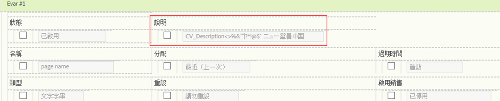

# 自訂報表說明

您可以提供eVar、prop、分類和事件的自訂報表說明。 所有使用者都能看到這些說明。

**[!UICONTROL Analytics]** > **[!UICONTROL Admin]** > **[!UICONTROL Report Suites]** > **[!UICONTROL Edit Settings]** >變 **[!UICONTROL *數&#x200B;*]**

>[!NOTE] 大部分傳統分類都能新增說明，但目前不適用於行動裝置分類。

1. 提供報表的說明。 字元數上限為255。
1. 按一下 **[!UICONTROL Save]**.

說明會顯示在兩個位置：

* 報告的標題列：

   

* 當您將滑鼠指標暫留在左側導覽的報表上時，工具提示：

   

