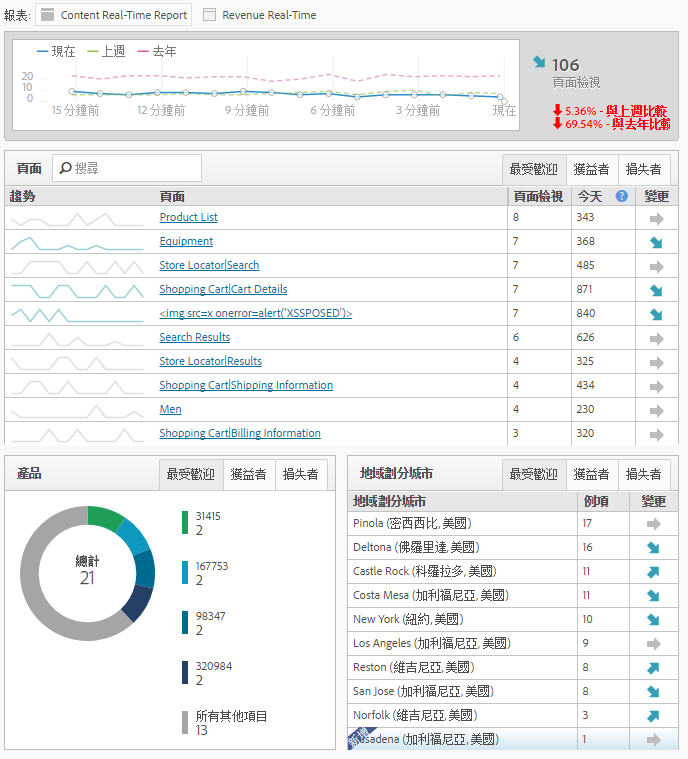

# 即時報表

顯示網頁流量並即時排名頁面檢視。 提供可操作的資料，供您據以進行業務決策。

>[!NOTE]即時報表不需要進行額外的實作或標記。它會運用您現有的 Adobe Analytics 實作。若要設定即時報表，請參 [閱即時報表設定](/help/admin/admin/realtime/t-realtime-admin.md)。

**[!UICONTROL Site Metrics]** > **[!UICONTROL Real-Time]**

請即時回答下列問題：我的網站有何趨勢、原因為何？它可讓您做為行銷人員，快速回應並主動管理行銷內容與宣傳的效能。 報告的即時資料延遲不到兩分鐘，而且會逐分鐘自動更新。

控制面板包含Adobe Analytics高頻度量和網站分析，以視覺化方式報告動態新聞和零售網站的流量和頁面檢視趨勢。 即時瞭解資料中每分每秒的趨勢，在收集資料後數秒內即可完成。 它使用即時關聯和追蹤內容及部分轉換，將資料收集並串流至自動更新的UI。

以下為兩個常見的使用案例：出版商想隨著使用者活動改變而促銷/取消促銷故事；以及行銷人員想追蹤新產品線的上市。

身為管理員，您可以

* 使用現有的維度或分類和量度，為每個報表套裝建立最多3個即時報表。 使用次要維度與主要維度建立關聯（或劃分）。
* 除了1個全網站量度外，每個報表新增3個維度（或分類）（一個主要和兩個次要）。
* 使用任何自訂事件、購物車事件或例項。
* 檢視高達 2 小時的歷史即時資料，並修改此設定：

   * 前 15 分鐘：1 分鐘詳細程度
   * 前 30 分鐘：1 分鐘詳細程度
   * 前 1 小時：2 分鐘詳細程度
   * 前 2 小時：4 分鐘詳細程度

* 例如，將上週的值與去年的值（以及今天的總計）進行比較。

請記住，eVar（轉換量度）不受支援，因為沒有永續性的概念。 雖然您可以選取轉換度量，但只有在維度設定在相同頁面上時，這些度量才能運作。 如需詳細資訊，請參閱設定即時報 [表中擷取的警告訊息](/help/admin/admin/realtime/t-realtime-admin.md)。

「管理員」或「所有報表存取」和「進階報表」權限群組中的任何使用者只能設定和檢視即時報表。 不過，即時確實尊重權限。 例如，如果您沒有查看收入的權利，您將無法檢視包含收入資料的即時報表。

## Data Latency as a Result of A4T Configuration {#section_806CE36354FC4C539A0DED9266A5C704}

在Adobe Target中啟用A4T整合後，Adobe Analytics中將會再延遲5-10分鐘。 此延遲增加可讓Analytics和Target的資料儲存在相同的點擊上，讓您依頁面和網站區段來劃分測試。

此延遲增加的現象會反映在所有 Adobe Analytics 服務和工具中 (包括即時資料流與即時報表)，且適用於下列情況：

* 對於即時串流、即時報告與API請求，以及流量變數的目前資料，僅會延遲具有補充資料ID的點擊。
* 對於轉換量度、已完成資料和資料饋送的目前資料，所有點擊都會延遲5-7分鐘。

請注意，即使您尚未完全實作該整合，該延遲增加現象也會在您實作身份服務後開始。
