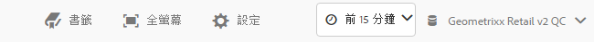
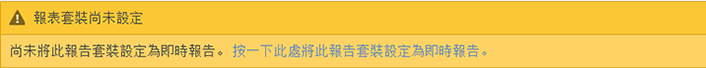
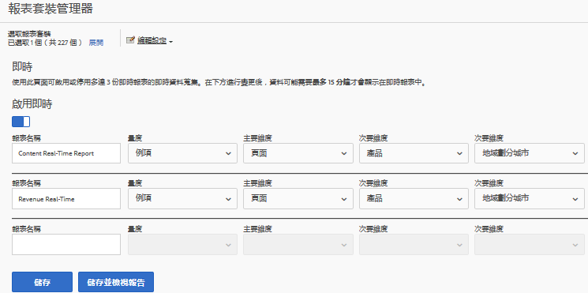
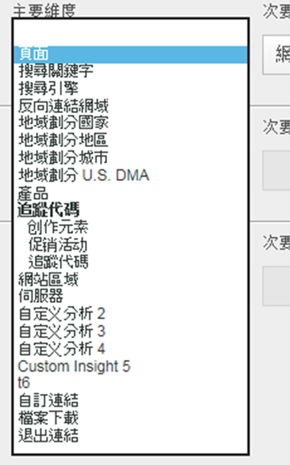
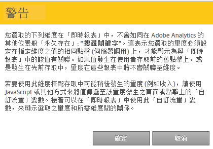

# 即時報表設定

設定即時報表的管理步驟。

在 Reports &amp; Analytics 中設定即時報表，包括選取報表套裝，以及為其選取最多 3 個報表。

1. 選取您要啟用即時報表的報表套裝。

   導覽至&#x200B;**[!UICONTROL 「Analytics]** > **[!UICONTROL 報表]** > **[!UICONTROL 檢視全部報表 > 網站量度]** > **[!UICONTROL 即時」]**，並從上方的下拉式清單中選取報表套裝：

   

   如果您嘗試對尚未設定即時報表的報表套裝檢視即時報表，會出現一則訊息，供您設定報表套裝。

   

1. 按一下&#x200B;**[!UICONTROL 「設定」]** (齒輪圖示)，執行[!UICONTROL 報表套裝管理器]。

   (也可從&#x200B;**[!UICONTROL 「Analytics]** > **[!UICONTROL 管理員 > 報表套裝]** > **[!UICONTROL 編輯設定]** > **[!UICONTROL 即時」]**&#x200B;中存取。)

1. 開啟&#x200B;**[!UICONTROL 啟用即時]**&#x200B;設定。
1. 設定最多 3 個報告的即時資料收集，每個報告各一個量度和三個維度或分類。

   

   如需深入瞭解支援的即時量度和維度，請參閱[支援的量度和維度](/help/admin/admin/realtime/realtime-metrics.md)。

   如果您已定義分類，則會以縮排顯示在其所定義的維度下方：

   

   >[!NOTE]
   >
   >針對單一即時報表，目前不支援啟用重複維度，即使為每個維度選取了不同的分類亦同。

   如需分類的詳細資訊，請參閱[關於分類](/help/components/c-classifications2/c-classifications.md)。

   >[!NOTE]
   >
   >在「即時」中，有些維度 (如「搜尋關鍵字」或「產品」) 不會像在 Adobe Analytics 中的其他位置一樣持續存在。選取非持續性的量度時，會出現此警告：

   

1. 按一下&#x200B;**[!UICONTROL 「儲存」]**&#x200B;或&#x200B;**[!UICONTROL 「儲存並檢視報表」]**。

   初始設定報告後，最多可能需要 20 分鐘，才會開始串流資料。從那時起，資料就立即可用。如需檢視即時報告的詳細資訊，請參閱[執行即時報告](https://marketing.adobe.com/resources/help/zh_TW/sc/user/reports_realtime.html)。

1. 依預設，所有使用者都能存取即時報告。
