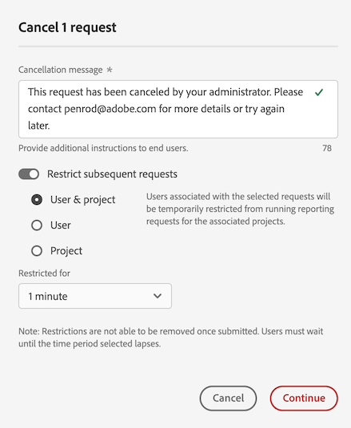

# 取消報告活動管理器中的報告請求

[!UICONTROL 報告活動管理員]可讓系統管理員快速診斷並取消報告要求，以修正尖峰報告期間的報告容量問題。

取消報表請求時，請考量下列事項：

* 您可以取消特定請求、取消特定使用者的所有請求，或取消與特定專案相關的所有請求。

  當您取消要求時，動作會記錄在[記錄檔](/help/admin/admin/logs.md)中。 [!UICONTROL **事件型別**]&#x200B;資料行顯示為&#x200B;[!UICONTROL **管理動作**]，而且可在&#x200B;[!UICONTROL **事件**]&#x200B;資料行取得取消的說明。

* 當您取消請求時，也可以選擇限制指定期間的後續請求。

  當您限制後續要求時，動作會記錄在[記錄檔](/help/admin/admin/logs.md)中。 [!UICONTROL **事件型別**]&#x200B;資料行顯示為&#x200B;[!UICONTROL **管理動作**]，而且可在&#x200B;[!UICONTROL **事件**]&#x200B;資料行取得限制的描述。

* 如果請求的&#x200B;[!UICONTROL **使用者**]&#x200B;資料行顯示為&#x200B;[!UICONTROL **無法辨識**]，則您無法取消請求。 發生這種情況時，表示使用者是在您沒有管理許可權的登入公司中。

如需報告活動管理員的詳細資訊，包括主要權益和許可權要求，請參閱[報告活動管理員概觀](/help/admin/admin/reporting-activity-manager/reporting-activity-overview.md)。

## 取消特定請求

您可以取消耗用大量報告容量的個別請求。

1. 在Adobe Analytics中，移至&#x200B;**[!UICONTROL 管理員]** > **[!UICONTROL 報告活動管理員]**。

1. 選取您要取消報表請求的報表套裝。<!--double-check this step-->

   如需此頁面上可用資料的詳細資訊，請參閱[在報告活動管理器中檢視報告活動](/help/admin/admin/reporting-activity-manager/reporting-activity.md)。

1. 選取&#x200B;[!UICONTROL **要求**]&#x200B;標籤，然後選取一或多個要求。

   <!-- add screenshot -->

1. 選取&#x200B;[!UICONTROL **取消要求**]。

   顯示&#x200B;[!UICONTROL **取消&#x200B;_x_報表要求**]&#x200B;對話方塊。

1. 取消訊息欄位會顯示取消使用者請求時向使用者顯示的訊息。 已提供預設訊息。 您可以更新預設訊息以提供其他詳細資料。

1. （選擇性）若要限制指定期間的未來請求，請執行下列步驟：

   1. 啟用選項&#x200B;[!UICONTROL **限制後續請求**]

      

   1. 從下列選項中選擇：

      | 選項 | 函數 |
      |---------|----------|
      | [!UICONTROL **使用者與專案**] | 與所選請求關聯的使用者將暫時被限制，無法執行關聯專案的報告請求。 |
      | [!UICONTROL **使用者**] | 與所選請求關聯的使用者將暫時被限制提出任何報告請求。 |
      | [!UICONTROL **專案**] | 與所選請求關聯的專案將暫時被限制執行所有報告請求。 |
      | [!UICONTROL **已針對**]&#x200B;限制 | 選擇限制要求的時間長度。 您可以選擇1分鐘（預設）、5分鐘、10分鐘、15分鐘或30分鐘。<!-- double-check this -->
限制設定後，您就無法提前移除限制。
 |

      {style="table-layout:auto"}

1. 選取&#x200B;[!UICONTROL **繼續取消**]。

   Analysis Workspace中會顯示通知，通知使用者請求已取消。 如需如何在Analysis Workspace中顯示此專案的詳細資訊，請參閱[使用者存取已取消報表時的體驗](#experience-when-users-access-a-cancelled-report)。

## 依使用者取消請求

您可以取消與一或多個使用者相關聯的所有要求。

1. 在Adobe Analytics中，移至&#x200B;**[!UICONTROL 管理員]** > **[!UICONTROL 報告活動管理員]**。

1. 選取您要取消報表請求的報表套裝。<!--double-check this step-->

   如需此頁面上可用資料的詳細資訊，請參閱[在報告活動管理器中檢視報告活動](/help/admin/admin/reporting-activity-manager/reporting-activity.md)。

1. 選取&#x200B;[!UICONTROL **使用者**]&#x200B;標籤，然後選取一或多個使用者。

   <!-- add screenshot -->

1. 選取&#x200B;[!UICONTROL **取消要求**]。

   顯示&#x200B;[!UICONTROL **取消x使用者**]&#x200B;的&#x200B;_x_&#x200B;報告要求對話方塊。

1. 取消訊息欄位會顯示取消使用者請求時向使用者顯示的訊息。 已提供預設訊息。 您可以更新預設訊息以提供其他詳細資料。

1. （選擇性）若要限制指定期間的未來請求，請執行下列步驟：

   1. 啟用選項&#x200B;[!UICONTROL **限制後續要求**]。

      

   1. 從下列選項中選擇：

      | 選項 | 函數 |
      |---------|----------|
      | [!UICONTROL **使用者與專案**] | 所選的使用者將暫時被限制，無法對關聯專案提出任何報告請求。 |
      | [!UICONTROL **使用者**] | 所選的使用者將暫時被限制，無法提出任何報告請求。 |
      | [!UICONTROL **專案**] | 與所選使用者關聯的專案將被限制，無法由任何使用者提出任何報告請求。 |
      | [!UICONTROL **已針對**]&#x200B;限制 | 選擇限制要求的時間長度。 您可以選擇1分鐘（預設）、5分鐘、10分鐘、15分鐘或30分鐘。<!--double-check this--> 
限制設定後，您就無法提前移除限制。
 |

      {style="table-layout:auto"}

1. 選取&#x200B;[!UICONTROL **繼續取消**]。

   Analysis Workspace中會顯示通知，通知使用者請求已取消。 如需如何在Analysis Workspace中顯示此專案的詳細資訊，請參閱[使用者存取已取消報表時的體驗](#experience-when-users-access-a-cancelled-report)。

## 依專案取消請求

您可以取消與一或多個專案關聯的所有請求。

1. 在Adobe Analytics中，移至&#x200B;**[!UICONTROL 管理員]** > **[!UICONTROL 報告活動管理員]**。

1. 選取您要取消報表請求的報表套裝。<!--double-check this step-->

   如需此頁面上可用資料的詳細資訊，請參閱[在報告活動管理器中檢視報告活動](/help/admin/admin/reporting-activity-manager/reporting-activity.md)。

1. 選取&#x200B;[!UICONTROL **專案**]&#x200B;標籤，然後選取一或多個專案。

   <!-- add screenshot -->

1. 選取&#x200B;[!UICONTROL **取消要求**]。

   顯示來自x專案的&#x200B;[!UICONTROL **取消&#x200B;_x_報告要求**]&#x200B;對話方塊。

1. 取消訊息欄位會顯示取消使用者請求時向使用者顯示的訊息。 已提供預設訊息。 您可以更新預設訊息以提供其他詳細資料。

1. （選擇性）若要限制指定期間的未來請求，請執行下列步驟：

   1. 啟用選項&#x200B;[!UICONTROL **限制後續要求**]。

      

   1. 從下列選項中選擇：

      | 選項 | 函數 |
      |---------|----------|
      | [!UICONTROL **使用者與專案**] | 所選的專案將暫時被限制，無法由關聯使用者提出任何報告請求。 |
      | [!UICONTROL **使用者**] | 與所選專案關聯的使用者將被限制，無法提出任何報告請求。 |
      | [!UICONTROL **專案**] | 選取的專案將暫時禁止任何使用者提出任何報告請求。 |
      | [!UICONTROL **已針對**]&#x200B;限制 | 選擇限制要求的時間長度。 您可以選擇1分鐘（預設）、5分鐘、10分鐘、15分鐘或30分鐘。<!--double-check this--> 
限制設定後，您就無法提前移除限制。
 |

      {style="table-layout:auto"}

1. 選取&#x200B;[!UICONTROL **繼續取消**]。

   Analysis Workspace中會顯示通知，通知使用者請求已取消。 如需如何在Analysis Workspace中顯示此專案的詳細資訊，請參閱[使用者存取已取消報表時的體驗](#experience-when-users-access-a-cancelled-report)。

## 依應用程式取消請求

您可以取消與一或多個應用程式關聯的所有要求。 取消與應用程式相關的請求時，您可以選擇進一步限制在指定期間內與該應用程式相關的請求。

應用程式包括：

* Analysis Workspace UI
* Workspace 排程專案
* Report Builder
* 產生器 UI：細分群體、計算量度、註解、客群等。
* 1.4 或 2.0 API 的 API 呼叫
* 智慧型警報
* 與任何人共用連結
* 查詢Analytics報表引擎的任何其他應用程式

若要依應用程式取消請求，請執行下列步驟：

1. 在Adobe Analytics中，移至&#x200B;**[!UICONTROL 管理員]** > **[!UICONTROL 報告活動管理員]**。

1. 選取您要取消報告要求的連線。<!--double-check this step-->

   如需此頁面上可用資料的詳細資訊，請參閱[在報告活動管理器中檢視報告活動](/help/admin/admin/reporting-activity-manager/reporting-activity.md)。

1. 選取&#x200B;[!UICONTROL **應用程式**]&#x200B;標籤，然後選取一或多個應用程式。

   <!-- add screenshot -->

1. 選取&#x200B;[!UICONTROL **取消要求**]。

   顯示來自x專案的&#x200B;[!UICONTROL **取消&#x200B;_x_報告要求**]&#x200B;對話方塊。

1. 取消訊息欄位會顯示取消使用者請求時向使用者顯示的訊息。 已提供預設訊息。 您可以更新預設訊息以提供其他詳細資料。

1. （選擇性）若要限制指定期間的未來請求，請執行下列步驟：

   1. 啟用選項&#x200B;[!UICONTROL **限制後續請求**]

      

   1. 從下列選項中選擇：

      | 選項 | 函數 |
      |---------|----------|
      | [!UICONTROL **使用者與專案**] | 選取的應用程式將暫時限制在相關使用者和專案所提出的任何報告請求中。
這是限制最少的選項。
 |
      | [!UICONTROL **使用者**] | 與所選應用程式相關聯的使用者將被限制提出任何報告請求。 |
      | [!UICONTROL **專案**] | 與所選應用程式關聯的專案將限制在任何使用者提出的任何報告請求中。 |
      | [!UICONTROL **已針對**]&#x200B;限制 | 選擇限制要求的時間長度。 您可以選擇1分鐘（預設）、5分鐘、10分鐘、15分鐘或30分鐘。<!--double-check this--> 
限制設定後，您就無法提前移除限制。
 |

      {style="table-layout:auto"}

1. 選取&#x200B;[!UICONTROL **繼續取消**]。

   應用程式中會顯示通知(例如在Analysis Workspace中)，通知使用者請求已取消。 如需如何在Analysis Workspace中顯示此專案的詳細資訊，請參閱[使用者存取已取消報表時的體驗](#experience-when-users-access-a-cancelled-report)。

## 使用者存取已取消報告時的體驗

在Analysis Workspace中，使用者嘗試存取受取消影響的報表或視覺效果時，會看到下列訊息：

### 專案上的訊息

當使用者嘗試存取受取消影響的專案時，他們會看到一則訊息，通知他們報表已暫時受限：

### 視覺效果上的訊息

當使用者嘗試存取受取消影響的視覺效果時，他們會看到一則訊息，通知他們報表的資料處理暫時受限：

