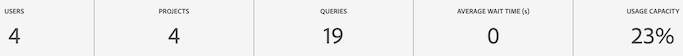

# 報告活動管理器

>[!NOTE]
>
>此功能目前正在進行 Beta 版測試。

報告活動管理器可讓您查看組織中每個報告套裝的報告容量。它為身為管理員的您提供報告使用量的詳細可見度，並幫助您在尖峰報告期間輕鬆診斷和修正容量問題。

當您的組織達到報告請求容量並遇到報告效能降低時，您現在無需 Adobe 客戶服務或工程部門的介入，就可以自行診斷報告問題。您可以在單一介面中輕鬆管理報告佇列並立即採取行動，以改善使用者體驗。這個工具：

* 在整個報表套裝中即時通知您目前的報表容量。
* 提供有關目前報告請求的詳細報告查詢資訊，無論已排入佇列還是進行中。
* 允許您透過優先處理某些報告請求並取消其他報告請求以釋放容量，而最佳化報告佇列。換句話說，您可以即時詢問：這時是否需要這份報告，或者我可以取消它以支持更緊急的報告？

## 存取報告活動管理器

在 Adobe Analytics 中，管理員前往「**[!UICONTROL 管理員]** > **[!UICONTROL 報告活動管理器]**」。

## 權限

您需要Analytics系統管理員權限才能管理報表活動。 產品管理員存取權不足。

## 檢視報告佇列

開啟報告活動管理員總覽頁面時，您將看到已啟用基本報告套裝清單。

| UI 元素 | 說明 |
| --- | --- |
| **[!UICONTROL 報告套裝]** | 您正在監控其報告活動的基本報告套裝。 |
| **[!UICONTROL 虛擬報告套裝]** | 顯示注入到此基本報告套裝所有虛擬報告套裝。虛擬報告套裝因套用了額外層級的篩選和細分，而增加了報告請求的複雜性。來自虛擬報告套裝的所有請求都會合併並歸結為基本報告套裝。
例如，如果您有來自 5 個 VRS 的 10 個請求，那麼在基本層級的報告套裝中會有 50 個請求。如此一來，您很快就會達到容量。 |
| **[!UICONTROL 使用容量]** | 以百分比即時顯示使用了多少報告套裝的報告容量。 |
| **[!UICONTROL 狀態]** | 四個可能狀態指標： <ul><li>**紅色 —  [!UICONTROL 容量]**:報表套裝的報表容量已超過上限。 (95% - 100%) </li><li>**黃色 —  [!UICONTROL 接近容量]**:此報表套裝有達到其最大容量的危險。 (90% - 94%)</li><li>**綠色 —  [!UICONTROL 一切都好]**:報告能力很強。 (0% - 90%)</li><li>**灰色 —  [!UICONTROL 狀態待定]**:?</li></ul> |

### 其他報表活動動作

* 按一下右上角的 **[!UICONTROL 重新整理]** 重新整理結果。
* 按一下報告套裝名稱左側的星號，將此報告套裝加到我的最愛。
* 查看左上角的 **[!UICONTROL 我的最愛]**，顯示您的最愛報告套裝。
* 在搜尋列中按名稱或 ID 搜尋報告套裝。
* 按狀態篩選報告套裝。

## 檢視個別報告套裝的報告活動

按一下您要檢視其詳細資訊之報表套裝的標題連結。

### 折線圖

折線圖顯示過去2小時內所選報表套裝的報表活動。

* X軸顯示過去2小時的報告容量資料。
* Y軸顯示查詢的平均等待時間（以秒為單位）。
* 您可以將滑鼠移至折線圖上，即可檢視該即時的時間點和平均等待時間。

   

### 篩選器

您可以依「應用程式」（請參閱下表中的清單）、依「使用者」及依「專案」篩選表格。

### 摘要數字

摘要數字顯示下列資訊：

| 摘要數字 | 說明 |
| --- | --- |
| 用戶 | 目前有多少使用者傳送報表請求至此報表套裝。 |
| 專案 | 工作區專案、Report Builder活頁簿等 |
| 查詢 | 當前運行的查詢數。 |
| 平均等待時間 | 所有正在運行的查詢的平均等待時間。 |
| 使用容量 | 此報表套裝的目前使用量。 |

{style=&quot;table-layout:auto&quot;}

### 表格

下表詳細列出報表套裝的詳細資料。

| 欄目 | 說明 |
| --- | --- |
| 查詢ID | 可用於疑難排解。 |
| 執行時間 | 查詢已運行多久。 |
| 等待時間 | 處理查詢之前等待的時間。 通常為「0」，但容量足夠。 |
| 開始時間 | 查詢開始處理時（管理員的當地時間）。 |
| 應用程式 | 「報表活動管理員」支援的應用程式為： <ul><li>Analysis Workspace UI</li><li>工作區已排程專案</li><li>Report Builder</li><li>建立器UI:區段、計算量度、註解、對象等</li><li>來自1.4或2.0 API的API呼叫（5個同時請求）</li><li>智慧型警報</li></ul> |
| 使用者 | 啟動查詢的用戶。 |
| 專案 | 工作區專案、Report Builder活頁簿等 |
| 月份界限 | 一個請求跨越的月邊界數。 這會增加請求的複雜性。 |
| 「欄」 | 工作區中量度和劃分的數量，可評估請求的複雜性。 |
| 區段 | 套用至此請求的區段數。 這會增加請求的複雜性。 |
| 狀態 | 四個可能狀態指標： <ul><li>**紅色 —  [!UICONTROL 容量]**:報表套裝的報表容量已超過上限。 （95%以上）</li><li>**黃色 —  [!UICONTROL 接近容量]**:此報表套裝有達到其最大容量(90% - 95%)的危險。</li><li>**綠色 —  [!UICONTROL 一切都好]**:報告能力很強。</li><li>**[!UICONTROL 狀態待定]**:狀態不可用。</li></ul> |

{style=&quot;table-layout:auto&quot;}

## 取消報表請求

取消請求

1. 勾選一或多個方塊的左側 **[!UICONTROL 查詢ID]** 在表格中按一下 **[!UICONTROL 取消請求]** 在底部。
1. 在 **[!UICONTROL 取消x查詢]** 窗口，您可以根據需要修改取消消息。
1. 按一下&#x200B;**[!UICONTROL 「繼續」]**。

   

例如，工作區中的應用程式使用者會看到下列通知出現在其專案中：

## 常見問答

| 問題 | 回答 |
| --- | --- |
| 我可以購買額外的報告容量嗎？ | 此功能將於近期推出。 |
| 其他問題？ |  |

{style=&quot;table-layout:auto&quot;}
