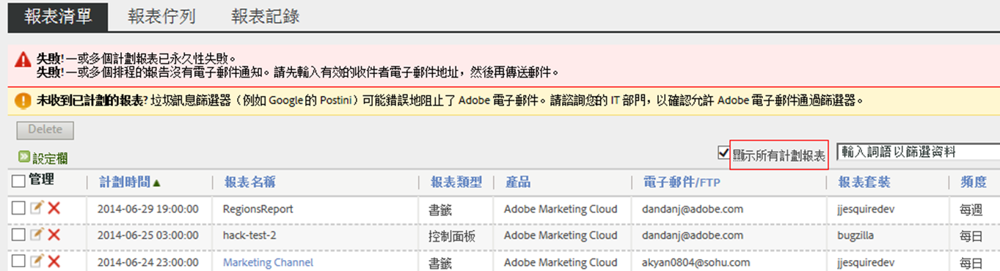
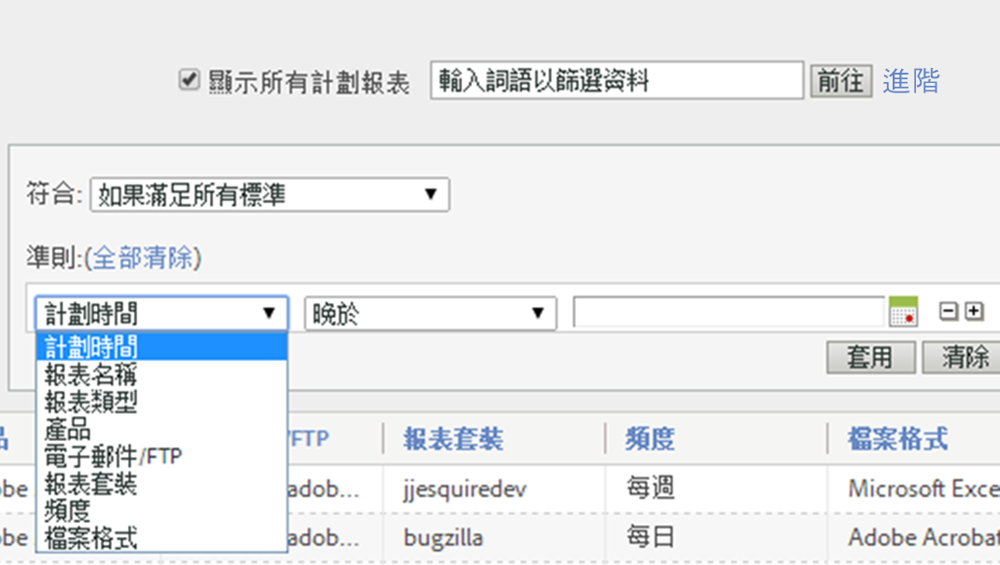
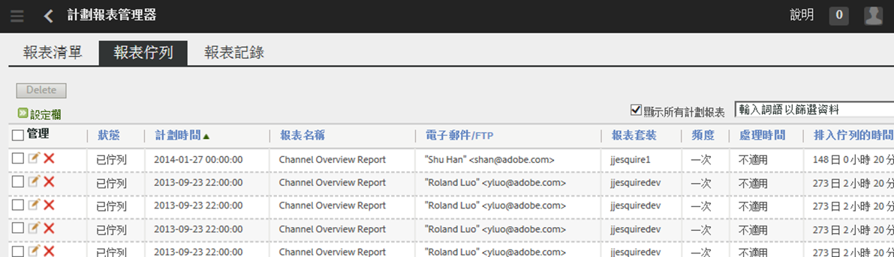
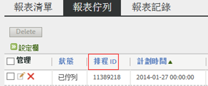

# 排程報表佇列

讓管理員層級使用者查看與管理組織中的排程報表。

**[!UICONTROL Analytics]** &gt; **[!UICONTROL 元件]** &gt; **[!UICONTROL 排程報表]**

「排程報表管理員」中的管理層級功能包含:

* 在組織中[「顯示所有計劃報表」](/help/admin/admin/scheduled-reports-admin.md#section_3F167CAAEEC24140B476CF95B7402690)的選項。
* 組織中的[進階篩選功能](/help/admin/admin/scheduled-reports-admin.md#section_206A52A85DE84947AAB3AD082FBF6275)。
* 新的[「報表佇列」](/help/admin/admin/scheduled-reports-admin.md#section_03C866115D354BB182E90BF4D52F1E0B)標籤會列出報告伺服器上所有佇列等候執行的報告。
* 在「報表佇列」介面中公開「[排程 ID](/help/admin/admin/scheduled-reports-admin.md#section_568B70F4228C4229977CB85D2DCD53A1)」。

## 顯示所有計劃報表 {#section_3F167CAAEEC24140B476CF95B7402690}

在&#x200B;**[!UICONTROL 報表清單]**&#x200B;標籤上，除了您私人排程的報表，您還可以&#x200B;**[!UICONTROL 顯示組織中所有已排程報表]**。

> [!NOTE]**[!UICONTROL 「報表名稱」]**&#x200B;欄會顯示正在排程的報表名稱，而&#x200B;**[!UICONTROL 「檔案名稱」]**&#x200B;欄則會顯示您在「進階傳送選項」中所設定的所有自訂檔案名稱。結果就是，若您排定相同報表類型的多份報表並且逐一指定自訂名稱，則「排程報告管理員」就會顯示具有相同報表名稱但是檔案名稱不同的多個項目。這是由於正在排程的後端報表是相同的所致，因此「報表名稱」欄會出現除了自訂檔案名稱 (依設定) 之外的所有報表名稱皆相同的情況。

## 進階篩選功能 {#section_206A52A85DE84947AAB3AD082FBF6275}

例如，如果您要篩選所有排程為每小時執行的報表，可在&#x200B;**[!UICONTROL 「進階」]**&#x200B;篩選器中指定&#x200B;**[!UICONTROL 「頻率等於每小時」]**，然後按一下&#x200B;**[!UICONTROL 「套用」]**:

## 報表佇列 {#section_03C866115D354BB182E90BF4D52F1E0B}

此佇列可讓您管理排程報告，以及可能可以刪除「堵塞」佇列的排程報告。(通常報告在 4 小時後逾時)。

「報表佇列」也能讓您「跳過計劃報表一次」。只需按一下&#x200B;**[!UICONTROL 「管理」]**&#x200B;欄中的藍色圖示。

## 排程 ID {#section_568B70F4228C4229977CB85D2DCD53A1}

當您需要聯絡 Adobe Client Care 以便尋求排程報表問題的解決辦法時，「報表佇列」介面中公開的&#x200B;**[!UICONTROL 「排程 ID」]**&#x200B;可提供協助。

