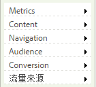

# 簡化的報表功能表

在 Reports &amp; analytics 中實作簡化報表功能表的步驟。

簡化的Adobe報告與分析功能表可讓您選擇套用替代和簡化的功能表，並在下方套用已重組的檔案夾。 簡化的功能表預設會顯示這些選項：

>[!NOTE] 請注意，套用簡化的功能表，會移除您已對預設功能表結構自訂的所有設定，也會對您組織中的所有 Marketing Reports &amp; analytics 使用者實作簡化的功能表結構。由於無法回復現有功能表結構中的任何自訂項目，在實作此新的功能表之前請先審慎考慮後果 (例如已針對現有功能表結構開發的培訓項目)。

1. 導覽至 **[!UICONTROL Analytics]** > **[!UICONTROL Admin]** > **[!UICONTROL Report Suites]** 以開啟「報表套裝管理員」。
1. 選取您要對其實作簡化之功能表結構的報表套裝。
1. Go to **[!UICONTROL Edit settings]** > **[!UICONTROL General]** > **[!UICONTROL Customize Menus]**.
1. Click **[!UICONTROL Restore Simplified]** to implement the simplified menu structure.

   

1. To go back to the (non-customized) default menu, click **[!UICONTROL Restore Defaults]**.
