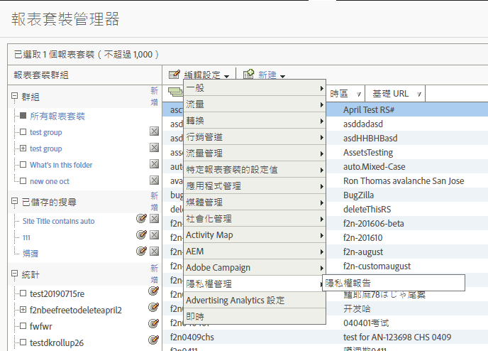
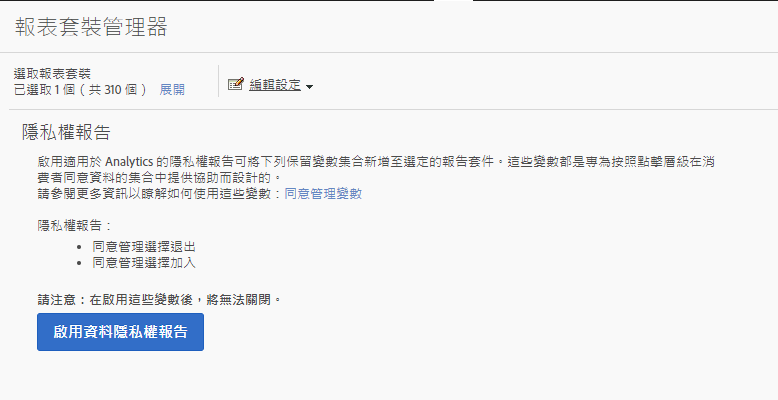
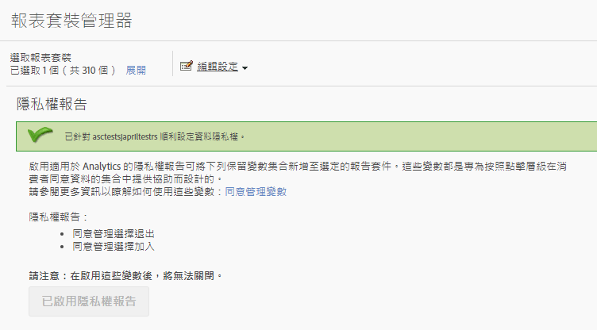
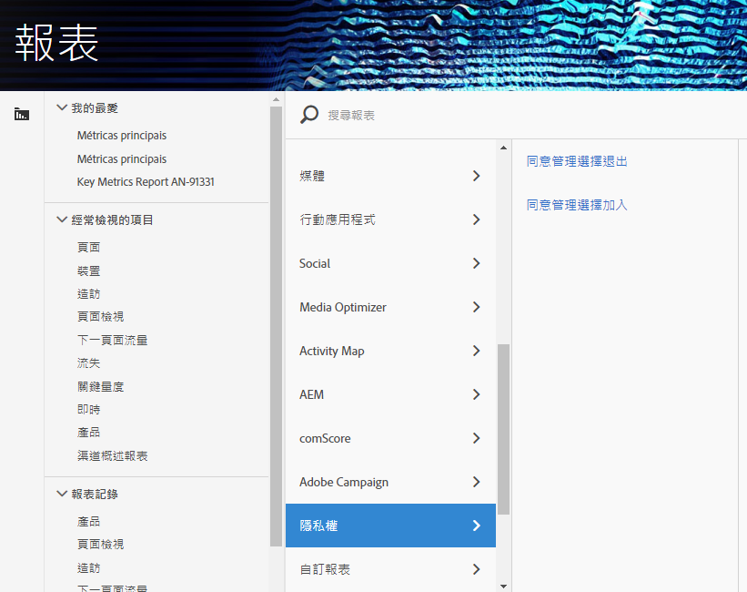

# 隱私權報表變數

為了在管理隱私權資料方面提供額外協助，我們提供一組保留變數，可搭配特定上下文資料變數使用。
這些隱私權報表變數提供簡單易用的架構，可用來擷取每個 Analytics 點擊的隱私權狀態。

## 變數

* 同意管理選擇退出
   * 保留變數: 清單 Prop
   * 類型: 逗號分隔字串
   * 包含:
      * `contextData.['cm.ssf']=1` 顯示為 SSF
      * `contextData.['opt.dmp']=N` 顯示為 DMP
      * `contextData.['opt.sell']=N` 顯示為 SELL

* 同意管理選擇加入
   * 保留變數: 清單 Prop
   * 類型: 逗號分隔字串
   * 包含:
      * `contextData.['opt.dmp']=Y` 顯示為 DMP
      * `contextData.['opt.sell']=Y` 顯示為 SELL

## 報表

您可透過 Analytics Admin Console 中提供的新「隱私權」設定來啟用隱私權報表變數。

每個報表套裝皆可依照以下步驟設定:
1. 在 Reports &amp; Analytics 中，按一下&#x200B;**[!UICONTROL 「管理員 &gt; 報表套裝」]**。
1. 選取您要收集媒體資料的報表套裝，然後按一下&#x200B;**[!UICONTROL 「編輯設定 &gt; 隱私權管理」]**。

   

1. 按一下&#x200B;**[!UICONTROL 「啟用資料隱私權報表」]**&#x200B;按鈕。

   > [!NOTE] 這些變數一經啟用即無法關閉。

   

1. 啟用後會顯示一則確認訊息。

   

1. 保留的變數現在可用於報表。請參閱「同意管理選擇退出」和「同意管理選擇加入」。

   

## 實施

已預先定義三個上下文資料變數，用於搭配隱私權報表管理保留變數使用。如何管理並保留這些變數的設定取決於每位實作工程師。

如需實作上下文資料變數的通用指引，請參閱[上下文資料變數](https://docs.adobe.com/help/en/analytics/implementation/javascript-implementation/variables-analytics-reporting/context-data-variables.html)。

### SSF

* 上下文資料: `contextData.['cm.ssf']`
* 接受的值:
   * 1 - 傳送「1」值時，表示伺服器端轉送處於選擇退出狀態。值「1」與此變數搭配使用，將會封鎖此點擊與 Adobe Audience Manager 間的共用。請參閱[ AAM ePrivacy 合規性](https://docs.adobe.com/help/en/analytics/integration/audience-analytics/audience-analytics-workflow/ssf-gdpr.html)。
   * 此參數不接受其他值。

### DMP

* 上下文資料: `contextData.['opt.dmp']`
* 接受的值: 
   * N - 傳送「N」值時，表示消費者選擇不分享至資料管理平台。**注意:** 目前，將此變數設為「N」並不會封鎖對 AAM 的分享，不過，我們將在 2020 年初新增封鎖 AAM 功能呼叫的功能。目前 Adobe 建議同時設定 `c.cm.ssf=1` 和 `c.opt.dmp=N` 以封鎖將點擊傳送至 AAM。
   * Y - 傳送「Y」值時，表示消費者選擇分享至資料管理平台。

### SELL

* 上下文資料: `contextData.['opt.sell']`
* 接受的值: 
   * N - 傳送「N」值時，表示消費者選擇不分享或銷售資料給第三方。
   * Y - 傳送「Y」值時，表示消費者選擇分享或銷售資料給第三方。
