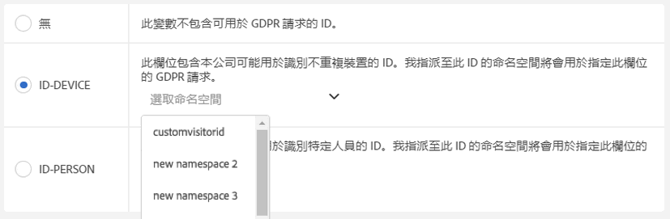
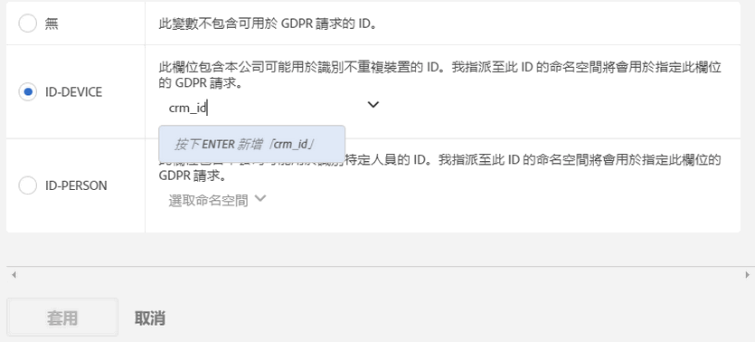

# Analytics 變數的資料隱私權標籤

## 為何標籤您的資料？{#section_A075CDF3AD0744BD8CEB41CE3FB7BFB3}

許多 Adobe 客戶的法律團隊都已檢閱過資料隱私權法規 (GDPR、CCPA 等)，且已針對如何處理資料以遵循資料隱私權法規得出各自的結論。各公司的法律解釋可能有所不同，而且所需的資料處理設定也可能因客戶而異。由於客戶對資料隱私權資料處理和不同資料集有不同的偏好，因此 Adobe 可讓 Adobe 客戶 (以資料控管者的身分) 根據其獨特資料，針對資料隱私權資料處理自訂其所需的設定。這讓每個獨特客戶都能夠針對其品牌和獨特的資料集，透過最適合的方式處理資料隱私權請求。

Adobe Analytics 會根據資料敏感程度和合約規定提供適用的資料標籤工具。標籤是相當重要且實用的功能，有助於：(1) 識別資料主題、(2) 判斷要傳回做為存取要求一部分的資料，以及 (3) 識別刪除要求中須刪除的資料欄位。

在確定應將哪些標籤套用至哪些變數/欄位之前，您需要先[瞭解在 Analytics 資料中擷取的 ID](/help/admin/c-data-governance/gdpr-analytics-ids.md)，並決定要將哪個 ID 用於資料隱私權請求。

Adobe Analytics 資料隱私權實作支援下列身分資料、敏感資料和資料控管的標籤。

## DULE 標籤 {#section_B2E78130957647338495EF37DE21D6BC}

> [!NOTE] 資料使用標籤和實行 (DULE) 架構的設計目的，是為了在所有 Adobe 解決方案/服務/平台上提供統一方式，以擷取、通訊和使用 Adobe Experience Cloud 上資料的中繼資料。中繼資料可協助資料控管單位指出哪些資料屬於個人資料、哪些資料屬於敏感資料，以及資料具有哪些合約規定。在此最初發行的版本中，Analytics 只會公開與資料隱私權相關的 DULE 標籤。隨著其他 Adobe 產品陸續實施 DULE 標籤支援，未來版本將會引入其他敏感資料標籤和合約標籤，以確保只依據法律允許的方法使用產品間共用的資料。

## 身分資料標籤 (DULE) {#identity-data-labels}

身分資料「I」標籤可用來分類可識別身分或聯絡特定人員的資料。

<table id="table_6B5368D714424E52835D5DFE189BD080"> 
 <thead> 
  <tr> 
   <th colname="col1" class="entry"> 標籤 </th> 
   <th colname="col2" class="entry"> 定義 </th> 
   <th colname="col3" class="entry"> 其他需求 </th> 
  </tr>
 </thead>
 <tbody> 
  <tr> 
   <td colname="col1"> <p>I1 </p> </td> 
   <td colname="col2"> <p><b>可直接識別</b>：可以明確識別或可與個人直接聯絡的資料，例如姓名或電子郵件地址。 </p> </td> 
   <td colname="col3"> 
    <ul id="ul_4E2AD59D119E40D28B869D0BB63B9FD9"> 
     <li id="li_AC3E99B57E3A4AE2A12BE219680AFC58">無法在事件上設定 </li> 
     <li id="li_BB66992863C8402F8D58656293F31E71">無法在銷售 eVar 上設定 </li> 
    </ul> </td> 
  </tr> 
  <tr> 
   <td colname="col1"> <p>I2 </p> </td> 
   <td colname="col2"> <p><b>可間接識別</b>：可與任何其他資料合併使用，以識別或直接聯絡個人或裝置的資料， </p> <p>不允許自行識別個人身分，但可以與其他資訊 (可能有、也可能沒有) 整合，以識別某個對象。例如：客戶忠誠度編號或公司 CRM 系統所用的 ID (每位客戶指定一個唯一 ID)。 </p> </td> 
   <td colname="col3"> 
    <ul id="ul_A0EF0F3DC5804D4FBE228946D697ABEB"> 
     <li id="li_A592EA6DA82C4D8C80E03F02ADF4E20E">無法在事件上設定 </li> 
     <li id="li_46CE7B1E84884CDAB356A6DF89397849">無法在銷售 eVar 上設定 </li> 
    </ul> </td> 
  </tr> 
 </tbody> 
</table>

## 敏感資料標籤 (DULE) {#sensitive-data-labels}

系統會使用敏感資料「S」標籤，將地理資料等敏感資料加以分類。未來將會引入其他敏感資料標籤，以識別其他類型的敏感資訊。

<table id="table_A778A508620545CCB37830E5CF1C75B7"> 
 <thead> 
  <tr> 
   <th colname="col1" class="entry"> 標籤 </th> 
   <th colname="col2" class="entry"> 定義 </th> 
  </tr>
 </thead>
 <tbody> 
  <tr> 
   <td colname="col1"> <p>S1 </p> </td> 
   <td colname="col2"> <p> 與緯度和經度有關的精確地理位置資料可用於判定裝置的確切位置 (誤差範圍小於 100 公尺)。 </p> </td> 
  </tr> 
  <tr> 
   <td colname="col1"> <p>S2 </p> </td> 
   <td colname="col2"> <p> 地理位置資料可用於判定廣泛定義的地理圍欄區域。 </p> </td> 
  </tr> 
 </tbody> 
</table>

## 資料控管標籤 (資料隱私權) {#data-governance-labels}

資料控管標籤讓使用者可分類反映隱私權相關考量事項，以及遵循法規和公司政策的合約條件資料。

**資料隱私權存取標籤**

<table id="table_663EFF43A454498386F7F3E60875E0F8"> 
 <thead> 
  <tr> 
   <th colname="col1" class="entry"> 標籤 </th> 
   <th colname="col2" class="entry"> 定義 </th> 
   <th colname="col3" class="entry"> 其他需求 </th> 
  </tr>
 </thead>
 <tbody> 
  <tr> 
   <td colname="col1"> <p>無 </p> </td> 
   <td colname="col2"> <p>如果此變數包含的資料中，不包括資料隱私權存取請求中傳回至資料主體的必要資料，請選取此選項。 </p> </td> 
   <td colname="col3"> </td> 
  </tr> 
  <tr> 
   <td colname="col1"> <p>ACC-ALL </p> </td> 
   <td colname="col2"> <p><u>所有</u>資料隱私權存取請求皆應包含此欄位中的值。 </p> <p>如果此值來自多人共享的裝置，則您身為資料控管者可藉由套用此標籤，表明此欄位資料可與任何具備該共享裝置存取權限的人共享。 </p> </td> 
   <td colname="col3"> <p>將會為所有資料隱私權請求傳回帶有此標籤的欄位。 </p> </td> 
  </tr> 
  <tr> 
   <td colname="col1"> <p>ACC-PERSON </p> </td> 
   <td colname="col2"> <p> 只有在相當確定點擊來自資料主體時 (可透過符合 ID-PERSON 欄位值的資料隱私權請求 ID 來判斷)，資料隱私權請求才可包含此欄位中的值。 </p> </td> 
   <td colname="col3"> <p>您也必須在該報表套裝中某個變數上設定 ID-PERSON 標籤，並使用該 ID 提交請求，否則不會套用該標籤。 </p> </td> 
  </tr> 
 </tbody> 
</table>

儘管有幾個變數會接收到其他標籤，不過我們還是希望您將存取標籤套用至大部分變數中。然而，要與資料主體共用哪些收集到的資料，最終取決於您與法律團隊的諮詢結果。

**資料隱私權刪除標籤**

<table id="table_59DFCE4D90214CB5972BDDE5B7391B4D"> 
 <thead> 
  <tr> 
   <th colname="col1" class="entry"> 標籤 </th> 
   <th colname="col2" class="entry"> 定義 </th> 
   <th colname="col3" class="entry"> 其他需求 </th> 
  </tr>
 </thead>
 <tbody> 
  <tr> 
   <td colname="col1"> </td> 
   <td colname="col2"> <p>刪除標籤與其他標籤的相異之處在於它們並非互斥。您可以選取任一個標籤、同時選取兩者或兩者皆不選。您不一定要加上個別的「無」標籤，只要不勾選任何一個「刪除」選項就會顯示「無」。 </p> </td> 
   <td colname="col3"> <p>惟欄位含有允許點擊與資料主體建立關聯的值時 (亦即允許辨識資料主體的身分)，才需要使用刪除標籤。 </p> <p> 其他個人資訊 (我的最愛、瀏覽/購物記錄、健康情況等)則不需要刪除，因為與資料主體之間的關聯將遭到截斷。 </p> </td> 
  </tr> 
  <tr> 
   <td colname="col1"> <p>DEL-DEVICE </p> </td> 
   <td colname="col2"> <p>對於資料隱私權刪除請求，只有在點擊含有特定 ID-DEVICE 的請求中，才應對此欄位的值進行匿名處理。 </p> <p>如果在其他點擊中出現相同的值而未遭刪除，則其他點擊中的例項不會變更。這會導致運算此欄位中獨特計數的報表計數發生變化。在共享裝置上，這不只會影響資料主體，也可能會移除其他人的識別碼。 </p> <p>如果此欄位也具有 ID-DEVICE 標籤，而且以該欄位中的值做為資料隱私權請求的 ID，則計數不會變更。 </p> </td> 
   <td colname="col3"> 
    <ul id="ul_45C3A09E1F05492B97C3F3DEA7C78FBC"> 
     <li id="li_BAB277F92F284ADE9D7B6839BDD716E2">也需要 I1 或 I2 或 S1 標籤 </li> 
     <li id="li_6DDFC0571457489CBA9D76F547247F20">無法在事件上設定 </li> 
     <li id="li_E79C6DFC6C58478EAA1504E3820D512C">無法在銷售 eVar 上設定 </li> 
     <li id="li_B78E273212E447D49D0707E174B66DEC">無法在分類上設定 </li> 
     <li id="li_F0F52D0DE7454557A6A97063C1FBC372">您必須使用 ID-DEVICE 提交請求或將 expandIDs 設定為 true，否則不會套用該標籤。 </li> 
    </ul> </td> 
  </tr> 
  <tr> 
   <td colname="col1"> <p>DEL-PERSON </p> </td> 
   <td colname="col2"> <p>對於資料隱私權刪除請求，只有在點擊含有特定 ID-PERSON 的請求中，才應對此欄位的值進行匿名處理。 </p> <p>如果在其他點擊中出現相同的值而未遭刪除，則其他點擊中的該值不會變更。這會導致運算此欄位中獨特計數的報表計數發生變化。如果此欄位也具有 ID-PERSON 標籤，而且以該欄位中的值做為資料隱私權請求的 ID，則計數不會變更。 </p> </td> 
   <td colname="col3"> 
    <ul id="ul_6722E42E036E47B4B5E17DC213636D51"> 
     <li id="li_6C1A64FF68AF428A827D8C6C33E22970">也需要 I1 或 I2 或 S1 標籤 </li> 
     <li id="li_8053533FFE874EE795C8B6043A4F73B3">無法在事件上設定 </li> 
     <li id="li_D6700CF4D03E44DDA83C4DDBB5B70CC3">無法在銷售 eVar 上設定 </li> 
     <li id="li_B6C2B15484B344889DBF29B62E2EA8FD">無法在分類上設定 </li> 
     <li id="li_3BBD0C27D9644C2B9618457A0BFC15EF">您也必須在該報表套裝中某個變數上設定 ID-PERSON 標籤，並使用該 ID 提交請求，否則不會套用該標籤。 </li> 
    </ul> </td> 
  </tr> 
 </tbody> 
</table>

**資料隱私權身分標籤**

<table id="table_F6BBC868457443A19A7B693BD6C55B4B"> 
 <thead> 
  <tr> 
   <th colname="col1" class="entry"> 標籤 </th> 
   <th colname="col2" class="entry"> 定義 </th> 
   <th colname="col3" class="entry"> 其他需求 </th> 
  </tr>
 </thead>
 <tbody> 
  <tr> 
   <td colname="col1"> <p>無 </p> </td> 
   <td colname="col2"> <p>此變數不包含用於資料隱私權請求的 ID。 </p> </td> 
   <td colname="col3"> <p>如果此欄位含有透過資料隱私權 API 或 UI 提交存取或刪除請求時會使用的 ID，您才需要設定這些標籤中的其中一個。 </p> </td> 
  </tr> 
  <tr> 
   <td colname="col1"> <p>ID-DEVICE </p> </td> 
   <td colname="col2"> <p>此欄位包含的 ID 可用於針對資料隱私權請求識別裝置，但無法辨別共用裝置上的不同使用者。 </p> <p>您不需要為所有包含 ID 的變數指定此標籤 (這是 I1/I2 標籤的作用)。如果您使用儲存在此變數中的 ID 提交資料隱私權請求，而且想要搜尋此變數以找出指定 ID，請使用此標籤。 </p> </td> 
   <td colname="col3"> 
    <ul id="ul_618019CB8FCA4A5C94C47636240197B2"> 
     <li id="li_0E5ADED36FF24A348FDD434E2CC8C8EE">也需要 I1 或 I2 標籤 </li> 
     <li id="li_20BCFF07B2BF468C8E0D477C10B2EF9F">無法在事件上設定 </li> 
     <li id="li_0BD73EEF4184475D8E97878CF8DBEB90">無法在銷售 eVar 上設定 </li> 
     <li id="li_129851035C4A4BF0922296B4C3BEE39B">無法在分類上設定 </li> 
    </ul> </td> 
  </tr> 
  <tr> 
   <td colname="col1"> <p>ID-PERSON </p> </td> 
   <td colname="col2"> <p>此欄位包含的 ID 可針對資料隱私權請求識別已驗證的使用者 (特定人員)。 </p> <p>您不需要為所有包含 ID 的變數指定此標籤 (這是 I1/I2 標籤的作用)。如果您要使用儲存在此變數中的 ID 提交資料隱私權請求，而且想要搜尋此變數以找出指定 ID，請使用此標籤。 </p> </td> 
   <td colname="col3"> 
    <ul id="ul_0C7EEC8FCB5C4BCDA5D48F3C98770A67"> 
     <li id="li_2E781AE8D7A046A7996C7300CA854B86">也需要 I1 或 I2 標籤 </li> 
     <li id="li_EB4C6430C218405DAAE81DEE010DCAA2">無法在事件上設定 </li> 
     <li id="li_05AA67B45974474F9DA520E8B877BA11">無法在銷售 eVar 上設定 </li> 
     <li id="li_8A6BF4B40ED249289EAD46FE1C755FB0">無法在分類上設定 </li> 
    </ul> </td> 
  </tr> 
 </tbody> 
</table>

## 將變數標示為 ID-DEVICE 或 ID-PERSON 時提供命名空間 {#section_F0A47AF8DA384A26BD56032D0ABFD2D7}

當您將變數標示為 ID-DEVICE 或 ID-PERSON 時，系統會提示您提供命名空間。您可以使用先前定義的命名空間或定義新的命名空間。

**使用先前定義的命名空間**

如果您先前曾將 ID 標籤指派給登入公司中任何報表套裝的其他變數，您可以選取任何一個現有的命名空間。如果此變數包含的 ID 類型與先前以此命名空間為標籤的其他變數相同，而且您想要在提交請求時搜尋所有的變數，您應重複使用該命名空間。

1. 按一下&#x200B;**[!UICONTROL 「選取命名空間」]**，然後選取任何一個現有的命名空間。
1. 按一下&#x200B;**[!UICONTROL 「套用」]**。



**定義新的命名空間**

您也可以定義新的命名空間。我們建議將命名空間字串限制為英數字元，再加上底線、破折號及空格字元。所有字元都會轉換為小寫。

1. 按一下&#x200B;**[!UICONTROL 「選取命名空間」]**，然後輸入命名空間標題。

   

1. 按下 **[!UICONTROL Enter]** 即可新增此命名空間。「套用」按鈕必須等到現在才會啟用。
1. 按一下&#x200B;**[!UICONTROL 「套用」]**。

您指定為命名空間的字串，也就是在透過資料隱私權 API 提交請求 (即「namespace」參數的值) 時應使用的字串。接著，請求會讓 Adobe Analytics 搜尋所有報表套裝中共用此命名空間的變數，找出請求中指定的 ID。

您不需要為所有包含 ID 的變數指定 ID-DEVICE 或 ID-PERSON 標籤 (這是 I1/I2 標籤的作用)。如果您要使用儲存在此變數中的 ID 提交資料隱私權請求，而且想要搜尋此變數以找出指定 ID，請使用此標籤。舉例來說，如果 eVar1 含有電子郵件地址，而 eVar2 含有登入使用者名稱，不過您只會以使用者名稱來提交請求，便可以使用命名空間「user name」將 eVar1 標示為 I1、ACC-PERSON、DEL-PERSON，而將 eVar2 標示為 I2、ACC-PERSON、DEL-PERSON、ID-PERSON。接著，您可以利用使用者區段 JSON 區塊來提交請求，如下所示：

```
{
     "namespace": "user name",
     "type": "analytics",
     "value": "rocketman123"
}
```

在同一個報表套裝內，不同變數可以使用相同的命名空間。例如，某些自訂實作會將 CRM-ID 儲存在 prop 和 eVar 中。如果兩者其中之一一律會發生 CRM-ID (如 eVar)、偶爾發生在另一個變數中 (即 prop)，以及不發生在 eVar 時也絕對不會發生在 prop，則只有 eVar 需要 ID 標籤和命名空間，因為 Adobe 只能在該 eVar 中搜尋 ID。然而如果 CRM-ID 有時候會發生在某個變數中，有時則會發生在另一個變數中，那麼這兩個變數都應該擁有相同的命名空間，而 Adobe 會搜尋這兩個變數，找出在以此命名空間提交之資料隱私權請求中指定 ID 的發生次數。您仍應針對所有這些變數設定 DEL 標籤；如此一來，不論這個值出現在任何位置，都會對其進行匿名處理。

又例如，您的 CRM ID 可能有時候會透過 eVar1 傳送，有時候透過 prop7。於是，您會建立一條處理規則，將值從 eVar1 (若有的話) 複製到 eVar3，否則系統會將值從 prop7 複製到 eVar3。在這種情況下，eVar3 將一律包含 CRM ID (若為已知 ID)，所以只有 eVar3 需要 ID-PERSON 標籤。

> [!CAUTION] 系統會保留命名空間「visitorId」和「customVisitorId」，以識別 Analytics 舊版追蹤 Cookie 和 Analytics 客戶的訪客 ID。請勿將這些命名空間用於自訂流量或轉換變數。

## 支援的變數類型與資料隱私權/DULE 標籤 {#section_CE7C3EDE1344466A98BC45E394B40762}

資料隱私權/DULE 標籤會影響四大類 Analytics 變數。並非所有變數皆支援所有標籤。此表格顯示哪些變數支援或不支援哪些標籤。

<table id="table_95D4416B3A8A40C28B2610D0003456E6"> 
 <thead> 
  <tr> 
   <th colname="col1" class="entry"> 變數類型 </th> 
   <th colname="col2" class="entry"> 支援的標籤 </th> 
   <th colname="col3" class="entry"> 不支援的標籤 </th> 
  </tr>
 </thead>
 <tbody> 
  <tr> 
   <td colname="col1"> 
    <ul id="ul_0615B545A5AD43F2A6F25698A47AAD3E"> 
     <li id="li_A4B3E8E241B149C99F2A71B21227AD72">自訂成功事件 </li> 
     <li id="li_8AEF688AE9B8426C82D199E4B195330D">銷售 eVar </li> 
     <li id="li_DFFCA65DCC6146AEB6D47476B4D4CC3B">多值變數 (mvVars) </li> 
     <li id="li_3192D08B12C249D1AAA8AAEEDE2FD7D7">階層變數 </li> 
    </ul> </td> 
   <td colname="col2"> <p>S1/S2 </p> <p>ACC-ALL、ACC-PERSON </p> </td> 
   <td colname="col3"> <p>I1/I2 </p> <p>ID-DEVICE、ID-PERSON </p> <p>DEL-DEVICE、DEL-PERSON </p> </td> 
  </tr> 
  <tr> 
   <td colname="col1"> <p>分類 </p> </td> 
   <td colname="col2"> <p>I1/I2、S1/S2 </p> <p>ACC-ALL、ACC-PERSON、 </p> </td> 
   <td colname="col3"> <p>ID-DEVICE、ID-PERSON </p> <p>DEL-DEVICE、DEL-PERSON </p> </td> 
  </tr> 
  <tr> 
   <td colname="col1"> 
    <ul id="ul_1C2FD4D606664965A88F10818E1C11A9"> 
     <li id="li_590975F5C7304317B22C80B20718E914">流量變數 (prop) </li> 
     <li id="li_6E614B7036994434BFDA71A4424529A0">商務變數 (非銷售 eVar) </li> 
    </ul> </td> 
   <td colname="col2"> <p>所有標籤 </p> </td> 
   <td colname="col3"> - </td> 
  </tr> 
  <tr> 
   <td colname="col1"> <p>大部分其他變數 </p> <p><i>(請參閱下表以瞭解例外情況)</i> </p> </td> 
   <td colname="col2"> <p>ACC-ALL、ACC-PERSON </p> </td> 
   <td colname="col3"> <p>I1/I2、S1/S2 </p> <p>ID-DEVICE、ID-PERSON </p> <p>DEL-DEVICE、DEL-PERSON </p> </td> 
  </tr> 
 </tbody> 
</table>

## 可以指派 ACC-ALL/ACC-PERSON 以外標籤的變數/已修改 {#section_4FA003003D1B4E2EBCFCDB1A7CD4A824}

<table id="table_0972910DB2D7473588F23EA47988381D"> 
 <thead> 
  <tr> 
   <th colname="col1" class="entry"> 群組 </th> 
   <th colname="col2" class="entry"> 變數 </th> 
   <th colname="col3" class="entry"> 可修改的標籤 </th> 
   <th colname="col4" class="entry"> 留言 </th> 
  </tr>
 </thead>
 <tbody> 
  <tr> 
   <td colname="col1" morerows="1"> 
    <ul id="ul_62FA1BAA3B9245909509566D8C03F900"> 
     <li id="li_38F7C4E18ECB42C292370713F502B8EB">轉換維度 </li> 
     <li id="li_41CB61F927CB4402AAB4A62E219CD153">自訂流量維度 </li> 
    </ul> </td> 
   <td colname="col2"> <p>所有，分類除外 </p> </td> 
   <td colname="col3"> <p>全部 </p> </td> 
   <td colname="col4"> </td> 
  </tr> 
  <tr> 
   <td colname="col2"> <p>分類 </p> </td> 
   <td colname="col3"> <p>無 / I1 / I2 </p> <p>無 / S1 / S2 </p> </td> 
   <td colname="col4"> </td> 
  </tr> 
  <tr> 
   <td colname="col1"> <p>轉換事件 </p> </td> 
   <td colname="col2"> <p>全部 </p> </td> 
   <td colname="col3"> <p>無 / S1 / S2 </p> </td> 
   <td colname="col4"> </td> 
  </tr> 
  <tr> 
   <td colname="col1"> <p>解決方案維度和事件 </p> </td> 
   <td colname="col2"> <p>Activity Map 連結、 </p> <p>Activity Map 頁面 </p> </td> 
   <td colname="col3"> <p>無 / I1 / I2 </p> <p>無 / DEL-DEVICE / DEL-PERSON </p> </td> 
   <td colname="col4"> <p>變數可包含 URL 參數，這些參數可能包含可直接識別或可間接識別的資料。如果您的實作未收集這些變數中可直接識別或可間接識別的資料，那麼這些資料不需要身分或刪除標籤。 </p> <p>請注意，刪除會清除 URL 參數，但會保留基礎 URL。 </p> </td> 
  </tr> 
  <tr> 
   <td colname="col1"> <p>資料處理維度 </p> </td> 
   <td colname="col2"> <p>自訂訪客 ID </p> </td> 
   <td colname="col3"> <p>ID-DEVICE/ID-PERSON </p> <p>DEL-DEVICE / DEL-PERSON </p> </td> 
   <td colname="col4"> <p>您不能移除 ID 或 DEL 標籤 (設定為「無」)，不過您可以根據自訂 ID 實作，將其變更為 DEVICE 或 PERSON 變體。 </p> <p>如果您不使用自訂訪客 ID，那麼採用哪種設定並不重要。 </p> </td> 
  </tr> 
  <tr> 
   <td colname="col1" morerows="1"> 
    <ul id="ul_5EB0193732D44A20AEA08CE9DFE01DBD"> 
     <li id="li_F70D969F83314A94BD8567449968EE2F">標準維度 </li> 
     <li id="li_6046764B19FF4679B51E55671C2C0ADB">資料處理維度 </li> 
    </ul> </td> 
   <td colname="col2"> <p>IP 位址 </p> <p>IP 位址 2 </p> </td> 
   <td colname="col3"> <p>DEL-DEVICE / DEL-PERSON </p> </td> 
   <td colname="col4"> <p>您不能移除 DEL 標籤，不過可以變更為 DEL-DEVICE、DEL-PERSON 或兩者。 </p> </td> 
  </tr> 
  <tr> 
   <td colname="col2"> <p>ClickMap 動作 (舊版)、 </p> <p>ClickMap 內容 (舊版)、 </p> <p>頁面、 </p> <p>頁面 URL、 </p> <p>原始登入頁面 URL、 </p> <p>反向連結、 </p> <p>造訪開始頁面 URL </p> </td> 
   <td colname="col3"> <p>無 / I1 / I2 </p> <p>無 / DEL-DEVICE / DEL-PERSON </p> </td> 
   <td colname="col4"> <p>變數可包含 URL 參數，這些參數可能包含可直接識別或可間接識別的資料。如果您的實作未收集這些變數中可直接識別或可間接識別的資料，那麼這些資料不需要身分或刪除標籤。 </p> <p>請注意，刪除會清除 URL 參數，但會保留基礎 URL。 </p> </td> 
  </tr> 
 </tbody> 
</table>

## 刪除處理 {#section_F3DEE591671A4B16A8E043F91C137ECB}

Adobe Analytics 提供的資料隱私權刪除請求支援，目的為將對報表的影響降至最低。在大多數情況下，報表中顯示的量度應該不會變更。在資料隱私權刪除前執行的歷史報表將會與刪除後執行的報表一致。為了達成此目的，可以完全解除已刪除資料與資料主體的關聯，同時保留無法識別身分的資料；如此一來，報表的值就能維持一致。

下表說明如何「刪除」不同的變數。這並不是完整的清單。

<table id="table_A329C2E2645F4685BC208826D070A5F6"> 
 <thead> 
  <tr> 
   <th colname="col1" class="entry"> 變數 </th> 
   <th colname="col2" class="entry"> 刪除方法 </th> 
  </tr>
 </thead>
 <tbody> 
  <tr> 
   <td colname="col1"> <p>• 流量變數 (prop) </p> <p>• 商務變數 (eVars) </p> </td> 
   <td colname="col2"> <p>現有值會被新值取代，格式為「Data Privacy-356396D55C4F9C7AB3FBB2F2FA223482」，其中「Data Privacy-」首碼之後的 32 位數十六進位值，為 128 位元強式密碼偽隨機數。由於舊值是以隨機字串取代，故無法由新值反推原始值，亦無法由原始值推導出新值。 </p> <p>對於指定的變數而言，如果同一個資料隱私權請求中被刪除的其他點擊內，也出現相同的值遭到取代，則該值的所有例項都會取代為相同的新值。 </p> <p>若值的部分例項遭刪除請求取代，而隨後有一請求刪除了原始值的其他 (新) 的例項，則新取代的值會不同於原本取代的值。 </p> </td> 
  </tr> 
  <tr> 
   <td colname="col1"> <p>購買 ID </p> </td> 
   <td colname="col2"> <p>現有值會被新值取代，格式為「G-7588FCD8642718EC50」，其中「G-」首碼之後的十六進位 18 位數為一組 128 位元強式密碼偽隨機數的前 18 位數。適用於刪除流量變數與商務變數的所有註解，亦可在此套用。 </p> <p>購買 ID 為交易 ID，其主要目的在於確保購買不會遭到重覆扣款，例如有人重新整理其購買確認頁面時。ID 本身可能會將購買項目與您自己的資料庫中記錄購買的資料列加以繫結。大部分情況下不需要刪除此 ID，故預設不會刪除。若您在提出資料隱私權刪除自有資料請求後，購買仍可反向繫結使用者，則您可能需要刪除該欄位，這樣該訪客的 Analytics 資料就無法反向繫結購買者。 </p> </td> 
  </tr> 
  <tr> 
   <td colname="col1"> <p>訪客 ID </p> </td> 
   <td colname="col2"> <p>這個值為 128 位元的整數，並以 128 位元強式密碼偽隨機數值取代。 </p> </td> 
  </tr> 
  <tr> 
   <td colname="col1"> <p>• MCID </p> <p>• 自訂訪客 ID </p> <p>• IP 位址 </p> <p>• IP 位址 2 </p> </td> 
   <td colname="col2"> <p>這個值會遭清除 (根據變數類型而設定為空字串或 0)。 </p> </td> 
  </tr> 
  <tr> 
   <td colname="col1"> <p>• ClickMap 動作 (舊版) </p> <p>• ClickMap 內容 (舊版) </p> <p>• 頁面 </p> <p>• 頁面 URL </p> <p>• 原始登入頁面 URL </p> <p>• 反向連結 </p> <p>• 造訪開始頁面 URL </p> </td> 
   <td colname="col2"> <p>URL 參數會加以清理/移除。若值看起來不像 URL，則會遭到清除 (設為空白字串)。 </p> </td> 
  </tr> 
  <tr> 
   <td colname="col1"> <p>• 緯度 </p> <p>• 經度 </p> </td> 
   <td colname="col2"> <p>精準度會降低為 1 公里以上。 </p> </td> 
  </tr> 
 </tbody> 
</table>

## 不支援預期刪除標籤的變數 {#section_956B766EFFEC427E87E6CFF3A4217E86}

本節旨在釐清不支援刪除之 Analytics 變數的相關資訊。有時候，這些變數會遭到非 Analytics 使用者 (例如法務團隊)　刪除，而這些人並不瞭解變數中包含的資料類型，僅根據變數的名稱做出不正確的假設。以下為其中一些變數的清單，以及這些變數不需要刪除，或者為這些變數不需要特定的刪除標籤的原因。

<table id="table_6FECF3D654514862912D371E6BE4143B"> 
 <thead> 
  <tr> 
   <th colname="col1" class="entry"> 變數 </th> 
   <th colname="col2" class="entry"> 意見 </th> 
  </tr>
 </thead>
 <tbody> 
  <tr> 
   <td colname="col1"> <p>新訪客 ID </p> </td> 
   <td colname="col2"> <p>新訪客 ID 為我們第一次看到指定的訪客 ID 時為 true 的布林值。訪客 ID 匿名處理後，就不需要刪除該訪客 ID。匿名處理後，就會對應至我們第一次看到的這個匿名 ID。 </p> </td> 
  </tr> 
  <tr> 
   <td colname="col1"> <p>郵遞區號 </p> <p>地理郵遞區號 </p> </td> 
   <td colname="col2"> <p>郵遞區號設定為僅適用於源自美國的點擊，而不適用於來自歐盟的點擊。即使在設定之後，也只能提供廣泛的地理區域，而難以重新識別資料主體。 </p> </td> 
  </tr> 
  <tr> 
   <td colname="col1"> <p>地理緯度 </p> <p>地理經度 </p> </td> 
   <td colname="col2"> <p>這些提供從 IP 位址衍生的粗略位置。其準確度通常與郵政區號類似，在實際位置的數十公里範圍內。 </p> </td> 
  </tr> 
  <tr> 
   <td colname="col1"> <p>使用者代理 </p> </td> 
   <td colname="col2"> <p>使用者代理可辨識所使用的瀏覽器版本。 </p> </td> 
  </tr> 
  <tr> 
   <td colname="col1"> <p>使用者 ID </p> </td> 
   <td colname="col2"> <p> 指定包含資料的 Analytics 報表套裝 (採用號碼形式)。 </p> </td> 
  </tr> 
  <tr> 
   <td colname="col1"> <p>報表套裝 ID </p> </td> 
   <td colname="col2"> <p> 指定包含資料的 Analytics 報表套裝名稱。 </p> </td> 
  </tr> 
  <tr> 
   <td colname="col1"> <p>訪客 ID </p> <p>MCID / ECID </p> </td> 
   <td colname="col2"> <p> 這些具有 DEL-DEVICE 標籤，但無法新增 DEL-PERSON 標籤。如果您指定<a href="/help/admin/c-data-governance/gdpr-id-expansion.md">透過每個請求進行 ID 擴增</a>，然後就會為所有刪除請求自動刪除這些 ID，即使是那些使用 ID-PERSON 的資料亦然。 </p> <p>如果您並未使用 ID 擴增，但希望這些 Cookie ID 匿名處理包含與在 prop 或 eVar 中相匹配 ID 的點擊，則可以透過使用 ID-DEVICE 標籤標記 prop 或 eVar 來解決此標籤限制，即使其實際上可辨識個人身分 (所有 DEL-PERSON 標籤也必須變更為 DEL-DEVICE 標籤)。在這種情況下，由於只有部分訪客 ID 或 ECID 的例項會予以匿名處理，因此歷史報表中的唯一訪客計數都會變更。 </p> </td> 
  </tr> 
  <tr> 
   <td colname="col1"> <p>AMO ID </p> </td> 
   <td colname="col2"> <p> Adobe Advertising Cloud ID 為解決方案變數，具有不可修改的 DEL-DEVICE 標籤。會像訪客 ID 和 MCID 一樣透過 cookie 自動填入資料。只要刪除了這些 ID，就應該會從點擊中刪除資料。如需更多詳細資料，請參閱這些變數的說明。 </p> </td> 
  </tr> 
 </tbody> 
</table>

## 存取請求的日期欄位 {#section_6678FB4FF42B481C9B78E64F61782397}

共有五個標準變數包含時間戳記：

<table id="table_49A9255366254F799E1682C30CBD98EB"> 
 <thead> 
  <tr> 
   <th colname="col1" class="entry"> 時間戳記 </th> 
   <th colname="col2" class="entry"> 定義 </th> 
  </tr>
 </thead>
 <tbody> 
  <tr> 
   <td colname="col1"> <p>點擊時間 UTC </p> </td> 
   <td colname="col2"> <p>Adobe Analytics 收到點擊的時間。 </p> </td> 
  </tr> 
  <tr> 
   <td colname="col1"> <p>自定點擊時間 UTC </p> </td> 
   <td colname="col2"> <p>點擊發生的時間。某些行動應用程式和其他實作的點擊發生時間，可能會早於其接收時間。舉例來說，當點擊發生時若無可用的網路連線，則應用程式會保留點擊，並待有可用的連線時傳入。 </p> </td> 
  </tr> 
  <tr> 
   <td colname="col1"> <p>日期時間 </p> </td> 
   <td colname="col2"> <p>與「自訂點擊時間 UTC」值相同，但採用報表套裝的時區，而非 GMT。</p> </td> 
  </tr> 
  <tr> 
   <td colname="col1"> <p>首次點擊時間 GMT </p> </td> 
   <td colname="col2"> <p>在該次點擊中，收到此訪客 ID 值首次點擊的自訂點擊時間 UTC 值。 </p> </td> 
  </tr> 
  <tr> 
   <td colname="col1"> <p>造訪開始時間 UTC </p> </td> 
   <td colname="col2"> <p>收到此訪客 ID 值當次造訪首次點擊的自訂點擊時間 UTC 值。</p> </td> 
  </tr> 
 </tbody> 
</table>

針對按資料隱私權存取請求傳回的檔案，產生這些檔案的程式碼會要求存取請求 (有適用這類要求的 ACC 標籤) 中，須納入前三個時間戳記變數中的其中一個。如未納入任一變數，則自訂點擊時間 UTC 會視同具有 ACC-ALL 標籤。

按資料隱私權存取請求傳回的點擊層級 CSV 檔案，會將這些欄位中採 Unix 時間戳記的值，轉換為日期/時間欄位的格式，即 YYYY-MM-DD HH:MM:SS (例如 2018-05-01 13:49:22)。在摘要 HTML 檔案中，這些時間戳記值會遭截斷，僅包括日期 (YYYY-MM-DD)，以減少這些欄位中所產生的不重複值數量。
