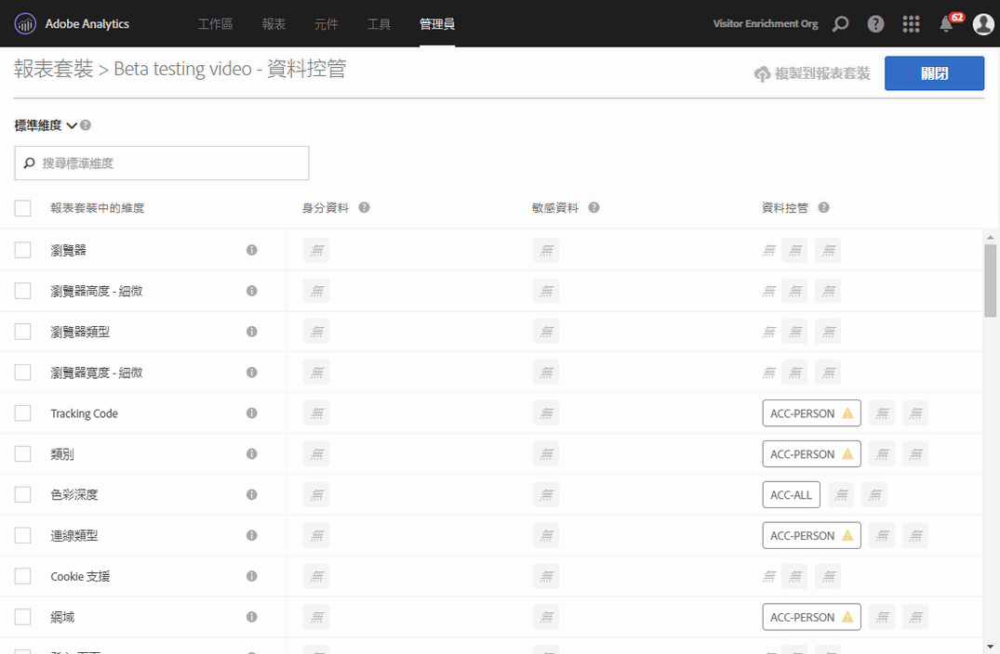
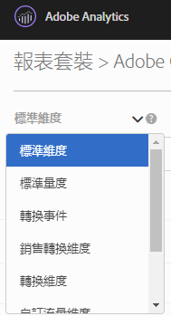
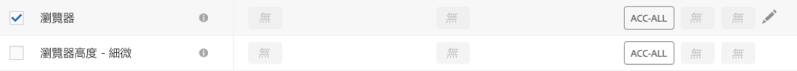
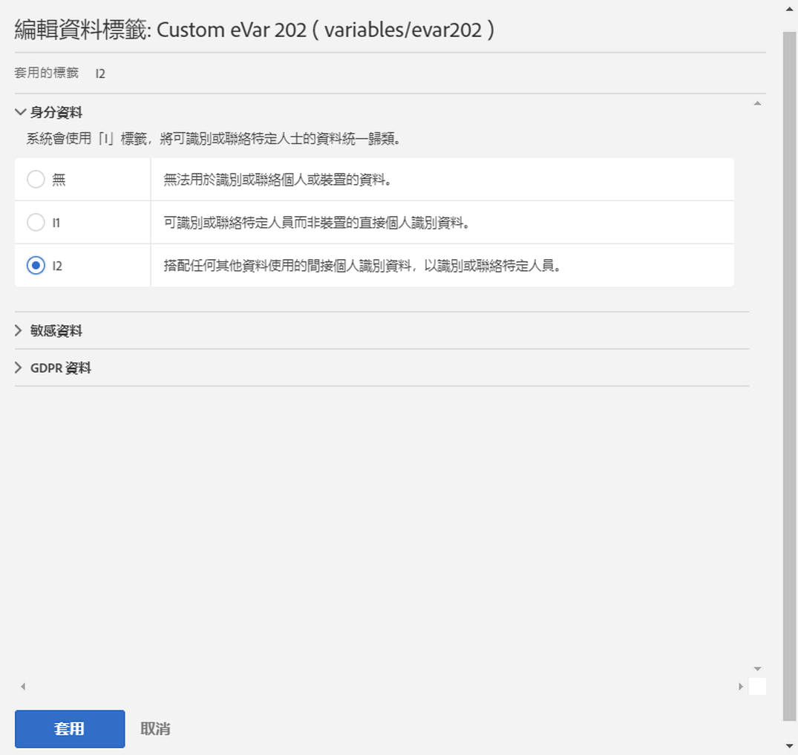
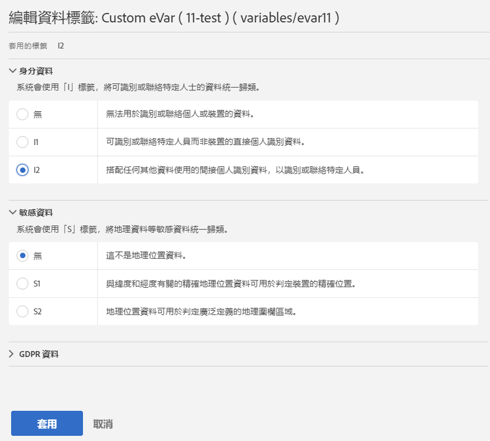
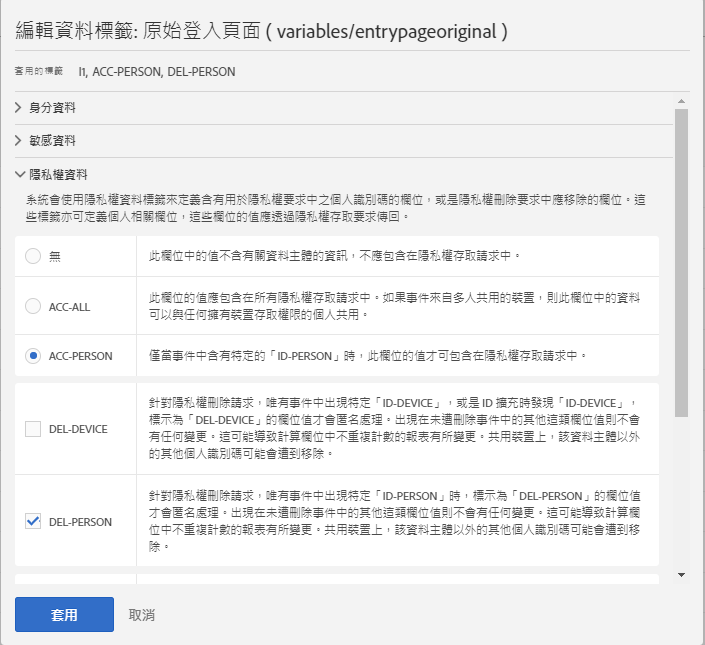
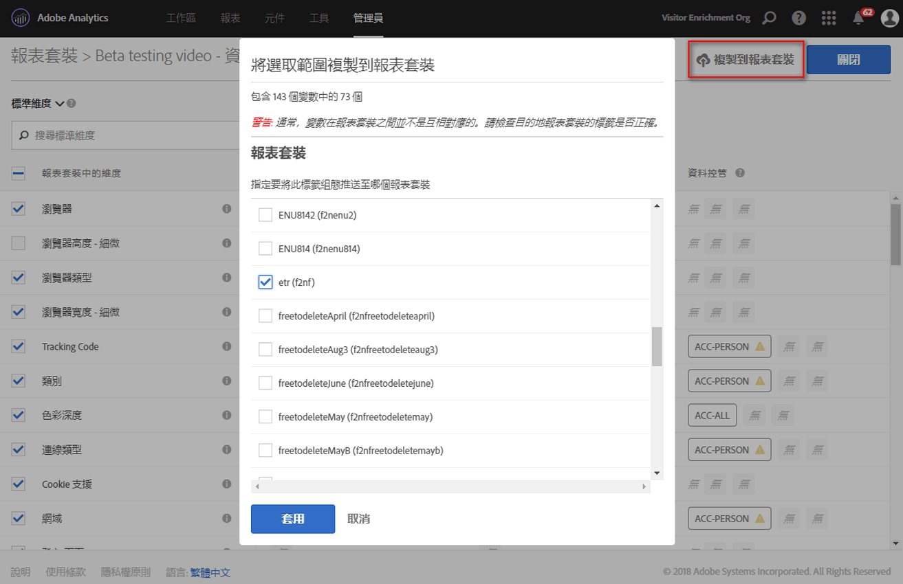

# 標籤報表套裝資料

為報表套裝資料加上標籤，代表您可為特定報表套裝內的每個變數，指派身分、敏感程度以及資料控管標籤。請務必先熟悉標籤及其定義。

> [!NOTE]請記住，每次建立新報表套裝，或在現有報表套裝內啟用新變數時，都必須仔細檢視標籤。啟用新解決方案整合時也必須檢閱標籤，因為它們可能會公開需要加上標籤的新變數。重新實作行動應用程式或網站可能會改變現有變數的使用方式，因此也可能需要更新標籤。

## 指派或編輯報表套裝標籤 {#section_39F829F35A274EACA532E2F6FF392996}

**範例**: 您做為資料控管單位，計劃從資料主體收集電子郵件地址和 Cookie ID 以處理其資料隱私權請求。這些 Cookie ID 儲存在 Adobe Analytics 的報表套裝中。若要建立電子郵件地址和 Cookie ID 的標籤，您必須在 Analytics 中使用 Adobe Cloud Platform 的資料使用標籤與實行 (DULE) 架構。

1. 在 Analytics 中，依序導覽至&#x200B;**[!UICONTROL 「管理]** &gt; **[!UICONTROL 資料控管]** &gt; **[!UICONTROL (選取報表套裝)」]**

1. 選取您想要加上標籤的變數群組。

   

   * **標準維度** (Adobe Analytics 立即可用維度)
   * **標準量度** (Adobe Analytics 立即可用量度)
   * **轉換事件** (自訂成功事件)
   * **銷售轉換維度** (銷售 eVars)
   * **轉換維度** (非銷售 eVars)
   * **自訂流量維度** (prop)
   * **解決方案維度和事件** (與解決方案相關的維度/事件，如行動裝置、視訊、Activity Map 等，以及與解決方案的整合，如 Adobe Campaign、Adobe Experience Manager、Advertising Cloud 等)
   * **資料處理維度** (非透過 Adobe Analytics UI 直接在報表中公開的變數，不過可以透過資料摘要及/或資料倉儲請求向您提供)

1. (可選) 按一下每個變數旁的資訊 (i) 圖示，即可進一步瞭解過去 90 天內最常用的值。(這項功能不適用於資料處理維度，因為 Analytics UI 未提供這些變數。)

   

1. 按一下變數的核取方塊來選取一或多個變數，接著選取&#x200B;**[!UICONTROL 「編輯」]**&#x200B;圖示 (位於右方) 來編輯一或多個變數。

   

1. **「身分資料」**&#x200B;標籤對話框便隨即自動開啟。這些標籤可分類本身就能使用的資料，或能與其他資料合併，以識別或直接與個人聯絡的資料。如需這些選項的詳細資訊，請參閱[身分資料標籤 (DULE)](/help/admin/c-data-governance/gdpr-labels.md#identity-data-labels)。

   >[!NOTE]
   >
   >資料使用標籤和實行 (DULE) 架構的設計目的，是為了在解決方案/服務/平台上提供統一方式，以擷取、通訊和使用 Adobe Experience Cloud 上資料的中繼資料。中繼資料可協助資料控管單位指出哪些資料屬於個人資料、哪些資料屬於敏感資料，以及資料具有哪些合約規定。

   

1. 開啟&#x200B;**「敏感資料」**&#x200B;區段以設定依地理位置資料分類的敏感資料標籤。如需這些選項的詳細資訊，請參閱[敏感資料標籤 (DULE)](/help/admin/c-data-governance/gdpr-labels.md#sensitive-data-labels)。

   

1. 開啟「資料隱私權資料」區段以設定&#x200B;**資料控管**&#x200B;標籤。使用本節內容指示 Adobe 該如何處理資料隱私權存取和刪除請求的每個變數，以及定義應掃描哪些變數來尋找這些請求的資料主體 ID。如需這些選項的詳細資訊，請參閱[資料控管標籤 (資料隱私權)](/help/admin/c-data-governance/gdpr-labels.md#data-governance-labels)。

   

1. 完成所有標籤設定後，按一下&#x200B;**[!UICONTROL 「套用」]**。

## 將標籤複製到報表套裝{#section_7C6FDAFF049F4126B84F6261F72668EE}

若您想將相同的 DULE/資料隱私權設定套用至多個報表套裝，您可以依照以下步驟操作:

1. 選取變數群組 (標準維度、轉換維度等)包含想要複製的變數。請注意，您一次只能複製一個變數群組的標籤。
1. 選取群組中的某些變數或所有變數。
1. 按一下「資料控管」對話方塊右上角的&#x200B;**[!UICONTROL 「將標籤複製到報表套裝」]**。

   

1. 勾選&#x200B;**[!UICONTROL 「選擇全部」]**，將選取的變數複的標籤製到所有報表套裝，或選取您想為其複製標籤的個別報表套裝。

   >[!IMPORTANT]
   >
   >請記住，您選取的所有報表套裝都必須對應至您的 Experience Cloud 組織。

   將某個變數或一組變數的標籤複製到不同的報表套裝時，複製的標籤會出現在目標報表套裝中對應位置的變數。若是標準維度、標準量度、解決方案維度和事件及資料處理維度，系統會將標籤複製到目標報表套裝中&#x200B;**名稱相同**&#x200B;的變數。

   至於轉換變數 (eVars)、銷售轉換維度及自訂流量維度 (props)，系統會將標籤複製到目標報表套裝中&#x200B;**數字相同**&#x200B;的變數。例如，系統會將 eVar12 複製到所有目標報表套裝中的 eVar12。在判斷複製目標時，系統會忽略這些變數的名稱。如果目標報表套裝未啟用對應的變數，該變數的複製作業將會失敗。

   在複製為變數定義的分類標籤時，系統會在目標報表套裝的對應變數中尋找名稱與來源分類相同的分類，再將標籤複製到該分類 (如 eVar7 到 eVar7)。否則，該分類標籤的複製作業將會失敗。

   套用一組標籤後，系統會顯示狀態訊息。狀態訊息包含任何目標變數或分類的名稱，以及複製失敗的報表套裝。

   >[!IMPORTANT]
   >
   >每次都應該檢查目標報表套裝，確認您所複製的標籤正確無誤。這點對於含有 ID 或 DEL 標籤的變數來說尤其重要。

1. 按一下&#x200B;**[!UICONTROL 「套用」]**。

