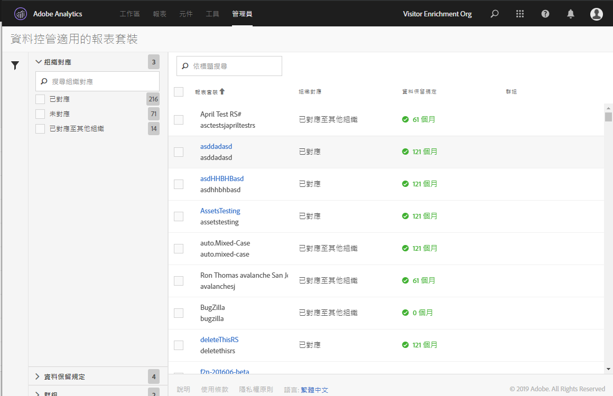
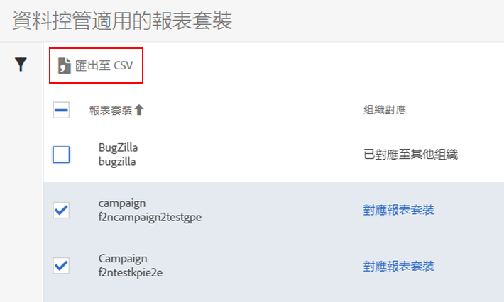

# 檢視/管理報表套裝資料控管設定

「管理工具」中的資料控管對話方塊提供概述，讓您瞭解已針對資料控管設定哪些報表套裝、是否已對應至 Experience Cloud 組織，以及此報表套裝是否已制定資料保留政策。

1. 登入 Adobe Experience Cloud。
1. 依序導覽至&#x200B;**[!UICONTROL 「Analytics]** &gt; **[!UICONTROL 管理]** &gt; **[!UICONTROL 資料控管」]**。

   您將看到屬於您登入公司的所有報表套裝:

   

<table id="table_448292730FF0475E9DCB731882F9A29B"> 
 <thead> 
  <tr> 
   <th colname="col1" class="entry"> 設定 </th> 
   <th colname="col2" class="entry"> 說明 </th> 
  </tr> 
 </thead>
 <tbody> 
  <tr> 
   <td colname="col1"> 
報表套裝 
 </td> 
   <td colname="col2"> 
第一行列出報表套裝的易記名稱。第二行含有報表套裝的內部名稱。如果您可以設定報表套裝的標籤，第一行便會是帶您前往標籤頁面的可點擊連結。 
 </td> 
  </tr> 
  <tr> 
   <td colname="col1"> 
組織對應 
 </td> 
   <td colname="col2"> 
    <ul id="ul_EF8F613B0C5E42D19DB60BD0C89C114B"> 
     <li id="li_B35EE88555F547EFBF55ADE9D0C9EC3B"><b>已對應</b>: 此報表套裝與您目前登入的 Analytics 登入公司已對應至同一個 Experience Cloud 組織。只有套用此設定的報表套裝才能加上標籤。 </li> 
     <li id="li_4E800BF80CFF477BAA091EF272D9071C"><b>對應報表套裝</b>: 按一下此連結可讓您<a href="https://marketing.adobe.com/resources/help/zh_TW/mcloud/report-suite-mapping.html">將報表套裝對應至</a> Experience Cloud 組織。 
換句話說，您會重新導向至 Experience Cloud 組織 – 報表套裝對應管理頁面，您可在該處找到報表套裝，並指派給適當的組織。完成之後，導覽返回此資料控管 UI。 
 </li> 
     <li id="li_FF825A65D089487BBF5FCB0D74D41CD7"><b>已對應至其他組織</b>: 其他 Experience Cloud 組織已將此報表套裝套用至其組織。 </li> 
    </ul> </td> 
  </tr> 
  <tr> 
   <td colname="col1"> 
資料保留政策 
 </td> 
   <td colname="col2"> 
Analytics 資料隱私權實作需要您制定資料保留政策。 
 
此設定會顯示: 
 
    <ul> 
     <li>是否已針對此報表套裝制定資料保留政策。 </li> 
     <li>刪除資料之前 Adobe 要保留資料的時間。預設的資料保留時間為 25 個月。 </li> 
    </ul> 
附註: 若未設定資料保留時間，Adobe Analytics 就無法協助您處理資料隱私權 API 的相關請求，亦即無法處理一般使用者所提出的存取或刪除請求。請聯絡客戶成功案例經理，以設定資料保留時間。 
 </td> 
  </tr> 
  <tr> 
   <td colname="col1"> 
群組 
 </td> 
   <td colname="col2"> 
目前尚未執行分組功能。 
 </td> 
  </tr> 
  <tr> 
   <td colname="col1"> 
左側側邊列 
 </td> 
   <td colname="col2"> 
按一下漏斗圖示即可開啟或關閉側邊列。 
 
「組織對應」區段會顯示上述每個類別中的報表套裝數目。 
 
「資料保留政策」區段會顯示貴組織目前制定的每一項資料保留政策，以及指派至該保留政策的報表套裝數目。 
 </td> 
  </tr> 
  <tr> 
   <td colname="col1"> 
匯出至 CSV 
 </td> 
   <td colname="col2"> 
如果您勾選一個或多個報表套裝旁的核取方塊，「匯出至 CSV」選項便會隨即出現。這個選項可讓您下載 CSV 檔案，檔案會包含所有選取報表套裝中所有變數的全部目前標籤定義。 
 
我們建議您與法律團隊商議標籤選擇，而這個選項有助於簡化該審核程序。您可以將 .CSV 檔案分享給他們，而不必在登入資料控管 UI 的情況下執行審核程序。 
 
 
 </td> 
  </tr> 
 </tbody> 
</table>

