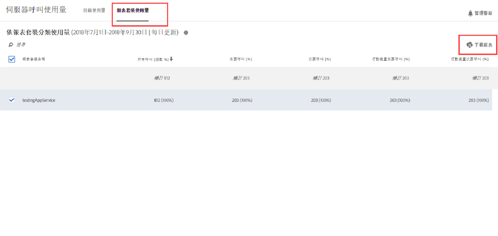
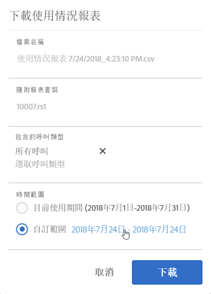
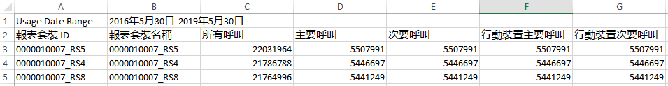

# 檢視報表套裝使用量

「報表套裝使用量」標籤針對目前使用期間，與您帳單公司綁定的所有登入公司中每個報表套裝提供伺服器使用量資料。

**[!UICONTROL 「分析]** > **[!UICONTROL 管理員]** > **[!UICONTROL 伺服器呼叫使用量]** > **[!UICONTROL 報表套裝使用量」]**

>[!IMPORTANT]
>
>如果報表套裝未[連結至 Experience Cloud 組織](https://marketing.adobe.com/resources/help/zh_TW/mcloud/report-suite-mapping.html)，則其使用量資料不會反映在此控制面板上。此外，計費 ID 可以綁定多個 Experience Cloud 組織；組織與計費 ID 之間並非總是 1:1 的關係。

報表套裝使用量控制面板

* 顯示 Experience Cloud 組織中，每個報表套裝之目前使用期間的伺服器呼叫使用量 (所有呼叫、主要、次要、行動主要、行動次要)。
* 顯示每個伺服器呼叫類別的整體使用量百分比。
* 每日更新。
* 可下載。
* 可讓您存取&#x200B;**[!UICONTROL 「管理警報」]** UI。

| 欄目 | 定義 |
|--- |--- |
| 報表套裝名稱 | 報表套裝的易記名稱。 |
| 所有呼叫 (總數 %) | 目前使用期間內發生的所有伺服器呼叫。 |
| 主要呼叫 (%) | 目前使用期間內發生的所有主要伺服器呼叫次數 (及其總計百分比)。 |
| 次要呼叫 (%) | 目前使用期間內發生的所有次要伺服器呼叫次數 (及其總計百分比)。 |
| 主要行動裝置 (%) | 目前使用期間內發生的所有行動主要伺服器呼叫次數 (及其總計百分比)。 |
| 次要行動裝置 (%) | 目前使用期間內發生的所有行動次要伺服器呼叫次數 (及其總計百分比)。 |

## 下載使用情況報表 {#section_D7345660B5E043CD8850954216509A3D}

此選項可讓您下載目前使用資料，以及目前使用期間之前時段的資料 (可追溯至 2015 年 1 月)。該報表將下載為 .csv 檔案。

1. 請選取至少一個報表套裝。
1. 按一下&#x200B;**[!UICONTROL 「下載報表」]**。

   

| 報表元素 | 說明 |
|--- |--- |
| 檔案名稱 | 硬式編碼名稱：使用量報表 `day and time of report creation.csv` |
| 隨附報表套裝 | 您在「報表伺服器使用量」頁面上選取的任何報表套裝都包含在此清單中。 |
| 包含的呼叫類型 | 指定以下任意組合：所有呼叫 (預設)、主要、次要、行動主要、行動次要。 |
| 時間範圍 | 您可以選擇目前使用期間或指定自訂範圍。對於自訂範圍，請指定「範圍開始」和「範圍結束」。 **注意：**您無法下載 2015 年 1 月之前的使用量資料 。 |

1. 按一下&#x200B;**[!UICONTROL 「下載」]**。

下方螢幕擷圖為下載的 .csv 檔案外觀。檔案中包含報表套裝 ID 欄。報表套裝 ID 會指定僅能包含英數字元的不重複 ID。此 ID 在建立報表套裝後即無法變更。

