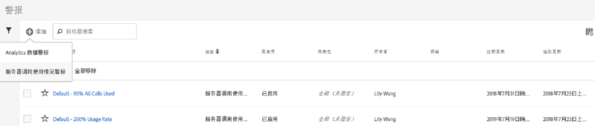
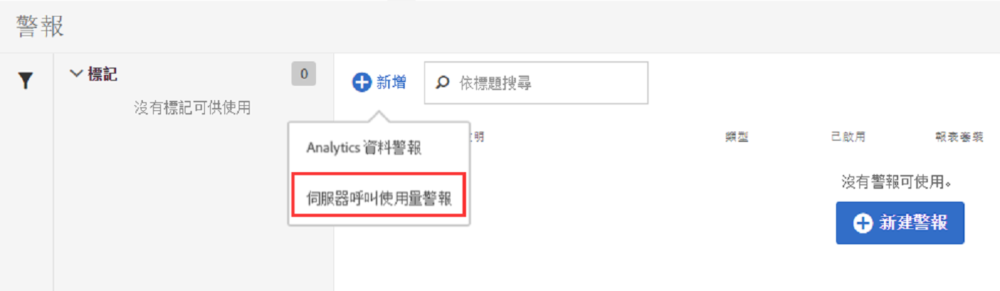
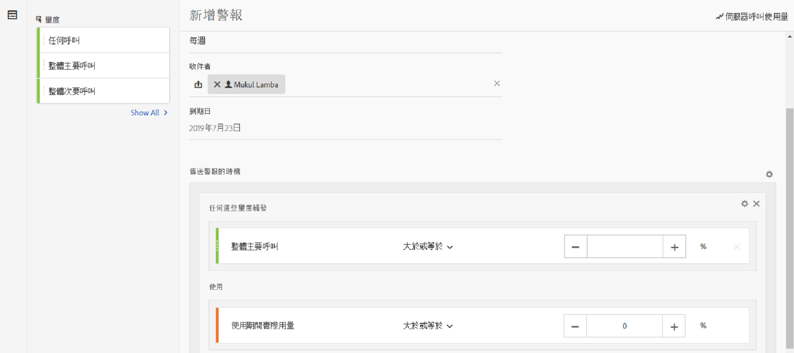
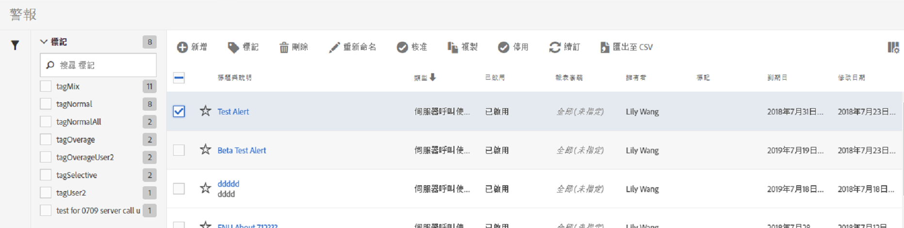

# 伺服器呼叫使用警報

當您設定警報時，該警報會套用至結帳公司之所有登入公司中的所有報表套裝。

## 概述

A new alert category called **[!UICONTROL Server Calls Usage Alert]** is part of the the existing [Alert Management](https://marketing.adobe.com/resources/help/en_US/analytics/analysis-workspace/intellligent_alerts.html) user interface.

It is pre-populated with **1 default alert** that appears within any login company that has access to the Server Call Usage feature. 如果符合下列其中一個標準，此警報會觸發對所有登入公司管理員的通知：

* 對於您有權使用的任何伺服器呼叫類型，「任何」伺服器呼叫使用量「高於或等於」100%，或者
* 對於您有權使用的任何伺服器呼叫類型，「任何」伺服器呼叫使用量「高於或等於」90%，或者
* 對於您有權使用的任何伺服器呼叫類型，「任何」伺服器呼叫使用量「高於或等於」70%，而且「實際使用期間」低於或等於使用期間的 75%。

您可以透過兩種方式存取伺服器呼叫使用量警報:

* 按一下「目前使用量」標籤或「報表套裝使用量」標籤右上角的&#x200B;**[!UICONTROL 「管理警報」]，或**
* Navigate to **[!UICONTROL Components]** &gt; **[!UICONTROL Alerts]** in Adobe Analytics.

## 建立伺服器呼叫使用量警報 {#section_2A2882C6D48D47C1944D52FB7C766BEC}

若要建立其他警報，

1. Click **[!UICONTROL + Add]** and select **[!UICONTROL Server Call Usage Alert]**.

   

1. 定義警報。

   

   * **標題**：指定描述性名稱。您無法儲存沒有名稱的警報。
   * **時間粒度**：表示將會檢查警報的頻率。*目前僅支援每週粒度。*&#x200B;這表示將每週檢查警報，並回顧目前使用期間的資料。
   * **收件者**：指定組織中的任何人員，當警報觸發指定臨界值時，應該會收到電子郵件。
   * **到期日**：依預設，到期日是警報建立日期的一年。
   * **傳送警報的時機**:

      * 任何這些量度觸發將伺服器呼叫類型新增為量度，並透過選取輔助符號和臨界值來指定警報臨界值：
         * 高於或等於
         * 低於或等於
      * 使用指定「逗留期間」的臨界值和條件(大於或等於或等於或等於)。

1. 按一下&#x200B;**[!UICONTROL 儲存]**。

## 管理伺服器呼叫使用量警報 {#section_8FF98170763C4B5CBEC6DD43F893177A}

若要管理警報:

1. 選取一或多個警報旁的核取方塊。警報管理動作會顯示在頂端。
1. 完成以下一或多個動作:

   | Action | 定義 |
   |--- |--- |
   | + 新增 | 按一下[!UICONTROL 「+ 新增」]以存取[「警報產生器」](../../admin/c-server-call-usage/scu-alerts.md)。 |
   | 標記 | 標記警報可讓您組織警報以方便使用。 |
   | 刪除 | 您可以刪除預設警報以外的所有警報。 |
   | 重新命名 | 您可以重新命名預設警報以外的所有警報。 |
   | 核准 | 核准警報即可使其成為「正式」警報。 |
   | 啟用/停用 | 您可以啟用或停用所有警報，甚至是預設警報。 |
   | 續訂 | 選取一或多個警報後，可續訂這些警報。這將延長警報到期日，無論其原始到期日為何，將從按下[!UICONTROL 「更新」]之日起延長 1 年。 |
   | 匯出至 CSV | 請參閱[下載使用情況報表](../../admin/c-server-call-usage/report-suite-usage.md) |

