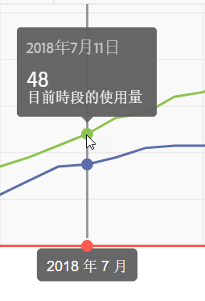
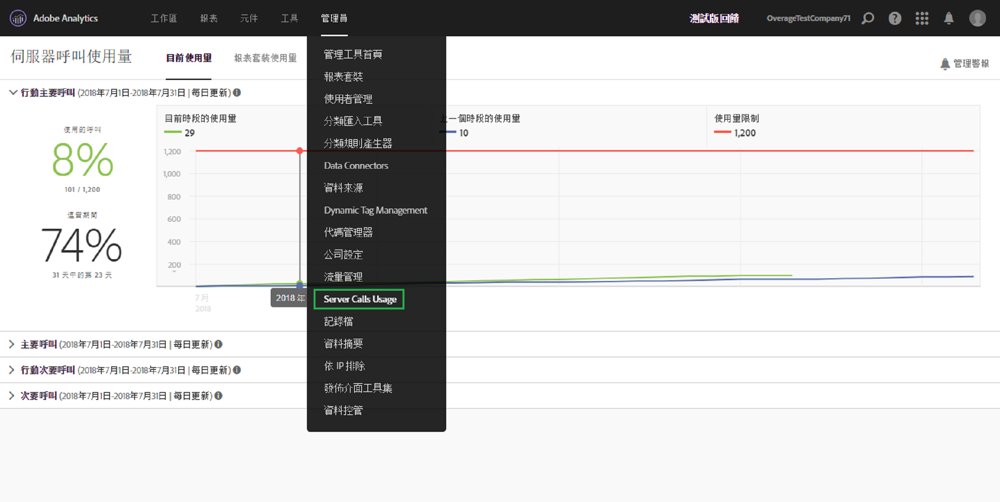

# 檢視目前伺服器呼叫使用量

**[!UICONTROL Analytics]** > **[!UICONTROL Admin]** > **[!UICONTROL Server Call Usage]** > **[!UICONTROL Current Usage]**

>[!IMPORTANT] 您看到的所有使用量和承諾使用量，是所有登入公司和報表套裝的累計值。

「目前使用狀況」控制面板

* 顯示您各伺服器呼叫類型的伺服器呼叫消耗和承諾的劃分資訊。 此檢視對於不同的客戶可能不同，而且與您的合約內容一致。 例如，您可能已註冊4種不同的伺服器呼叫類型： Web的主要和次要呼叫，以及Mobile的主要和次要呼叫。 在這種情況下，此視圖將包含4個頁籤，每個類型各一個。 在每個標籤中，您將能夠查看當前使用期的衝減。
* 比較目前的使用情形（綠線）與您的合約使用限制（紅線）。

   

* 比較您目前期間的使用情形與去年的使用情形（藍線）。 顯然，只有當貴公司有來年的伺服器呼叫使用資料時，才會出現藍線。

   > [!NOTE] 如果您想要檢視上個時段的使用量，您必須前往[「報表套裝使用量」](/help/admin/c-server-call-usage/report-suite-usage.md)標籤下載上個時段的使用量資料。

* 列出已用呼叫的百分比（以百分比和原始資料計），以及使用期間花費的百分比（以百分比和原始資料計）。
* 依預設，會每日更新，並有5天的處理延遲。
* 可讓您收合和展開所有小報表。

| UI詞語 | 定義 |
|---|---|
| 本期使用（綠色） | 當前期間基於使 [用期](/help/admin/c-server-call-usage/overage-overview.md)。 |
| 上一期使用（藍色） | 上一期間定義為當前使用期間減去1年。 |
| 使用限制（紅色） | 您在此使用期間的合約使用限制。 |
