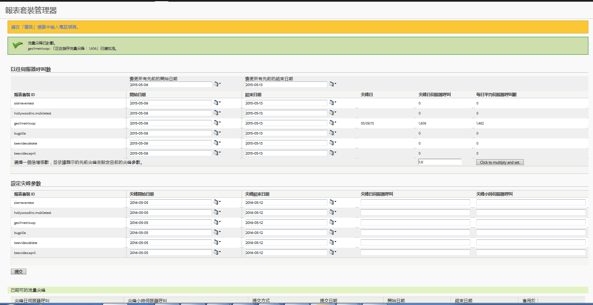

# 預估以往伺服器呼叫數並計劃流量尖峰

您可取得 (舉例來說) 去年特定時間範圍內伺服器的每日平均呼叫數，再加上今年伺服器呼叫的預估可能增加次數。如此一來，您便可以根據此乘數因子，為流量尖峰制定排程。

1. 以管理員身分登入 Analytics，並前往「**[!UICONTROL 管理員]** > **[!UICONTROL 流量管理]**」。

1. 按一下&#x200B;**[!UICONTROL 「展開」]**&#x200B;以展開報表套裝清單，然後按一下&#x200B;**[!UICONTROL 「選取報表套裝」]**&#x200B;以選取多個報表套裝。

1. 按一下&#x200B;**[!UICONTROL 「排程尖峰」]**。
1. 在&#x200B;**[!UICONTROL 「以往伺服器呼叫數」]**&#x200B;中，選取所選報表套裝的開始和結束日期。

   隨即產生「尖峰日」、「尖峰日伺服器呼叫」和「每日平均伺服器呼叫數」的數量。

1. 輸入倍增因子的值，然後按一下&#x200B;**[!UICONTROL 「按一下即可相乘並設定」]**。

   隨即為每個報表套裝的每個欄加乘值。

1. 在&#x200B;**[!UICONTROL 「設定尖峰參數」]**&#x200B;下方提交所選報表套裝的尖峰參數。

   隨即為每個報表套裝計劃尖峰。

