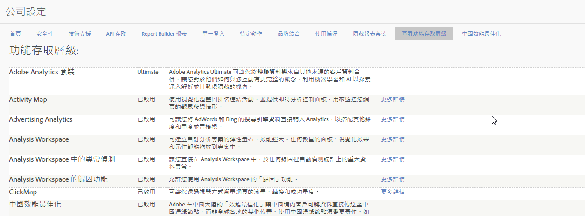

# 功能存取層級

**[!UICONTROL 「管理員]** > **[!UICONTROL 公司設定]** > **[!UICONTROL 檢視功能存取層級」]**

此設定群組讓您檢視貴公司有權獲得的 Adobe Analytics 功能存取層級。部分功能僅於更進階產品 SKU 提供，例如 [Adobe Analytics Ultimate](https://www.adobe.com/tw/data-analytics-cloud/analytics/ultimate.html)。

