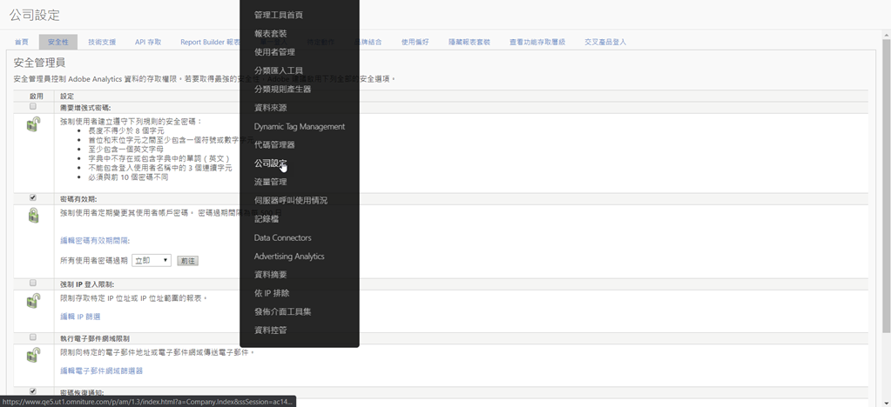

# 強制IP登入限制的 [!UICONTROL 生命週期結束]

Adobe Analytics **[中的「強制IP登入限制](/help/admin/company/security-manager.md)** 」功能可讓您將特定IP位址（視為安全）列入白名單，以允許成功登入並存取您的Adobe Analytics環境。 在許多情況下，此功能可用來將公司IP位址設為使用者唯一可登入的安全IP位址。 因此，若要使用Adobe Analytics，使用者必須在公司辦公室或透過VPN登入網路。

我們計畫於2020年10月終止此功能。

## 我們為什麼要終止此功能？

Experience cloud登入移轉和／或Experience cloud登入在某些情況下會中斷此功能。 使用「客戶屬性」或「觀眾程式庫」的 **[!UICONTROL 客戶]** ，常 **[!UICONTROL 常會突破]**。

此外，如果您擁有多個Experience cloud解決方案，則可以透過使用其他解決方案之一登入Experience cloud來規避此需求，因為Analytics本身以外並不存在或不支援此功能。 使用者也可以透過IP欺騙來解決這個問題。

最後，Adobe透過單一登入和同盟ID提供功能正常且更優越的替代解決方案。 此功能可讓您更精確地控制使用者的登入體驗並提供安全性。 請參閱下方以取得詳細資訊。

## 移除此功能對您有何影響？

對於任何已設定「 **[!UICONTROL 強制IP登入限制]** 」的客戶，此功能將於2020年10月移除。 屆時，任何仍有的IP登入限制將不再執行。 如果您仍需依IP位址限制登入，則應檢閱並實作建議的單一登入與同盟ID解決方案（以下更多資訊與資源）。

此外， **[!UICONTROL Analytics UI中的「]** dmin &gt;公司設定&gt;安全管理員 **[!UICONTROLA]** 」（如下所示）會移除「強制IP登入限制」設定。

## 您還有哪些選擇？

如上所述，此Analytics功能將結束生命週期。 為了給您實作SSO和Federated ID的時間，我們已將EOL日期延遲至2020年10月。

SSO和Federated ID都是比我們目前提供的IP登入限制功能更優越的解決方案，可為您提供更多的控制、安全性和功能。 有關如何設定SSO/Federated ID的資訊，我們提供下列說明檔案。 我們建議您仔細閱讀並與IT部門合作，以實作這些內容：

* [單一登入與Experience Cloud](https://spark.adobe.com/page/JeSB8EPEQIvjD/)
* [管理控制台——身分設定檔案](https://helpx.adobe.com/enterprise/using/set-up-identity.html)
* [管理控制台——身分設定教學課程（影片）](https://helpx.adobe.com/enterprise/how-to/identity-directories-domains.html?playlist=/ccx/v1/collection/product/enterprise/topics/enterprise-identity/collection.ccx.js&ref=helpx.adobe.com)
* [設定同盟ID教學課程（影片）](https://helpx.adobe.com/enterprise/how-to/identity-configure-ids.html?playlist=/ccx/v1/collection/product/enterprise/topics/enterprise-identity/collection.ccx.js&ref=helpx.adobe.com)
* [單一登入——常見問題](https://helpx.adobe.com/enterprise/using/sso-faq.html)
* [Adobe支援的身分類型](https://helpx.adobe.com/enterprise/using/identity.html)

如果您想要繼續表達對IP登入限制的支援，並要求由Experience cloud提供，您可在我們的論壇頁面上投票支 [持此功能](https://forums.adobe.com/ideas/11648)。