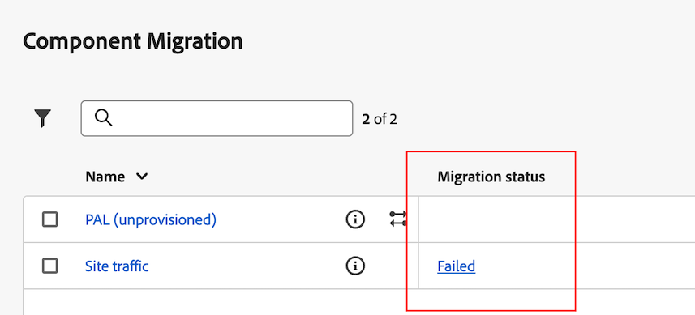

# 將元件和專案從Adobe Analytics移轉至Customer Journey Analytics

Adobe Analytics 管理員可以將 Adobe Analytics 專案及其關聯元件移轉到 Customer Journey Analytics。

移轉過程包括：

* 在 Customer Journey Analytics 中重新建立 Adobe Analytics 專案。

* 將 Adobe Analytics 報表套件中的維度和指標對應到 Customer Journey Analytics 資料視圖中的維度和指標。

  有些維度和量度會自動對應，有些則必須在移轉程式中手動對應。 區段也會移轉，但在移轉過程中不需要進行對應。

  移轉完成時，所有移轉的元件都會顯示在移轉摘要中。

>[!NOTE]
>
>此頁面上的資訊說明如何使用使用者介面移轉專案及其相關元件。
>
>或者，您可以使用API執行移轉。 如需詳細資訊，請參閱[Adobe Analytics API](https://adobedocs.github.io/analytics-2.0-apis/?urls.primaryName=Analytics%202.0%20APIs)。 所有API定義都可在&#x200B;**[!UICONTROL 選取定義]**&#x200B;下拉式功能表中取得。

## 準備移轉

在將任何專案移轉至Customer Journey Analytics之前，請在[準備將元件和專案從Adobe Analytics移轉至Customer Journey Analytics](/help/admin/tools/component-migration/prepare-component-migration.md)中進一步瞭解移轉專案。

此外，請使用Analytics管理員可用的工具來執行[Adobe Analytics詳細目錄](/help/admin/tools/analytics-inventory.md)。

## 將Adobe Analytics專案移轉至Customer Journey Analytics

>[!IMPORTANT]
>
>在依照本節所述將任何專案移轉至Customer Journey Analytics之前，請在[準備將元件和專案從Adobe Analytics移轉至Customer Journey Analytics](/help/admin/tools/component-migration/prepare-component-migration.md)中進一步瞭解移轉專案。
>
>**您對應的所有維度或量度都會是永久性的，不論此專案還是未來移轉到您整個IMS組織的所有專案，不論哪位使用者正在執行移轉。 除非連絡客戶服務，否則無法修改或復原這些對應。**

1. 在 Adobe Analytics 中，選取「[!UICONTROL **管理員**]」索引標籤，然後選取「[!UICONTROL **所有管理員**]」。

1. 在&#x200B;[!UICONTROL **資料組態與集合**]&#x200B;下，選取&#x200B;[!UICONTROL **元件移轉**]。

1. 找到您要移轉的專案。 您可以篩選、排序或搜尋專案清單。

   預設情況下，僅顯示與您共用的專案。 若要檢視您組織中的所有專案，請選取&#x200B;**篩選器**&#x200B;圖示，然後展開&#x200B;[!UICONTROL **其他篩選器**]&#x200B;並選取&#x200B;[!UICONTROL **全部顯示**]。 （如需有關篩選、排序和搜尋專案清單的詳細資訊，請參閱[篩選、排序和搜尋專案清單](#filter-sort-and-search-the-list-of-projects)。）

1. 將游標移至您要移轉的專案上，然後選取&#x200B;**移轉**&#x200B;圖示。

   或

   選取您要移轉的專案，然後選取&#x200B;[!UICONTROL **移轉至Customer Journey Analytics**]。

   您一次只能選取一個專案進行移轉。

   顯示&#x200B;[!UICONTROL **將project_name移轉至Customer Journey Analytics**]&#x200B;對話方塊。

   <!-- add screenshot -->

1. 在&#x200B;[!UICONTROL **專案所有者**]&#x200B;欄位中，開始輸入您要在Customer Journey Analytics中設定為專案所有者的使用者名稱，然後在下拉式選單中選取其名稱。

   您指定的擁有者擁有專案的完整管理許可權。 擁有者必須是Customer Journey Analytics的管理員。 您可以在稍後步驟中變更專案的所有權。

1. 在「[!UICONTROL **對應報表套裝的結構描述**]」區段中，選取報表套裝。

1. 在&#x200B;[!UICONTROL **資料檢視**]&#x200B;下拉式功能表中，選取您要移轉專案和元件的Customer Journey Analytics資料檢視。

1. 選取&#x200B;[!UICONTROL **對應結構描述**]。

1. 在&#x200B;[!UICONTROL **對應結構描述**]&#x200B;區段中，展開&#x200B;[!UICONTROL **維度**]&#x200B;和&#x200B;[!UICONTROL **量度**]&#x200B;區段。

   Adobe Analytics中的部分維度和量度會自動對應至Customer Journey Analytics中的維度或量度。 其他則需要手動對應。

   **自動對應維度和量度**

   >[!NOTE]
   >
   >   如果您使用WebSDK將資料內嵌至Adobe Experience Platform，維度和量度無法自動對應。 如需詳細資訊，請參閱[準備將元件和專案從Adobe Analytics移轉至Customer Journey Analytics](/help/admin/tools/component-migration/prepare-component-migration.md#prerequisites)中的[必要條件](/help/admin/tools/component-migration/prepare-component-migration.md)。

   Adobe Analytics中的部分維度和量度會自動對應至Customer Journey Analytics中的維度或量度。 您無法針對這些維度和量度做出任何對應決策。

   例如，Adobe Analytics中的&#x200B;**造訪**&#x200B;量度會自動與Customer Journey Analytics中的&#x200B;**工作階段**&#x200B;量度對應。

   您可以選取任何維度或量度來檢視其相關聯的ID。

   <!-- update screenshot after I can see the Status column -->

   

   **手動對應維度和量度**

   Adobe Analytics中的部分維度和量度無法自動對應至Customer Journey Analytics中的維度或量度。

   當維度或量度無法自動對應時，[!UICONTROL **維度**]&#x200B;或&#x200B;[!UICONTROL **量度**]&#x200B;區段標題旁會顯示橘色計數器，指出需要手動對應的維度或量度數目。 在表格中，每個需要手動對應的維度或量度旁都會顯示警告圖示。

   此外，[!UICONTROL **狀態**]&#x200B;資料行顯示&#x200B;[!UICONTROL **未對應**]。

   <!-- update screenshot after I can see the Status column -->

   

1. 若要手動對應維度和量度，請選取包含警告圖示的維度或量度，然後在&#x200B;[!UICONTROL **對應的Customer Journey Analytics量度**]&#x200B;欄位中(若要對應維度，請選取&#x200B;[!UICONTROL **對應的Customer Journey Analytics維度**]&#x200B;欄位)，在Customer Journey Analytics中選取您要對應到您選取之維度或量度的維度或量度。

   

   維度或量度對應後，警告圖示會消失，[!UICONTROL **狀態**]&#x200B;欄會變更為帶有綠色圓點的&#x200B;[!UICONTROL **已對應**]。 （[!UICONTROL **已對應**]&#x200B;的狀態顯示為灰點，表示維度或量度已在先前的移轉期間對應；無法更新任何先前的對應。）

   對包含警告圖示的每個維度或量度重複此程式。

   在Adobe Analytics報表套裝中的所有維度和量度都對應至Customer Journey Analytics報表套裝中的維度或量度後，區段中的報表套裝名稱旁會出現綠色勾號&#x200B;[!UICONTROL **勾號**]。

1. （視條件而定）如果您要移轉的專案包含多個報表套裝，請在&#x200B;[!UICONTROL **對應報表套裝的結構描述**]&#x200B;區段中選取另一個報表套裝，然後重複步驟6到步驟10。<!-- double-check that the step numbers are still correct -->

1. 選取&#x200B;[!UICONTROL **移轉**]。

   >[!WARNING]
   >
   >   選取&#x200B;[!UICONTROL **移轉**]&#x200B;後，熒幕上會顯示警告訊息。 選擇繼續之前，請先瞭解您對應之任何維度或量度對於此專案及整個組織未來移轉的所有專案而言都是永久性的。 如果繼續，則無法修改您建立的對應。

   移轉完成後，[!UICONTROL **移轉狀態**]&#x200B;頁面會提供已移轉專案的摘要。

   如果移轉失敗，請參閱下面的[重試失敗的移轉](#retry-a-failed-migration)一節以取得詳細資訊。

1. （選用）專案移轉後，您就可以將專案的所有權轉移給Customer Journey Analytics中的任何使用者。 如需詳細資訊，請參閱Customer Journey Analytics指南中的[轉移資產](https://experienceleague.adobe.com/zh-hant/docs/analytics-platform/using/tools/asset-transfer/transfer-assets)。

## 重試失敗的移轉

如果移轉失敗，您可以重試移轉。

在重試失敗的移轉之前，請確定您已從專案移除任何[不支援的元素](/help/admin/tools/component-migration/prepare-component-migration.md#understand-unsupported-elements-that-cause-errors)。

>[!NOTE]
>
>如果重試後移轉仍持續失敗，請聯絡客戶服務並提供專案ID。 您可以在移轉狀態頁面找到專案ID。<!-- when does this page display? How can they get there -->

若要重試失敗的移轉：

1. 在 Adobe Analytics 中，選取「[!UICONTROL **管理員**]」索引標籤，然後選取「[!UICONTROL **所有管理員**]」。

1. 在&#x200B;[!UICONTROL **資料組態與集合**]&#x200B;下，選取&#x200B;[!UICONTROL **元件移轉**]。

1. 在您要重試的專案旁的&#x200B;[!UICONTROL **移轉狀態**]&#x200B;欄中選取&#x200B;[!UICONTROL **失敗**]。

   

   顯示&#x200B;[!UICONTROL **移轉狀態**]&#x200B;頁面。

   完成以上[將Adobe Analytics專案移轉至Customer Journey Analytics](#migrate-adobe-analytics-projects-to-customer-journey-analytics)一節中所述的移轉步驟後，此頁面也會立即顯示。

1. 選取&#x200B;[!UICONTROL **重試移轉**]。

## 篩選、排序和搜尋專案清單

您可以在「元件移轉」頁面上篩選、排序和搜尋專案清單。

### 篩選專案清單

您可以依下列條件篩選：

| 篩選器 | 說明 |
|---------|----------|
| [!UICONTROL **狀態**] | 移轉的狀態： <ul><li>[!UICONTROL **未啟動**]</li><li>[!UICONTROL **已啟動**]</li><li>[!UICONTROL **已完成**]</li><li>[!UICONTROL **已失敗**]</li></ul>。 |
| [!UICONTROL **標記**] | 選取標籤清單中的任何標籤。 只會顯示已套用選取標籤的專案。 |
| [!UICONTROL **報告套裝**] | 在報表套裝清單中選取任何報表套裝。 系統只會顯示使用選定報表套裝的專案。 |
| [!UICONTROL **所有者**] | 在擁有者清單中選取任何擁有者。 系統只會顯示您所選取使用者擁有的專案。 |
| [!UICONTROL **其他篩選器**] | 下列為其他可用的篩選： <ul><li>[!UICONTROL **我的**]：僅顯示您設為擁有者的專案。</li><li>[!UICONTROL **與我共用**]：僅顯示與您共用的專案。</li><li>[!UICONTROL **我的最愛**]：僅顯示標籤為我的最愛的專案。 （您可以從[專案登陸頁面](/help/analyze/landing.md)將專案標示為我的最愛。）</li><li>[!UICONTROL **每月**]</li><li>[!UICONTROL **每年**]</li></ul> |

{style="table-layout:auto"}

### 排序專案清單

您可以依任何欄排序專案清單。

若要排序專案清單，請執行下列動作：

1. 選取要作為排序依據之欄的欄標題。

1. （選擇性）再次選取相同的欄標題來反轉排序順序。

### 搜尋專案

您可以在「元件移轉」頁面上搜尋專案清單，以尋找您要移轉的專案。

1. 在「元件移轉」頁面頂端的搜尋欄位中，開始輸入您要移轉的專案名稱。

1. 當專案出現在下拉式選單中時，請選取專案。

<!-- is there going to be a way to customize the columns that are displayed? -->
