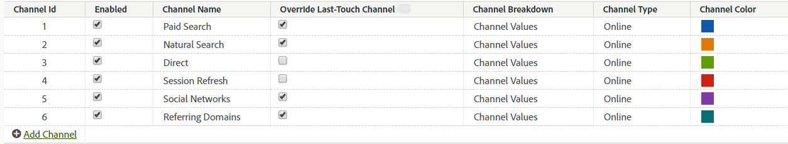

# 管理行銷管道

>[!NOTE]
>
> 有關行銷管道的一般資訊，請參閱[行銷管道入門](/help/components/c-marketing-channels/c-getting-started-mchannel.md)。
>
> 為了讓 Attribution 和 Customer Journey Analytics 的行銷管道獲得最大成效，我們已發佈一些[修改過的最佳做法](/help/components/c-marketing-channels/mchannel-best-practices.md)。

**[!UICONTROL Analytics]** > **[!UICONTROL 管理員]** > **[!UICONTROL 報告套裝]** > **[!UICONTROL 編輯設定]** > **[!UICONTROL 行銷管道]** > **[!UICONTROL 行銷管道管理員]**。

在行銷管道管理員中新增或啟用行銷管道。對於沒有行銷管道的報表套裝，自動設定可為您建立多個管道及其規則。您可視需要編輯預定義管道或建立自己的管道 (最多總共 25 個)。

[!UICONTROL 新增管道至「行銷管道」頁面，與在「行銷管道處理規則」頁面上建立規則是相互獨立的][&#128279;](/help/admin/tools/manage-rs/edit-settings/marketing-channels/mc-proc-rules.md)。建立規則時，您會將規則與管道相關聯。

以下是建立管道的指引：

* 透過設立所有管道的清單來提前計劃，以便將所有訪客點按歸入正確的管道類別。
* 納入[內部](/help/admin/tools/manage-rs/edit-settings/marketing-channels/mc-proc-rules.md)點擊類別的管道。
* 納入一個範圍廣泛的「其他行銷活動」管道，並放置在付費管道之後、自然管道之前。

## 先決條件 {#prereqs}

* 設定「行銷管道」維度的存取權。

  請參閱[行銷管道權限](/help/components/c-marketing-channels/c-channel-report-access.md)。

## 新增行銷通路 {#add-mktg-channels}

在行銷通路管理員中新增行銷通路。

>[!NOTE]
>
>管道無法刪除。如果不想使用管道，則可停用或重新命名它，並保留以備將來之用。

1. 按一下&#x200B;**[!UICONTROL 「Analytics]** > **[!UICONTROL 管理]** > **[!UICONTROL 報表套裝」]**。
1. 在[!UICONTROL 「報表套裝管理員」]頁面上，選擇一個報表套裝。

   如果選擇多個報表套裝，請選擇一個範本，將範本設定複製到所選的報表套裝。

   請參閱「[套用範本報表套裝設定至多個報表套裝](/help/components/c-marketing-channels/c-getting-started-mchannel.md)」。

1. 按一下&#x200B;**[!UICONTROL 「編輯設定]** > **[!UICONTROL 行銷管道]** > **[!UICONTROL 行銷管道管理員」]**。

   如果報表套裝尚未定義管道，則會顯示[自動設定](/help/components/c-marketing-channels/c-getting-started-mchannel.md)頁面。

1. 在[!UICONTROL 行銷管道管理員]頁面上，按一下&#x200B;**[!UICONTROL 「新增管道」]**。

   已定義 25 個管道時，此選項不可用。

1. 按一下&#x200B;**[!UICONTROL 「儲存」]**。
1. 若要設定管道規則，請按一下&#x200B;**[!UICONTROL 「行銷管道處理規則」]**。

   請參閱[建立行銷管道處理規則](/help/admin/tools/manage-rs/edit-settings/marketing-channels/mc-proc-rules.md)。

## 套用管道設定 {#mktg-channel-mgr}

有多種不同的設定可套用至[!UICONTROL 「行銷管道管理員」]頁面上的每個管道。

| 欄位 | 定義 |
|--- |--- |
| 已啟用 | 啟用或停用該行銷管道。 |
| 管道名稱 | 行銷管道的友好名稱。 |
| 覆蓋上次接觸管道 | 可讓您選擇是否使用選取的管道覆蓋現有的永續性上次接觸管道。如果勾選此核取方塊，任何管道 (包括直接和內部) 都會覆蓋現有的上次接觸管道。產生的結果會將轉換歸因於可能不值得該評價的管道。例如，若之前已透過免費搜尋管道獲得使用者，則此選項可確保直接管道不會接收用於轉換的評價。 |
| 管道劃分 | 允許您依該值劃分管道。建立[行銷管道分類](/help/admin/tools/manage-rs/edit-settings/marketing-channels/classifications-mchannel.md)時，您可新增可能的管道劃分 (子管道)。 |
| 類型 | 指定使用者如何進入您的網站。 您可選擇「線上」或「離線」。對於透過搜尋引擎或電子郵件促銷活動到來的訪客，您可使用「線上」管道。「離線」管道適用於透過報章廣告或雜誌廣告找到您網站的訪客。離線管道通常包括從報告資料來源匯入的資料。請參閱 [Data Sources](/help/import/data-sources/overview.md)。請參閱[新增離線資料](/help/components/c-marketing-channels/c-getting-started-mchannel.md)。 |

### 覆寫最佳做法

建議取消勾選直接和內部管道的覆寫上次接觸選項，如此這些管道就不會從其他持續沿用的上次接觸管道取走評分 (或互相取走評分)。

## 定義管道規則

報表中要能顯示管道和管道資料，首先須建立管道和處理資料的基本規則。您也可以指定要讓[訪客參與期間](/help/admin/tools/manage-rs/edit-settings/marketing-channels/visitor-engagement.md)持續多久的時間。

Adobe 在[自動設定](/help/components/c-marketing-channels/c-getting-started-mchannel.md)期間提供了數個預先定義的管道，您可依自身需求加以編輯。此外，您也可以修改此設定，並在[行銷通路處理規則](/help/admin/tools/manage-rs/edit-settings/marketing-channels/mc-proc-rules.md)中定義自訂規則。

>[!NOTE]
>
>Adobe 建議在您能作為測試範本使用的報表套裝中設定報表。您可使用範本將管道和規則設定總體套用至一個或多個生產報表套裝。
>
>請參閱「[套用範本報表套裝設定至多個報表套裝](/help/components/c-marketing-channels/c-getting-started-mchannel.md)」。
