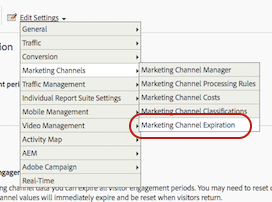

# 行銷管道期限

>[!NOTE]
>
> 有關行銷管道的一般資訊，請參閱[行銷管道入門](/help/components/c-marketing-channels/c-getting-started-mchannel.md)。
>
> 為了讓 Attribution 和 Customer Journey Analytics 的行銷管道獲得最大成效，我們已發佈一些[修改過的最佳做法](/help/components/c-marketing-channels/mchannel-best-practices.md)。

**[!UICONTROL Analytics]** > **[!UICONTROL 管理員]** > **[!UICONTROL 報告套裝]** > **[!UICONTROL 編輯設定]** > **[!UICONTROL 行銷管道]** > **[!UICONTROL 行銷管道期限]**。

瞭解如何指定行銷管道的期限或訪客參與期間。

訪客參與是指允許將訪客的之前網站活動歸因為首次接觸管道的時間。預設期限為 30 天。

如果訪客經常使用該網站，則參與回溯期會計入這些管道。管道必須閒置達 30 天，該期間才會過期，且管道才會重設。訪客的首次和上次接觸管道在該瀏覽器上閒置 30 天後，都將進行重設。

範例：

* 第 1 天：使用者因顯示而造訪網站。系統會將首次和上次接觸管道設為顯示。
* 第 2 天：使用者因免費搜尋而造訪網站。首次接觸仍會維持為顯示，而上次接觸則設為免費搜尋。
* 第 35 天：使用者未造訪網站達 33 天，而且使用在瀏覽器中開啟的分頁返回。在具有 30 天參與回溯期的前提下，該回溯期將已關閉，且行銷管道 Cookie 將會過期。系統會重設首次接觸和上次接觸管道，且由於使用者來自內部 URL，因而會設為工作階段重新整理。

## 行銷管道期限設定

期限設定包含下列項目：

| 欄位 | 定義 |
|--- |--- |
| 閑置天數 | 訪客的首次接觸參與過期之前必須經過的天數。預設值為 30。 |
| 從不 | 訪客參與期限從不過期。 |
| 管道重設 | 將所有訪客參與期限設為過期。如果您需要重設所有行銷管道資料，可將所有訪客參與期限設為過期。如果您的處理規則先前設定錯誤，便可能需要重設資料。當訪客返回時，所有首次和上次接觸管道值都會立即過期並重設。 |

## 定義行銷管道期限 {#define-expiration}

指定訪客參與期間。

1. 按一下 **[!UICONTROL Analytics]** > **[!UICONTROL 管理員]** > **[!UICONTROL 報表套裝]**。
2. 在「[!UICONTROL 報表套裝管理員]」中，按一下「**[!UICONTROL 編輯設定]** > **[!UICONTROL 行銷管道]** > **[!UICONTROL 行銷管道期限]**」。

   

3. 設定訪客參與期間欄位。
4. 按一下&#x200B;**[!UICONTROL 「儲存」]**。
