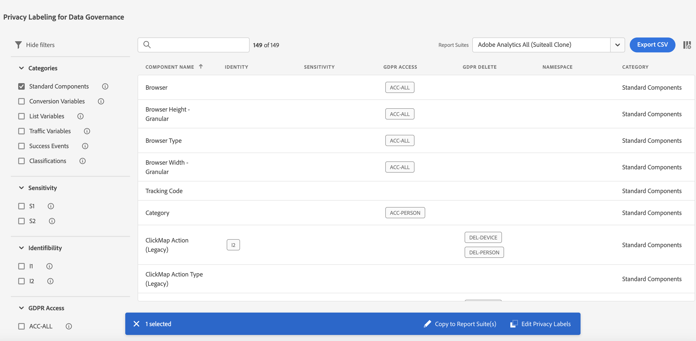

# 隱私權標籤概觀

為報表套裝資料加上標籤，代表您可為特定報表套裝內的每個變數，指派身分識別、敏感程度以及資料控管標籤。請務必先熟悉[標籤及其定義](/help/admin/tools/privacy-labeling/labels.md)。

>[!NOTE]
>
>請記住，每次建立新報表套裝，或在現有報表套裝內啟用新變數時，都必須仔細檢視標籤。啟用新解決方案整合時也必須檢閱標籤，因為它們可能會公開需要加上標籤的新變數。重新實施行動應用程式或網站可能會改變現有變數的使用方式，因此也可能需要更新標籤。

## 指派或編輯報表套裝的隱私權標籤 {#assign-edit}

**範例**：身為資料控管單位，您計畫從資料主體收集電子郵件地址和 Cookie ID，以處理其資料隱私權請求。這些 Cookie ID 儲存在 Adobe Analytics 的報表套裝中。

1. 在 Adobe Analytics 中，導覽至 **[!UICONTROL Analytics]** > 管理員 > **[!UICONTROL 所有管理員]** > **[!UICONTROL 資料設定和彙集]** > **[!UICONTROL 資料控管]**。

   

1. 從最上方的&#x200B;**[!UICONTROL 報表套裝]**&#x200B;選擇器中選擇一個報表套裝。

1. 在左側的篩選器區段中，選擇要加標籤的變數群組。 您一次只能為一個變數群組加標籤。

   * **標準元件** - 標準元件是現成可用的 Analytics 維度和指標，這是在 Analytics 內依預設收集的資料。
   * **轉換變數** - 自訂分析轉換變數 (或 eVar) 放置於您的網站上所選網頁的 Adobe 程式碼中。 其主要作用是將自訂行銷報告中的轉換成功量度區段。eVar 可以是根據瀏覽為準，其功能類似於 Cookie。 傳送到 eVar 變數的值，會在預定的期間內跟隨使用者。
   * **清單變數** - 清單變數是自訂變數，您可以視需要使用。 它們的作用與 eVar 類似，但是它們可以在同一次點擊中包含多個值。清單變數沒有字元限制。
   * **流量變數** - 自訂分析流量變數 (或 prop) 可讓您為自訂資料與特定流量相關的事件建立相互關聯。 prop 變數會嵌入至網站每個頁面上的實施代碼中。
   * **成功事件** - 成功事件 (也稱為轉換事件或自訂事件) 是可以被追蹤的行動。 成功事件的條件由您決定。 例如，若有訪客購買了一件物品，該購買事件即可被視為成功事件。
   * **分類** - 分類劃分是用於映射可回報資料的分析到相關屬性。 分類的用途廣泛，但最常用來分類促銷活動追蹤程式碼 (內部和外部) 和產品 ID。

1. 透過點選其核取方塊以選取一個變數，然後按一下出現在螢幕底部藍色列上的「**[!UICONTROL 編輯隱私權標籤]**」。

   

   此螢幕會顯示目前套用的標籤，並允許您應用其他標籤。 您可能無法套用或修改所有標籤，具體取決於元件。

   

1. 完成所有標籤設定後，按一下&#x200B;**[!UICONTROL 「套用」]**。

