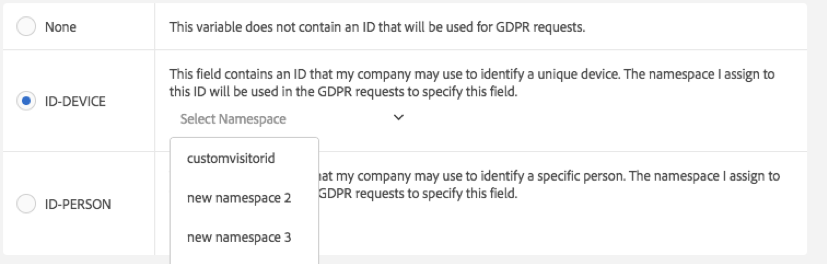

# Analytics 變數的資料隱私權標籤

Adobe 的客戶作為資料控管者，有責任遵循適用的資料隱私權法規，例如《一般資料保護規範》(GDPR) 和《加州消費者隱私法》(CCPA)。 客戶應諮詢自己的法律團隊，以確定應該如何處理其資料以遵守資料隱私權法律。 Adobe 了解其每個客戶都有與隱私權相關的獨特需求，這就是為什麼 Adobe 允許其客戶自訂其所需的資料隱私權資料處理設定。 這讓每個獨特客戶都能夠針對其品牌和獨特的資料集，透過最適合的方式處理資料隱私權請求。

Adobe Analytics 會根據資料敏感程度和契約限制提供標籤資料的工具。 標籤是一項重要的步驟，有助於: (1) 識別資料主體、(2) 判斷要傳回做為存取請求之一部分的資料，以及 (3) 識別做為部分刪除請求所必須刪除的資料欄位。

在確定應將哪些標籤套用至哪些變數/欄位之前，您需要先[瞭解在 Analytics 資料中擷取的 ID](/help/admin/tools/privacy-labeling/best-practices.md)，並決定要將哪個 ID 用於資料隱私權請求。

Adobe Analytics 資料隱私權實作支援下列身分識別資料、敏感資料和資料控管的標籤。

>[!NOTE]
>
>I1、I2、S1 及 S2 標籤與 Adobe Experience Platform 中對應命名的 DULE 標籤具有相同意義。 然而，它們的用途卻截然不同。 在 Adobe Analytics 中，這些標籤用於協助識別因 Privacy Service 請求而應匿名處理的欄位。 在 Adobe Experience Platform 中，它們用於存取控制、同意管理，以及對標記欄位執行行銷限制。 Adobe Experience Platform 支援許多 Adobe Analytics 未使用的其他標籤。 此外，Adobe Experience Platform 中的標籤也套用至結構描述。 如果您利用 Analytics 資料連接器將 Adobe Analytics 資料匯入至 Adobe Experience Platform，您需要確保在 Adobe Experience Platform 中，由每個報告套裝使用的結構描述已設定適當的 DULE 標籤。 Adobe Analytics 中指派的標籤不會自動套用至 Adobe Experience Platform 的這些結構描述，因為它們僅代表您可能需要套用的 DULE 標籤子集。 此外，不同的報告套裝可能共用一個結構描述，但具有相同編號的 prop 和 evar 會指派不同的標籤，並且此結構描述可能由其他資料來源的資料集共用，這可能會導致某些欄位為何接收到這些標籤的混亂。

## 身分識別資料標籤 {#identity-data-labels}

身分識別資料「I」標籤可用來分類可身分識別身分識別或聯絡特定人員的資料。

| 標籤 | 定義 | 其他需求 |
| --- | --- | --- |
| I1 | 可直接識別：可以明確識別或可與個人直接聯絡的資料，例如姓名或電子郵件地址。 | <ul><li>無法在事件上設定</li><li>無法在銷售eVar上設定</li></ul> |
| I2 | 可間接識別：可與任何其他資料合併使用，以識別或直接聯絡個人或裝置的資料，  不允許單獨識別個人，但可以結合其他資訊（不一定由您擁有）來識別某人。 例如：客戶忠誠度編號或公司 CRM 系統所用的 ID (每位客戶指定一個唯一 ID)。 | <ul><li>無法在事件上設定</li><li>無法在銷售eVar上設定</li></ul> |

{style="table-layout:auto"}

## 敏感資料標籤 {#sensitive-data-labels}

系統會使用敏感資料「S」標籤，將地理資料等敏感資料加以分類。 未來將會引入其他敏感資料標籤，以識別其他類型的敏感資訊。

| 標籤 | 定義 |
| --- | --- |
| S1 | 和經緯度相關的精確地理位置資料，可用來判斷裝置的確切位置（100米以內）。 |
| S2 | 地理位置資料可用於判定廣泛定義的地理圍欄區域。 |

{style="table-layout:auto"}

## 資料治理標籤 (資料隱私權) {#data-governance-labels}

資料控管標籤提供使用者進行資料分類以反映其隱私權相關考量與契約條件的能力，以協助 Adobe 客戶遵循法規和公司政策。

### 資料隱私權存取標籤 {#access}

| 標籤 | 定義 | 其他需求 |
| --- | --- | --- |
| 無 | 如果此變數所包含的資料，不包括資料隱私權存取請求傳回至資料主體的必要資料，請選取此選項。 | |
| ACC-ALL | 所有資料隱私權存取請求皆應包含此欄位中的值。 如果此值來自多人共享的裝置，則您身為資料控管者可藉由套用此標籤，表明此欄位資料可與任何具備該共享裝置存取權限的人共享。 | 將會為所有資料隱私權請求傳回帶有此標籤的欄位。 |
| ACC-PERSON | 只有在您合理確定該點擊是來自資料主體時 (可透過符合 ID-PERSON 欄位值的資料隱私權請求 ID 來判斷)，此欄位的值才可納入資料隱私權存取請求。 | 您也必須在此報告套裝中部分變數上設定 ID-PERSON 標籤，並使用該 ID 提交請求，否則不會套用此標籤。 |

{style="table-layout:auto"}

儘管有幾個變數會接收到其他標籤，不過我們還是希望您將存取標籤套用至大部分變數中。 然而，要決定與資料主體共用哪些所收集的資料，最終取決於您與法律團隊的諮詢結果。

### 資料隱私權刪除標籤 {#delete}

與其他標籤不同，這些「刪除」標籤並非互斥。 您可以選取「兩者」或「無」。 您不一定要加上個別的「[!UICONTROL 無]」標籤，只要不勾選任何一個「刪除」選項就會顯示「[!UICONTROL 無]」。

只有在欄位包含允許點擊與資料主體建立關聯的值時 (亦即允許辨識資料主體的身分)，才需要使用刪除標籤。 其他個人資訊（我的最愛、瀏覽/購買記錄、健康情況等） 不需要刪除，因為與資料主體的關聯將會中斷。

| 標籤 | 定義 | 其他需求 |
| --- | --- | --- |
| DEL-DEVICE | 對於資料隱私權刪除請求，只有在點擊含有特定 ID-DEVICE 的請求中，才應對此欄位的值進行匿名處理。  如果相同的值發生於其他未遭刪除的點擊，則不會變更其他點擊的例項。 這會導致運算此欄位中獨特計數的報告計數發生變化。 在共享裝置上，除了資料主體以外，這也可能會移除其他人的識別碼。  如果此欄位也具有 ID-DEVICE 標籤，而且以該欄位中的值做為資料隱私權請求的 ID，則計數不會變更。 | <ul><li>也需要I1、I2或S1標籤</li><li>無法在事件上設定</li><li>無法在銷售eVar上設定</li></li><li>無法在分類上設定</li><li>您必須使用ID-DEVICE提交請求，或將expandIDs設定為true ，否則不會套用此標籤。</li></ul> |
| DEL-PERSON | 對於資料隱私權刪除請求，只有在點擊含有特定 ID-PERSON 的請求中，才應對此欄位的值進行匿名處理。  如果相同的值發生於其他未遭刪除的點擊，則不會變更其他的值。 這會導致運算此欄位中獨特計數的報告計數發生變化。 如果此欄位也具有 ID-PERSON 標籤，而且以該欄位中的值做為資料隱私權請求的 ID，則計數不會變更。 | <ul><li>也需要I1、I2或S1標籤</li><li>無法在事件上設定</li><li>無法在銷售eVar上設定</li></li><li>無法在分類上設定</li><li>您也必須在該報表套裝中某個變數上使用 ID-PERSON 標籤集提交請求，並使用該 ID 提交請求，否則不會套用該標籤。</li></ul> |

{style="table-layout:auto"}

### 資料隱私權身分識別標籤 {#identity}

| 標籤 | 定義 | 其他需求 |
| --- | --- | --- |
| 無 | 此變數不包含用於資料隱私權請求的 ID。 | 如果此欄位含有透過 [Privacy Service API](https://experienceleague.adobe.com/docs/experience-platform/privacy/api/overview.html?lang=zh-Hant) 或 UI 提交存取或刪除請求時將使用的 ID，您才需要設定這些標籤中的其中一個。 |
| ID-DEVICE | 此欄位包含的 ID 可用於針對資料隱私權請求識別裝置，但無法辨別共用裝置上的不同使用者。  您不需要為所有包含 ID 的變數指定此標籤 (這是 I1/I2 標籤的作用)。 如果您使用儲存在此變數中的 ID 提交資料隱私權請求，而且想要搜尋此變數以找出指定 ID，請使用此標籤。 | 也需要 I1 或 I2 標籤。<ul><li>無法在事件上設定</li><li>無法在銷售eVar上設定</li><li>無法在分類上設定</li></ul> |
| ID-PERSON | 此欄位包含的 ID 可針對資料隱私權請求識別已驗證的使用者 (特定人員)。  您不需要為所有包含 ID 的變數指定此標籤 (這是 I1/I2 標籤的作用)。 如果您要使用儲存在此變數中的 ID 提交資料隱私權請求，而且想要搜尋此變數以找出指定 ID，請使用此標籤。 | <ul><li>也需要 I1 或 I2 標籤。</li><li>無法在事件上設定</li><li>無法在銷售eVar上設定</li><li>無法在分類上設定</li></ul> |

{style="table-layout:auto"}

## 將變數標示為 ID-DEVICE 或 ID-PERSON 時提供命名空間 {#provide-namespace}

當您賦予變數的標籤為 ID-DEVICE 或 ID-PERSON 時，系統會提示您提供命名空間。 您可以使用先前定義的命名空間或定義新的命名空間。

### 使用先前定義的命名空間 {#previously-defined}

如果您先前曾將 ID 標籤指派給登入公司中任何報表套裝的其他變數，您可以選取任何一個現有的命名空間。 如果此變數包含的ID型別與其他變數相同，且這些變數已加上此名稱空間的標籤，而您希望在提交請求時搜尋所有這些ID，則應重複使用名稱空間。

1. 按一下&#x200B;**[!UICONTROL 「選取命名空間」]**，然後選取任何一個現有的命名空間。
   
1. 按一下&#x200B;**[!UICONTROL 「套用」]**。


### 定義新的命名空間 {#define}

您也可以定義新的名稱空間。 我們建議將名稱空間字串限製為字母數字字元，加上字元底線、破折號和空格。 它們將會轉換為全部小寫。

1. 按一下&#x200B;**[!UICONTROL 「選取命名空間」]**，然後輸入命名空間標題。

   

1. 按下 **[!UICONTROL Enter]** 即可新增此命名空間。 「套用」按鈕必須等到現在才會啟用。
1. 按一下&#x200B;**[!UICONTROL 「套用」]**。

您指定為命名空間的字串，也就是在透過資料隱私權 API 提交請求 (即「namespace」參數的值) 時應使用的相同字串。 接著，請求會促使 Adobe Analytics 針對請求所指定的 ID，搜尋所有報告套裝中共用此命名空間的所有變數。

您不需要為所有包含 ID 的變數指定 ID-DEVICE 或 ID-PERSON 標籤 (這是 I1/I2 標籤的作用)。 如果您要使用儲存在此變數中的 ID 提交資料隱私權請求，而且想要搜尋此變數以找出指定 ID，請使用此標籤。 舉例來說，如果 eVar1 含有電子郵件地址，而 eVar2 含有登入使用者名稱，不過您只會以使用者名稱來提交請求，便可以使用命名空間「user name」將 eVar1 的標籤設為 I1、ACC-PERSON、DEL-PERSON，而將 eVar2 的標籤設為為 I2、ACC-PERSON、DEL-PERSON、ID-PERSON。 接著，您可以利用使用者區段 JSON 區塊來提交請求，如下所示：

```
{
     "namespace": "user name",
     "type": "analytics",
     "value": "rocketman123"
}
```

您可針對相同報表套裝中的不同變數，使用相同的名稱空間。 例如，某些自訂實作會將 CRM-ID 儲存在 prop 和 eVar 中。 如果其中之一一定會發生 CRM-ID (例如 eVar)，而且只偶爾發生在另一個變數中 (即 prop)，以及從未同時發生在prop 與 eVar，則只有 eVar 需要 ID 標籤和命名空間，因為 Adobe 只能在該 eVar 中搜尋該 ID。 然而，如果 CRM-ID 有時候會發生在某個變數中，有時則會發生在另一個變數中，那麼這兩個變數都應該擁有相同的命名空間，而 Adobe 會搜尋這兩個變數，找出在以此命名空間提交之資料隱私權請求中指定 ID 的發生次數。 您仍應該在所有這些變數上有DEL標籤，因此無論值發生在何處，都會進行匿名處理。

再舉一例，您可能有的CRM ID有時會透過eVar1傳入，有時會透過prop7傳入。 接著您會有一個處理規則，可將eVar1的值（如果存在的話）複製到eVar3中。 否則系統會從 prop7 將值複製到 eVar3。 在這種情況下，eVar3 將一律包含 CRM ID (若為已知 ID)，所以只有 eVar3 需要 ID-PERSON 標籤。

>[!CAUTION]
>
>系統會保留命名空間「`visitorId`」和「`customVisitorId`」，以識別 Analytics 舊版追蹤 Cookie 和 Analytics 客戶訪客 ID。 請勿將這些命名空間用於自訂流量或轉換變數。

## 變數類型以及其支援的資料隱私權標籤 {#variable-types}

資料隱私權標籤會影響四大類 Analytics 變數。 並非所有變數皆支援所有標籤。 此表格顯示哪些變數支援或不支援哪些標籤。

| 變數類型 | 支援的標籤 | 不支援的標籤 |
|--- |--- |--- |
| <ul><li>自訂成功事件</li><li>銷售 eVar</li><li>多值變數(mvVars)</li><li>階層變數</li></ul> | <ul><li>S1/S2</li><li>ACC-ALL、ACC-PERSON</li></ul> | <ul><li>I1/I2</li>  <li>ID-DEVICE、ID-PERSON</li><li>DEL-DEVICE、DEL-PERSON</li></ul> |
| 分類 | <ul><li>I1/I2、S1/S2</li><li>ACC-ALL、ACC-PERSON</li></ul> | <ul><li>ID-DEVICE、ID-PERSON</li><li>DEL-DEVICE、DEL-PERSON</li></ul> |
| <ul><li>流量變數(Prop)</li><li>Commerce變數（非銷售eVar）</li></ul> | 所有標籤 | - |
| 大多數其他變數 (*請參閱下表以了解例外情況*) | ACC-ALL、ACC-PERSON | <ul><li>I1/I2、S1/S2</li><li>ID-DEVICE、ID-PERSON</li><li>DEL-DEVICE、DEL-PERSON)</li></ul> |

{style="table-layout:auto"}

## 可以指派/修改 ACC-ALL/ACC-PERSON 以外標籤的變數 {#variables}

<table id="table_0972910DB2D7473588F23EA47988381D"> 
 <thead> 
  <tr> 
   <th colname="col1" class="entry"> 群組 </th> 
   <th colname="col2" class="entry"> 變數 </th> 
   <th colname="col3" class="entry"> 可修改的標籤 </th> 
   <th colname="col4" class="entry"> 評論 </th> 
  </tr>
 </thead>
 <tbody> 
  <tr> 
   <td colname="col1" morerows="1"> 
    <ul id="ul_62FA1BAA3B9245909509566D8C03F900"> 
     <li id="li_38F7C4E18ECB42C292370713F502B8EB">轉換維度 </li> 
     <li id="li_41CB61F927CB4402AAB4A62E219CD153">自訂流量維度 </li> 
    </ul> </td> 
   <td colname="col2"> <p>全部，分類除外 </p> </td> 
   <td colname="col3"> <p>全部 </p> </td> 
   <td colname="col4"> </td> 
  </tr>
  <tr> 
   <td colname="col1"> <p>流量變數 </p> </td> 
   <td colname="col2"> <p>清單 Prop </p> </td> 
   <td colname="col3"> <p>無/S1/S2 </p> </td> 
   <td colname="col4"> <p>清單 prop 可包含多個值，且不可作為隱私識別碼。</p> </td> 
  </tr> 
  <tr> 
   <td colname="col2"> <p>分類 </p> </td> 
   <td colname="col3"> <p>無/ I1 / I2 </p> <p>無/S1/S2 </p> </td> 
   <td colname="col4"> </td> 
  </tr> 
  <tr> 
   <td colname="col1"> <p>轉換事件 </p> </td> 
   <td colname="col2"> <p>全部 </p> </td> 
   <td colname="col3"> <p>無/S1/S2 </p> </td> 
   <td colname="col4"> </td> 
  </tr> 
  <tr> 
   <td colname="col1"> <p>解決方案維度和事件 </p> </td> 
   <td colname="col2"> <p>Activity Map 連結, </p> <p>Activity Map 頁面 </p> </td> 
   <td colname="col3"> <p>無/ I1 / I2 </p> <p>無/ DEL-DEVICE / DEL-PERSON </p> </td> 
   <td colname="col4"> <p>變數可包含URL引數，而這些URL引數可能包含直接或間接可識別的資料。 如果您的實作未收集在這些變數中可直接或間接身分識別的資料，那麼這些資料不需要身分識別或刪除標籤。 </p> <p>請注意，刪除會清除 URL 參數，但會保留基礎 URL。 </p> </td> 
  </tr> 
  <tr> 
   <td colname="col1"> <p>資料處理維度 </p> </td> 
   <td colname="col2"> <p>自訂訪客 ID </p> </td> 
   <td colname="col3"> <p>ID-DEVICE/ID-PERSON </p> <p>DEL-DEVICE/DEL-PERSON </p> </td> 
   <td colname="col4"> <p>您不能移除 ID 或 DEL 標籤 (設定為「無」)，不過您可以根據自訂 ID 實作，將其變更為 DEVICE 或 PERSON 變體。 </p> <p>如果您不使用自訂訪客 ID，則採用哪種設定並不重要。 </p> </td> 
  </tr> 
  <tr> 
   <td colname="col1" morerows="1"> 
    <ul id="ul_5EB0193732D44A20AEA08CE9DFE01DBD"> 
     <li id="li_F70D969F83314A94BD8567449968EE2F">標準維度 </li> 
     <li id="li_6046764B19FF4679B51E55671C2C0ADB">資料處理維度 </li> 
    </ul> </td> 
   <td colname="col2"> <p>IP 位址 </p> <p>IP 位址 2 </p> </td> 
   <td colname="col3"> <p>DEL-DEVICE/DEL-PERSON </p> </td> 
   <td colname="col4"> <p>您無法移除DEL標籤，但可以將其變更為DEL-DEVICE或DEL-PERSON，或同時變更兩者。 </p> </td> 
  </tr> 
  <tr> 
   <td colname="col2"> <p>ClickMap 動作 (舊版), </p> <p>ClickMap 內容 (舊版), </p> <p>頁面, </p> <p>頁面 URL、 </p> <p>原始登入頁面 URL, </p> <p>反向連結、 </p> <p>造訪開始頁面 URL </p> </td> 
   <td colname="col3"> <p>無/ I1 / I2 </p> <p>無/ DEL-DEVICE / DEL-PERSON </p> </td> 
   <td colname="col4"> <p>變數可包含URL引數，而這些URL引數可能包含直接或間接可識別的資料。 如果您的實作未收集在這些變數中可直接或間接身分識別的資料，那麼這些資料不需要身分識別或刪除標籤。 </p> <p>請注意，刪除會清除 URL 參數，但會保留基礎 URL。 </p> </td> 
  </tr> 
 </tbody> 
</table>

## 刪除處理 {#deletion}

Adobe Analytics 提供的資料隱私權刪除請求支援，目的為將對報表的影響降至最低。 在大多數情況下，報表中顯示的量度應該不會變更。 在資料隱私權刪除前執行的歷史報表將會與刪除後執行的報表一致。 為了達成此目的，可以完全解除已刪除資料與資料主體的關聯，同時保留無法識別身分的資料；如此一來，報告的值就能維持一致。

下表說明如何「刪除」不同的變數。 這不是完整清單。

| 變數 | 刪除方法 |
| --- | --- |
| <ul><li>流量變數 (prop)</li><li>商務變數 (eVars)</li></ul> | 現有值會被新值取代，格式為「Data Privacy-356396D55C4F9C7AB3FBB2F2FA223482」，其中「Data Privacy-」首碼之後的 32 位數十六進位值，為 128 位元強式密碼偽隨機數。<p>由於舊值是以隨機字串取代，故無法由新值反推原始值，亦無法由原始值推導出新值。  對於指定的變數而言，如果同一個資料隱私權請求中被刪除的其他點擊內，也出現相同的值遭到取代，則該值的所有例項都會取代為相同的新值。<p>如果某個值的某些執行個體被一個刪除請求取代，而之後的請求刪除了原始值的其他（新）執行個體，則新的取代值將與原始取代值不同。 |
| 購買 ID | 現有值會被新值取代，格式為「G-7588FCD8642718EC50」，其中「G-」首碼之後的十六進位 18 位數為一組 128 位元強式密碼偽隨機數的前 18 位數。 適用於刪除流量和商務變數的所有註解也會在此處適用。<p>購買ID是交易ID，其主要用途是確保購買不會獲得兩次退款，例如當有人重新整理其購買確認頁面時。 ID本身可能會將購買連結至您自己的DB中記錄該購買的列。 大部分情況下不需要刪除此 ID，故預設不會刪除。<p>若您在提出資料隱私權刪除自有資料請求後，購買仍可反向繫結使用者，則您可能需要刪除該欄位，這樣該訪客的 Analytics 資料就無法反向繫結購買者。 |
| 訪客 ID | 值是128位元整數，取代為加密性強的128位元偽隨機值。 |
| <ul><li>MCID</li><li>自訂訪客 ID</li><li>IP 位址</li><li>IP 位址 2 | 這個值會遭清除 (根據變數類型而設定為空字串或 0)。 |
| <ul><li>ClickMap 動作 (舊版)</li><li>ClickMap 內容 (舊版)</li><li>頁面</li><li>頁面 URL</li><li>原始登入頁面 URL</li><li>反向連結</li><li>造訪開始頁面 URL</li></ul> | URL引數已清除/移除。 如果值類似於URL，則會清除值（設為空字串）。 |
| <ul><li>緯度</li><li>經度</li></ul> | 精準度會降低為 1 公里以上。 |

{style="table-layout:auto"}

## 不支援預期刪除標籤的變數 {#no-delete-support}

本節旨在釐清可能不支援刪除之 Analytics 變數的相關資訊。 有時候，這些變數會遭到非 Analytics 使用者 (例如法務團隊) 刪除，而這些人並不瞭解變數中包含的資料類型，且僅根據變數的名稱做出假設。

在做出有關標記或刪除的決定之前，了解每個變數所包含的資料類型非常重要，而不是僅依賴變數名稱。 以下為其中一些變數的清單，以及這些變數不需要刪除，或者不需要特定的刪除標籤的原因：

| 變數 | 註解 |
| --- | --- |
| [!UICONTROL 新訪客 ID] | 新訪客 ID 是我們第一次看到指定的訪客 ID 時為 true 的布林值。 訪客ID匿名化後，就不需要再刪除。 進行匿名化之後，將會對應於我們第一次看到這個匿名化ID的時間。 |
| [!UICONTROL 郵遞區號]<p>[!UICONTROL 地理郵遞區號] | 郵遞區號僅針對源自美國的點選設定。 未針對來自歐盟的點選進行設定。 即使在設定之後，也只能提供廣泛的地理區域，因而難以重新識別資料主體。 |
| [!UICONTROL 地理緯度]<p>[!UICONTROL 地理經度] | 這些引數會提供衍生自IP位址的粗略位置。 準確性通常與郵遞區號類似，位於實際位置的數十公里內。 |
| [!UICONTROL 使用者代理] | 使用者代理可辨識所使用的瀏覽器版本。 |
| [!UICONTROL 使用者 ID] | 指定包含資料的 Analytics 報告套裝 (採用號碼形式)。 |
| [!UICONTROL 報告套裝 ID] | 指定包含資料的 Analytics 報告套裝名稱。 |
| [!UICONTROL 訪客 ID]<p>[!UICONTROL MCID] / [!UICONTROL ECID] | 這些 ID 具有 DEL-DEVICE 標籤，但無法新增 DEL-PERSON 標籤。 如果您希望這些 Cookie ID 匿名處理包含在 prop 或 eVar 中相符 ID 的點擊，則可以透過使用 ID-DEVICE 標籤，標記 prop 或 eVar 來解決此標籤限制，即使其實際上可辨識個人身分 (所有 DEL-PERSON 標籤也必須變更為 DEL-DEVICE 標籤)。 在這種情況下，由於只有部分訪客 ID 或 ECID 的例項會予以匿名處理，因此歷史報告中的獨特訪客計數都會變更。 |
| [!UICONTROL AMO ID] | Adobe Advertising ID為解決方案變數，具有不可修改的[!UICONTROL DEL-DEVICE]標籤。 會從Cookie填入，就像訪客ID和MCID一樣。 刪除其他ID時，應該從點選中刪除該ID。 如需詳細資訊，請參閱這些變數的說明。 |

{style="table-layout:auto"}

## 存取請求的日期欄位 {#access-requests}

共有五個標準變數包含時間戳記：

| 時間戳記 | 定義 |
| --- | --- |
| 點擊時間 UTC | Adobe Analytics收到點選的時間。 |
| 自訂點擊時間 UTC | 點擊發生的時間。某些行動應用程式和其他實作的點擊發生時間，可能會早於其接收時間。 例如，如果發生網路連線時無法提供，應用程式可能會保留點選，並在連線可供使用時將其傳送。 |
| 日期時間 | 與「自訂點擊時間 UTC」值相同，但採用報表套裝的時區，而非 GMT。 |
| 首次命中時間GMT | 針對此點選的訪客ID值所收到首次點選的自訂點選時間UTC值。 |
| 造訪開始時間 UTC | 收到此訪客 ID 值當次造訪首次點擊的自訂點擊時間 UTC 值。 |

{style="table-layout:auto"}

針對按資料隱私權存取請求傳回的檔案，產生這些檔案的程式碼會要求存取請求 (有適用這類要求的 ACC 標籤) 中，須納入前三個時間戳記變數中的其中一個。 如未納入任一變數，則自訂點擊時間 UTC 會視同具有 ACC-ALL 標籤。

資料隱私權存取請求傳回的點擊層級 CSV 檔案會將這些欄位中採 Unix 時間戳記的值轉換為日期/時間欄位的格式 `YYYY-MM-DD HH:MM:SS` (例如：`2018-05-01 13:49:22`)。 在此摘要 HTML 檔案中，這些時間戳記值將會遭截斷，使其僅包括日期 `YYYY-MM-DD`，以減少這些欄位所產生的唯一值數量。
