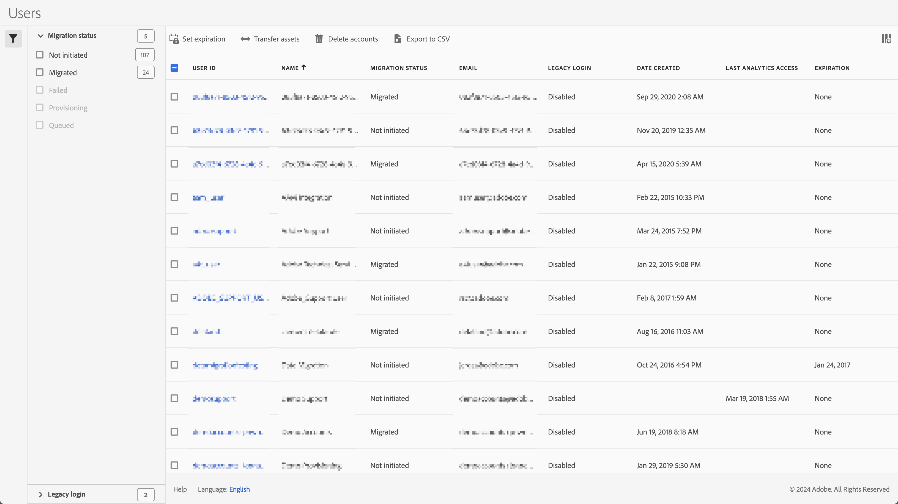

# 管理舊版使用者帳戶、資產、有效期

您可以使用&#x200B;**[!UICONTROL 管理員] > [!UICONTROL 所有管理員] > [!UICONTROL Analytics使用者與管理員]**&#x200B;來管理舊版使用者帳戶、其移轉狀態、到期資料、將資產轉移給其他使用者等等。

使用者畫面會顯示目前的Adobe Analytics使用者清單，其中包含下列欄：

| 欄 | 說明 |
|---|---|
| [!UICONTROL 使用者 ID] | 使用者用來登入Adobe Analytics的使用者ID。 |
| [!UICONTROL 名稱] | 使用者的名稱。 |
| [!UICONTROL 移轉狀態] | 從舊版使用者帳戶移轉至Enterprise ID或Adobe ID的狀態。  狀態可以是Not initiated、Queued或Migrated。 |
| [!UICONTROL 電子郵件] | 使用者的電子郵件。 |
| [!UICONTROL 舊版登入] | 舊版登入的狀態，可為「啟用」或「停用」。 |
| [!UICONTROL 建立日期] | 在Adobe Analytics中建立使用者帳戶時的時間戳記。 |
| [!UICONTROL 上次的Analytics存取權] | 使用者帳戶最近一次存取Adobe Analytics的時間戳記， |
| [!UICONTROL 期限] | 使用者帳戶的到期日期；若使用者帳戶沒有到期，則為「無」。 |

- 若要搜尋特定使用者，請使用 *依標題搜尋*&#x200B;欄位。
- 若要篩選移轉狀態清單，請選取 **[!UICONTROL 移轉狀態]**。
- 若要篩選舊版登入狀態的清單，請選取 **[!UICONTROL 舊版登入]**。
- 若要變更欄的顯示，請選取，然後從快顯視窗中選取欄。

從清單中選取一或多個使用者時，您可以套用各種動作：

| 動作 | 說明 |
|---|---|
|  **[!UICONTROL 移轉]** | 您可以將一個或多個使用者移轉至Enterprise ID或Adobe ID。 |
|  **[!UICONTROL 設定到期日]** | 您可以為選取的使用者設定使用舊版Adobe Analytics登入的有效日期。  選取日期，以使用行事曆快顯視窗來指定日期。 選取&#x200B;**[!UICONTROL 完成]**&#x200B;以確認過期。 |
|  **[!UICONTROL 轉移資產]** | 只有選取一位使用者時，才能使用此動作。 如果使用者擁有可轉移的資產，您可以選取帳戶專案（如書籤、控制面板等）。 選取&#x200B;**[!UICONTROL 轉移]**&#x200B;以完成轉移。  |
|  **[!UICONTROL 刪除帳戶]** | 畫面會顯示一個對話方塊，確認刪除選取的帳戶。 選取&#x200B;**[!UICONTROL 確定]**&#x200B;以刪除帳戶。 選取「**[!UICONTROL 取消]**」即可取消。 |
|  **[!UICONTROL 匯出為CSV]** | 此動作會立即下載檔案，檔案中包含所選使用者的逗號分隔值清單及其詳細資料（名稱、移轉狀態、電子郵件等）。 |

