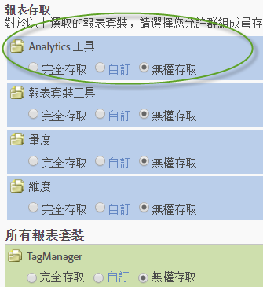

# 自訂 Analytics 工具權限

>[!IMPORTANT]
>
>使用者和產品管理功能已移至 [Admin Console](https://helpx.adobe.com/tw/enterprise/using/admin-console.html)。輪到您移轉使用者時，Adobe 會通知您。After all customers have migrated, help content for **[!UICONTROL Analytics]** > **[!UICONTROL Admin]** > **[!UICONTROL User Management]** will be retired.

啟用「一般」項目 (帳單、日誌等)、公司管理、工具、網站服務存取、Report Builder 和 Data Connectors 整合的使用者權限。

**[!UICONTROL User Management]** > **[!UICONTROL Groups]** > **[!UICONTROL All Report Access]** > **[!UICONTROL Analytics Tools]** > **[!UICONTROL Customize]**

>[!NOTE] 2016 年秋季版 (10 月 20 日) 更新了群組管理功能。請參閱[管理變更 - 2016 年秋季](/help/admin/user-management2/c-user-management/permissions-changes.md)以取得變更摘要。

## 報表存取 - 分析工具

Click **[!UICONTROL Customize]** to select items to which this group will have access.

## 欄位說明

此頁面上的設定與頁面上選取的報表套裝相 [!UICONTROL Define User Groups] 關。

| 元素 | 說明 |
|--- |--- |
| **一般** |  |
| [代碼管理器](/help/admin/admin/code-manager-admin.md) | 啟用下載適用於網頁和行動平台的資料收集代碼的權限。 |
| 代碼管理器 - 網站服務 | 允許非管理使用者透過網站服務存取「程式碼管理員」。 |
| [記錄檔](/help/admin/admin/logs.md) | 啟用記錄檔的權限，協助您查看使用者登入的時間、使用情形、存取權、報表套裝和管理員變更。 |
| 記錄檔 - 網站服務 | 允許非管理使用者透過網站服務存取「管理工具」記錄檔。 |
| [流量管理](/help/admin/c-traffic-management/traffic-management.md) | 「流量管理」頁面可讓您指定預期的流量變更。 |
| 權限管理 | 授與非管理員使用者「管理工具」中「使用者管理」頁面的存取權。 這些使用者擁有「讀取」權限，但沒有「寫入」權限。 |
| 權限 (寫入) - 網站服務 | 在「網站服務」的「使用者管理」下授予非管理使用者讀取和寫入權限設定。 此設定專指 Admin API 中所述的權限操作。 |
| 權限 (讀取) - 網站服務 | 允許非管理用戶在「Web服務」的「用戶管理」下查看權限設定。 此設定專指 Admin API 中所述的權限操作。 |
| **公司管理** |  |
| [安全性](/help/admin/company/security-manager.md) | 授予安全管理員頁面的權限，以控制對報表資料的存取。選項包括增強式密碼、密碼過期、IP 登入限制及電子郵件網域限制。 |
| 支援資訊 | 授予公司設定中的支援資訊的權限。 |
| [網站服務](/help/admin/company/web-services-admin.md) | 允許存取「管理工具」介面([!UICONTROL Company Settings] > [!UICONTROL Web Services])中的「網站服務」頁面。 「網站服務 API」提供對 Adobe Analytics 服務可程式化的存取，可讓您透過使用者介面複製並增強可用功能。 |
| 單一登入（舊版） | 授予「管理工具」中單一登入頁面的存取權。 **注意：**Adobe Experience Cloud 中的單一登入是使用 Experience Cloud 與解決方案之間的[帳戶連結](https://marketing.adobe.com/resources/help/zh_TW/mcloud/organizations.html)實作。 |
| [待定動作](/help/admin/company/pending-actions-admin.md) | Grants permission to manage pending actions in [!UICONTROL Company Settings]. |
| [品牌結合](/help/admin/company/co-branding-admin.md) | 授予與 Analytics 品牌結合的權限。 |
| [偏好設定](/help/admin/admin/preferences-manager.md) | 授予權限 [!UICONTROL Preference Manager]。 |
| [隱藏報表套裝](/help/admin/company/c-hide-report-suites.md) | 授予在 Adobe Analytics 使用者介面中隱藏報表套裝的權限。 |
| **工具** | 這些設定可授與Analytics工具（介面和應用程式）和進階功能（例如分段和計算量度）的存取權。 |
| [目前的資料](https://marketing.adobe.com/resources/help/zh_TW/reference/data_latency.html) | 授予在報告中使用「目前的資料」功能的權限。 |
| [ Ad Hoc Analysis 授權使用者](https://marketing.adobe.com/resources/help/zh_TW/dsc/) | 授予存取權 [!UICONTROL Ad Hoc Analysis]。 |
| 網站服務存取 | 為非管理員啟用網站服務存取權。 生成Web服務憑據。 |
| [Report Builder](https://marketing.adobe.com/resources/help/zh_TW/arb/setup.html) | 授與此群組成員授與授權的 [!UICONTROL Report Builder] 存取權。 |
| [Analysis Workspace 存取](https://marketing.adobe.com/resources/help/zh_TW/analytics/analysis-workspace/) | 授予對 Analysis Workspace 的使用者存取，即 [!DNL Adobe Analytics] 建議的報告介面。 |
| [Reports &amp; Analytics](https://marketing.adobe.com/resources/help/zh_TW/sc/user/) | 授予對 Reports &amp; Analytics 的使用者存取。 |
| [建立計算量度](https://marketing.adobe.com/resources/help/zh_TW/analytics/calcmetrics/) | 授予使用者建立計算量度的權限。 |
| [區段建立](https://marketing.adobe.com/resources/help/zh_TW/analytics/segment/) | 授予使用者建立區段的權限。 |
| **Data Connectors** |  |
| 整合（建立、更新或刪除） | 授予建立、更新和刪除 Data Connector 整合的權限。 |
