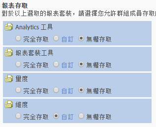

# 自訂報表存取 - 概觀

>[!IMPORTANT]
>
>使用者和產品管理功能即將移至 [Admin Console](https://helpx.adobe.com/enterprise/using/admin-console.html)。輪到您移轉使用者時，Adobe 會通知您。所有客戶都完成移轉後，**[!UICONTROL 「Analytics]** &gt; **[!UICONTROL 管理工具]** &gt; **[!UICONTROL 使用者管理」]**&#x200B;的說明內容將會淘汰。

自訂分析工具、報表套裝工具、量度和維度的群組權限。

**[!UICONTROL 新增群組]** &gt; **[!UICONTROL 報表存取]**

[!UICONTROL 定義使用者群組]頁面上的[!UICONTROL 報表存取]區段提供可讓您在精細層次自訂權限的存取。

例如，您可以建立群組，使其可取得多項 Analytics 工具 ([!UICONTROL Analysis Workspace]、[!UICONTROL Reports &amp; Analytics] 及 [!UICONTROL Report Builder])、具有特定量度和維度 (包括 eVar) 之權限，並具有區段或計算量度建立等功能。

## 關於權限應該知道的事項 {#section_3D25D4A5BD044008870C5B98F696244E}

<table id="table_DB7806E05E2040EC9A4CB7C3596879EC"> 
 <thead> 
  <tr> 
   <th colname="col1" class="entry"> 項目 </th> 
   <th colname="col2" class="entry"> 說明 </th> 
  </tr> 
 </thead>
 <tbody> 
  <tr> 
   <td colname="col1"> 
管理員存取/預先定義的群組 
 </td> 
   <td colname="col2"> 
 管理員不再需要預先定義的群組。管理員現在可以存取所有項目 (工具、量度和維度)，以及網站服務存取、Report Builder、Activity Map 和 Ad Hoc Analysis。 
 
群組的目的是授予或限制對非管理使用者的存取。 
 </td> 
  </tr> 
  <tr> 
   <td colname="col1"> 
自訂群組 
 </td> 
   <td colname="col2"> 
 自訂群組已取代預先定義的群組。現有預先定義的群組將使用相同群組名稱移轉至自訂群組。將保留您所建立的任何自訂群組，包括其設定。不過，您將注意到設定的位置將會移動。例如，公司設定 (自訂管理控制台中) 現在位於<a href="/help/admin/user-management2/c-customize-report-access/groups-analytics-tools.md">自訂分析工具</a>。 
 
 屬於「全部報表存取權 」的使用者已移轉至具有下列存取權的自訂群組: 
 
    <ul id="ul_7E1B443DEEF7452E85FEB30CA0BBC8BE"> 
     <li id="li_A510C2A4129340E0AB08EEBDBE4AEAD9">所有維度 </li> 
     <li id="li_8BA1D7A2527C4F10AC93108B9E87F418">所有量度 </li> 
     <li id="li_265830A2C6B94AF28720DA99980EAA51">所有報表套裝 </li> 
     <li id="li_685B99DEAB814D7B9C11B14AA4CB8CD4">頻道報表 </li> 
     <li id="li_B35420302AAB42509BD6AF0FA6349BF8">異常偵測 </li> 
     <li id="li_3787E4696C454D3ABD1D75F6C282A9A2">即時報表 </li> 
     <li id="li_3797DF9C40D1426588819116362962F5">Analysis Workspace 存取 </li> 
    </ul> 
管理員可以刪除自訂群組並建立自己的群組，因為先前在預先定義的群組中可使用的所有設定，皆可在位於「定義使用者群組」內的「報表存取」</a>設定中自訂。 
 </td> 
  </tr> 
  <tr> 
   <td colname="col1"> 
維度層級權限 
 </td> 
   <td colname="col2"> 
您可以自訂權限來加入或排除對維度的存取 (除了量度以外)。 
 
    <ul id="ul_DA5A54223673474E9151AF979DA50659"> 
     <li id="li_C3E82F7BC07A4F2F83A85D3D511292CC"> 
自訂群組中的所有目前的維度和量度已自動遷移至新類別。如果現有群組已啟用量度，則將依預設為其指定所有新近獲得權限的維度 (eVars 和內容感知) 和量度。 
 </li> 
     <li id="li_CC56F9181CC14AB59318628E72F2E8C9"> Classifications Importer (即原 SAINT) 權限: 存取類別是由存取類別基準的<a href="https://marketing.adobe.com/resources/help/en_US/reference/c_classifications.html">變數</a>所決定。  </li> 
    </ul> 
請參閱<a href="/help/admin/user-management2/c-customize-report-access/groups-dimensions.md">自訂維度權限</a>。 
 </td> 
  </tr> 
  <tr> 
   <td colname="col1"> 
<a href="https://helpx.adobe.com/enterprise/using/admin-console.html"> Adobe Admin Console</a> 
 </td> 
   <td colname="col2"> 
僅新客戶或已在 <a href="https://marketing.adobe.com/resources/help/en_US/mcloud/core_services.html">Experience Cloud</a> 中佈建公司的客戶才建議使用。已計劃將現有 Analytics 客戶移轉至 Experience Cloud 識別管理系統。 
 
如需詳細資訊，請參閱 <a href="https://marketing.adobe.com/resources/help/en_US/experience-cloud/admin-console/analytics-migration/">Analytics 使用者移轉至 Admin Console</a>。 
 </td> 
  </tr> 
  <tr> 
   <td colname="col1"> 
內容感知 
 </td> 
   <td colname="col2"> 
內容感知包括的變數可讓您管理與 Experience Cloud 解決方案整合相關之量度的權限。您可以管理 Social、Mobile 的權限，或管理透過 Experience Cloud 整合插入的任何其他資料的權限。預設會啟用這些項目。 
 </td> 
  </tr> 
  <tr> 
   <td colname="col1"> 
預設權限/報告 
 </td> 
   <td colname="col2"> 
這些已停用的報表將移除: 
 
    <ul id="ul_C0415CFF0562472297272EC58ECC0774"> 
     <li id="li_62B1CE33B1454987B878B321EB40D62E">每月摘要 </li> 
     <li id="li_71CD776D212540A18F9B083D2E11A296">訪客首頁 </li> 
     <li id="li_406200AD68C74D11B5F53988A4E76A68">Netscape 外掛程式 </li> 
     <li id="li_A124637D69C94C78921C8B028D890541">關鍵訪客 </li> 
     <li id="li_5C26FF95371B4F3080FF75C7F8DE0F72">關鍵訪客檢視的頁面 </li> 
     <li id="li_E7E262BD0CF64E16B838F995F6A13B8A">訪客快照 </li> 
     <li id="li_0EDC74625C0D4B1A992FCA49B648E4C0">DRM </li> 
     <li id="li_ACC92E6EA188409486E7C943F26B9DAC">網路通訊協定 </li> 
     <li id="li_6E18C4D12377416A8124BBD13164B03A">Java 版本 </li> 
     <li id="li_1599265E59EF4F34BB406356410C9E68">書籤 URL 長度 </li> 
     <li id="li_3035442010984C409089B21E03DB7BCC">裝置號碼傳輸 </li> 
     <li id="li_6B2163ED8FC84EBF933D97A504B4D527">PTT </li> 
     <li id="li_0EB8A4A7619B45DF87109B183A7C69C8">裝飾郵件支援 </li> 
     <li id="li_989FAC662F7344E6BDDC517B79D4581E">資訊 </li> 
     <li id="li_F1FB7F8E415443F3B63F6D11D59A04AB">資訊服務 </li> 
    </ul> 
以下報表: 
 
    <ul id="ul_F71505C59F734EA9B541BF8AB9F9388F"> 
     <li id="li_7D461907B895447280E69CF1520DF47C">仍能透過書籤存取。 </li> 
     <li id="li_27BA2DD6BA4C446FBAA06B6C76CD171F">並未包含在新的維度權限類別中。 </li> 
     <li id="li_504E9D8421714406A0F37DEF1E10E34B">已無法編輯其權限 </li> 
     <li id="li_0022E8DCA07344C793847E8282EFBEEF">具有目前的存取權限的自訂群組仍將保留存取權限 </li> 
    </ul> </td> 
  </tr> 
 </tbody> 
</table>

