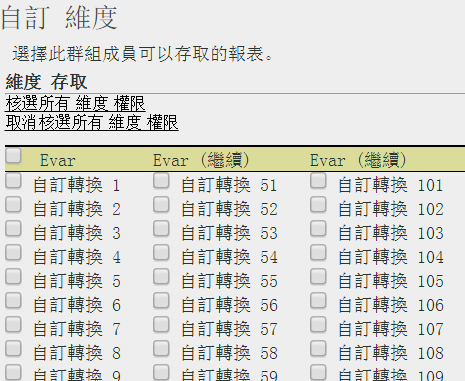

# 自訂維度權限

> [!IMPORTANT]使用者和產品管理功能即將移至 [Admin Console](https://helpx.adobe.com/enterprise/using/admin-console.html)。輪到您移轉使用者時，Adobe 會通知您。所有客戶都完成移轉後，**[!UICONTROL 「Analytics]** &gt; **[!UICONTROL 管理工具]** &gt; **[!UICONTROL 使用者管理」]**&#x200B;的說明內容將會淘汰。

在粒度層級自訂使用者存取，包括 eVar、流量報表、解決方案報表和路徑報表。

**[!UICONTROL 使用者管理]** &gt; **[!UICONTROL 群組]** &gt; **[!UICONTROL 報表存取]** &gt; **[!UICONTROL 維度]** &gt; **[!UICONTROL 自訂]**

> [!IMPORTANT] 目前部分維度無法提供權限。這些維度包括: 行動書籤長度、行動裝置號碼、行動 DRM、行動資訊服務、行動 Java VM、行動郵件裝飾、行動網路通訊協定、行動作業系統、行動「對講機」。
>
>不論使用者具備哪些其他權限，所有使用者都可使用這些維度。

此頁面上的設定屬於[!UICONTROL 定義使用者群組]頁面上選取的報表套裝。

瞭解權限維度類別的下列相關資訊。

* eVars 1-250 為個別取得權限。
* 所有流量報表皆屬於維度。
* 視訊和行動報表以及其他 Analytics 解決方案報表 (Experience Manager、Advertising Cloud、Social 等) 均屬維度。
* 如果用戶有權存取父維度，則可以使用路徑報表。
* 自訂群組中的所有目前的維度和量度已自動遷移至新類別。如果現有群組已啟用量度，則將依預設為其指定所有新近獲得權限的維度 (eVars 和內容感知) 和量度。
* Classifications Importer (即原 SAINT) 權限: 存取類別是由存取類別基準的[變數](https://marketing.adobe.com/resources/help/en_US/reference/c_classifications.html)所決定。 

如需更多詳細資訊，請參閱[關於權限變更的常見問題](https://marketing.adobe.com/resources/help/en_US/reference/permissions_faq.html)。

**自訂維度**

下列項目是您可以允許的維度。

<table id="table_F37D74A1619A4560A5F5651E855DAF1C"> 
 <thead> 
  <tr> 
   <th colname="col1" class="entry"> 元素 </th> 
   <th colname="col2" class="entry"> 說明 </th> 
  </tr> 
 </thead>
 <tbody> 
  <tr> 
   <td colname="col1"> 
 <a href="/help/admin/admin/conversion-var-admin/conversion-var-admin.md"> eVar </a> 
 </td> 
   <td colname="col2"> 
eVars 1-250 為個別取得權限。eVar 是自訂轉換變數，您可以用來將自訂報表中的轉換成功量度分段。 
 </td> 
  </tr> 
  <tr> 
   <td colname="col1"> 
 <a href="https://marketing.adobe.com/resources/help/en_US/sc/implement/props_eVars.html"> Prop </a> 
 </td> 
   <td colname="col2"> 
Prop 為自訂流量變數。 
 
請參閱 Analytics 實施中的<a href="https://marketing.adobe.com/resources/help/en_US/sc/implement/props_eVars.html">流量 Prop 和轉換 eVar</a>。 
 </td> 
  </tr> 
  <tr> 
   <td colname="col1"> 
 <a href="https://marketing.adobe.com/resources/help/en_US/sc/implement/hierN.html"> 階層 </a> 
 </td> 
   <td colname="col2"> 
 階層 (hierN) 變數會決定某個頁面在您的網站階層或頁面結構中的所在位置。 
 </td> 
  </tr> 
  <tr> 
   <td colname="col1"> 
 <a href="https://marketing.adobe.com/resources/help/en_US/sc/implement/listN.html"> Listvar </a> 
 </td> 
   <td colname="col2"> 
 清單變數的運作方式與清單 Prop 函數類似，也允許相同影像要求中可有多個值。 
 </td> 
  </tr> 
  <tr> 
   <td colname="col1"> 
標準 
 </td> 
   <td colname="col2"> 
請參閱 Analytics 中的標準(現成) 維度。 
 </td> 
  </tr> 
  <tr> 
   <td colname="col1"> 
 <a href="https://marketing.adobe.com/resources/help/en_US/em/"> AEM </a> 
 </td> 
   <td colname="col2"> 
Adobe Experience Manager 
 </td> 
  </tr> 
  <tr> 
   <td colname="col1"> 
 <a href="https://marketing.adobe.com/resources/help/en_US/media-optimizer/"> AMO </a> 
 </td> 
   <td colname="col2"> 
Adobe Advertising Cloud 
 </td> 
  </tr> 
  <tr> 
   <td colname="col1"> 
 <a href="https://marketing.adobe.com/resources/help/en_US/analytics/activitymap/"> Activity Map </a> 
 </td> 
   <td colname="col2"> 
 Activity Map 報告維度: Activity Map 頁面；Activity Map 連結；Activity Map 地區；各地區的 Activity Map 連結；Activity Map XY 
 </td> 
  </tr> 
  <tr> 
   <td colname="col1"> 
 <a href="https://marketing.adobe.com/resources/help/en_US/mobile/"> 行動 </a> 
 </td> 
   <td colname="col2"> 
Adobe Mobile Services 
 </td> 
  </tr> 
  <tr> 
   <td colname="col1"> 
 Comscore 
 </td> 
   <td colname="col2"> 
這項合作夥伴整合已不再進行。 
 </td> 
  </tr> 
  <tr> 
   <td colname="col1"> 
 <a href="https://marketing.adobe.com/resources/help/en_US/sc/appmeasurement/hbvideo/nielsen-partnership.html"> Nielsen </a> 
 </td> 
   <td colname="col2"> 
這項合作夥伴整合已不再進行。 
 </td> 
  </tr> 
  <tr> 
   <td colname="col1"> 
 社交 
 </td> 
   <td colname="col2"> 
未使用。 
 </td> 
  </tr> 
 </tbody> 
</table>
