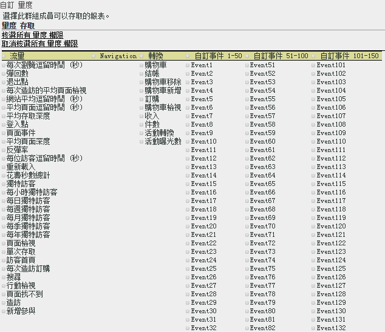

# 自訂量度權限

>[!IMPORTANT]
>
>使用者和產品管理功能即將移至 [Admin Console](https://helpx.adobe.com/tw/enterprise/using/admin-console.html)。輪到您移轉使用者時，Adobe 會通知您。所有客戶都完成移轉後，**[!UICONTROL 「Analytics]** > **[!UICONTROL 管理工具]** > **[!UICONTROL 使用者管理」]**&#x200B;的說明內容將會淘汰。

為流量量度、轉換量度、自訂事件、解決方案事件和內容感知啟用權限。

**[!UICONTROL 使用者管理]** > **[!UICONTROL 群組]** > **[!UICONTROL 報表存取]** > **[!UICONTROL 量度]** > **[!UICONTROL 自訂]**

「自訂量度」頁面上的設定適用於[!UICONTROL 定義使用者群組]頁面上選取的報表套裝。

## 解決方案事件

除了[自訂事件](https://marketing.adobe.com/resources/help/zh_TW/sc/implement/events.html)，此類別也包含 Analytics 解決方案事件，包括 Experience Manager (AEM)、Advertising Cloud (AMO)、行動裝置、視訊和 Social。具有任何量度的每個自訂群組，會將所有 Analytics 解決方案事件新增為新量度。

您可以對自訂事件和 Analytics 解決方案事件 (AEM、AMO、設定權限) 設定權限。

具有任何量度的每個自訂群組，會將所有 Analytics 解決方案事件新增為新量度。

如需在 Analytics 中所用量度的相關資訊 ，請參閱[量度概觀](/help/components/c-variables/c-metrics/metricslist.md)。

## 內容感知

內容感知包括的變數可讓您管理與 Experience Cloud 解決方案整合相關之量度的權限。您可以管理 [!DNL Social]、[!DNL Mobile] 的權限，或管理透過 [!DNL Experience Cloud] 整合插入的任何其他資料的權限。預設會啟用這些項目。
