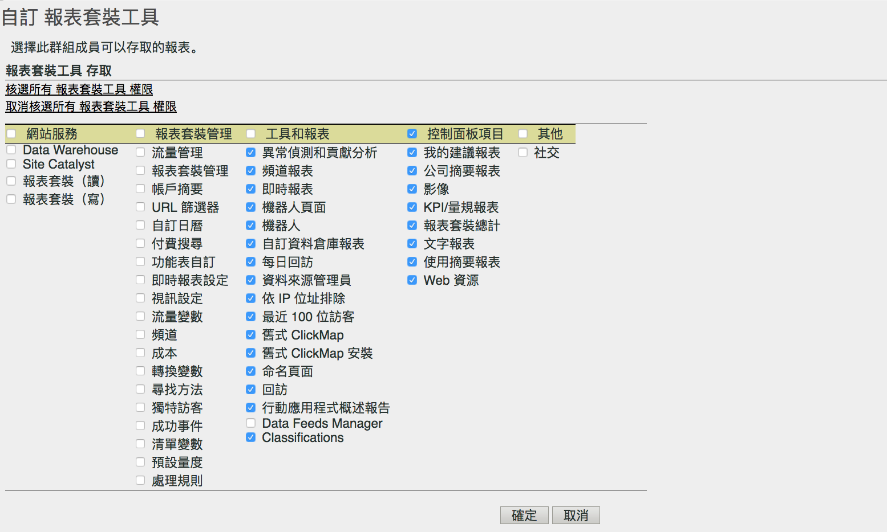

# 自訂報表套裝工具權限

>[!IMPORTANT]
>
>使用者和產品管理功能即將移至 [Admin Console](https://helpx.adobe.com/tw/enterprise/using/admin-console.html)。輪到您移轉使用者時，Adobe 會通知您。所有客戶都完成移轉後，**[!UICONTROL 「Analytics]** > **[!UICONTROL 管理工具]** > **[!UICONTROL 使用者管理」]**&#x200B;的說明內容將會淘汰。

為 API 存取、報表套裝管理、工具和報表與控制面板項目啟用使用者權限。

**[!UICONTROL 使用者管理]** > **[!UICONTROL 群組]** > **[!UICONTROL 報表存取]** > **[!UICONTROL 報表套裝工具]** > **[!UICONTROL 自訂]**

[!UICONTROL 自訂報表套裝工具]頁面會授予群組的成員對下列項目的存取。

## 欄位說明

此頁面上的設定屬於[!UICONTROL 定義使用者群組]頁面上選取的報表套裝。

| 元素 | 說明 |
|--- |--- |
| **網站服務** |  |
| 這些設定可讓使用者對 Data Warehouse 方法進行呼叫並提取報表套裝設定。 |  |
| Data Warehouse | 允許非管理使用者透過網站服務 API 利用 Data Warehouse 方法進行呼叫。請參閱 [Data Warehouse - 開發人員文件](/help/export/data-warehouse/data-warehouse.md) |
| 報表套裝 (讀取) | 允許非管理使用者在 API 中使用報表套裝方法。 |
| 報表套裝 (寫入) | 允許非管理使用者在 API 中使用報表套裝方法。 |
| **報表套裝管理** |  |
| 這些設定可授予對「管理員 > 報表套裝 > 編輯設定」([報表套裝管理器](/help/admin/c-manage-report-suites/report-suites-admin.md))的存取權。 |  |
| [流量管理](/help/admin/c-traffic-management/traffic-management.md) | 授予流量管理的權限。 |
| [報表套裝管理](/help/admin/c-manage-report-suites/report-suites-admin.md) | 授予管理報表套裝的權限。 |
| [帳戶摘要](/help/admin/admin/general-acct-settings-admin.md) | 授予編輯報表套裝之帳戶設定的權限。 |
| [URL 篩選器](/help/admin/admin/internal-url-filter-admin.md) | 授予報表套裝中內部 URL 篩選器的權限。內部 URL 篩選器可用來判斷哪些反向連結或反向連結頁面屬於網站內部。 |
| [自訂日曆](/help/admin/admin/custom-calendar.md) | 授予編輯自訂日曆的權限。 |
| [付費搜尋](https://marketing.adobe.com/resources/help/zh_TW/reference/paid_search_detection.html) | 「付費搜尋偵測」可區分「搜尋引擎」與「搜尋關鍵字」報表中的付費與免費搜尋。 |
| [功能表自訂](/help/admin/admin/customize-menus.md) | 自訂使用者在「Reports &amp; Analytics」中所見的報表功能表。 |
| [即時報表設定](/help/admin/admin/realtime/t-realtime-admin.md) | 設定即時報表分析的權限。 |
| [影片設定](/help/admin/admin/video-management.md) | 可指定一組要用來追蹤及報告影片相關資料的自訂轉換變數 (eVar) 與自訂事件的權限。 |
| [影片分類](https://marketing.adobe.com/resources/help/zh_TW/sc/appmeasurement/video/video_config.html) | 可指定一組要用來追蹤及報告影片相關資料的自訂轉換變數 (eVar) 與自訂事件的權限。 |
| [流量變數](/help/admin/admin/c-traffic-variables/traffic-var.md) | 可將自訂資料與特定的流量相關事件產生關連的權限。 |
| [流量分類](/help/admin/admin/c-traffic-variables/traffic-classifications.md) | 合併在「分類」中 (在「工具」和「報表」之下)。 |
| [頻道](https://marketing.adobe.com/resources/help/zh_TW/mchannel/index.html) | 授予「報表套裝管理器 > 編輯設定 > 行銷管道」中行銷管道設定的權限。 |
| [成本](https://marketing.adobe.com/resources/help/zh_TW/mchannel/c_overview_budget.html) | 啟用報表套裝管理器中「行銷管道 > 行銷管道成本」的權限。 |
| [轉換變數](/help/admin/admin/conversion-var-admin/conversion-var-admin.md) | 自訂分析轉換變數 (或 eVar) 放置於您的網站上所選網頁的 Adobe 程式碼中。其主要作用是將自訂行銷報告中的轉換成功量度區段。 |
| [尋找方法](/help/admin/admin/finding-methods.md) | 可讓您識別不同的尋找方法報表如何接收網站上轉換成功事件的評分。 |
| [轉換分類](/help/admin/admin/conversion-var-admin/conversion-classifications.md) | 合併在「分類」中 (在「工具」和「報表」之下)。 |
| [不重複訪客](https://marketing.adobe.com/resources/help/zh_TW/reference/t_unique_visitor_variable.html) | 授予指定獨特訪客變數的權限。 |
| [成功事件](https://marketing.adobe.com/resources/help/zh_TW/reference/success_event.html) | 可以追蹤的動作，例如產品檢視、結帳和購買。 |
| [分類階層](/help/components/c-classifications2/classification-hierarchies.md) | 合併在「分類」中 (在「工具」和「報表」之下)。 |
| [清單變數 ](https://marketing.adobe.com/resources/help/zh_TW/sc/implement/listN.html) | 也稱為清單變數 (List Var)。清單變數的運作方式與清單 Prop 類似，也允許相同影像要求中可有多個值。 |
| [預設量度](/help/admin/admin/default-metrics.md) | 若使用者未選取自訂量度集，則「Reports &amp; Analytics」在所有轉換報表中都會顯示預設量度集。所選定量度會顯示給相關報表套裝的所有使用者。 |
| [處理規則](https://marketing.adobe.com/resources/help/zh_TW/sc/implement/ref-processing-rules.html) | 授予對「處理規則」的存取權限，可簡化資料收集，以及管理傳送至報表的內容。 |
| **工具和報表** |  |
| [異常偵測](https://marketing.adobe.com/resources/help/zh_TW/analytics/analysis-workspace/anomaly_detection.html) | 授予對異常偵測的權限，其提供一種統計方法，以判斷指定的量度和先前的資料比較有何變更。 |
| [頻道報表](https://marketing.adobe.com/resources/help/zh_TW/mchannel/index.html) | 授予對可以在「報表 > 行銷管道報表」中找到的行銷管道報表的權限。 |
| [即時報表](/help/admin/admin/realtime/t-realtime-admin.md) | 授予對即時報表的存取。 |
| [機器人頁面](/help/admin/admin/bot-removal/bot-rules.md) | 機器人規則可讓您移除報表套裝中，由已知編目程式和機器人產生的流量。移除機器人流量可以提供網站上更準確的使用者活動測量。 |
| [機器人](/help/admin/admin/bot-removal/bot-rules.md) | 機器人規則可讓您移除報表套裝中，由已知編目程式和機器人產生的流量。移除機器人流量可以提供網站上更準確的使用者活動測量。 |
| [自訂 Data Warehouse 報表](/help/export/data-warehouse/data-warehouse.md) | Data Warehouse 是指用於儲存和自訂報告的原始、未處理資料複本，可供您透過篩選資料的方式來執行。您可以要求報告依據您的特定問題，從原始資料顯示進階資料關係。 |
| [每日回訪](/help/components/c-variables/dimensionslist/reports-daily-return-visits.md) | (舊版) 該報告顯示在指定某天曾多次瀏覽網站的訪客數量。一天指過去的 24 個小時。 |
| [資料來源管理員](/help/admin/admin/data-sources.md) | 「資料來源」功能可讓您從離線來源將資料匯入至 Analytics。 |
| [依 IP 位址排除](/help/admin/admin/exclude-ip.md) | 您可以從報表中排除特定 IP 位址的資料，例如內部網站活動、網站測試和員工使用情形。 |
| 舊版 ClickMap | 授予對舊版 ClickMap 覆蓋工具功能表的存取。 |
| 舊版 Clickmap 安裝 | 授予對舊版 ClickMap 工具的安裝權限。 |
| [回訪](/help/components/c-variables/dimensionslist/reports-return-visits.md) | 此報告會顯示瀏覽次數大於 1 的瀏覽數。「回訪報告」會包含非 Cookie 訪客。 |
| [分類匯入程式](https://marketing.adobe.com/resources/help/zh_TW/reference/c_working_with_saint.html)/匯出程式和[規則產生器](https://marketing.adobe.com/resources/help/zh_TW/reference/classification_rule_builder.html) | 合併在「分類」中 (請參閱以下內容)。 |
| 資料摘要管理員 | 授予權限至Analytics 資料摘要。 |
| 分類 | 結合下列權限：「流量分類」、「視訊分類」、「轉換分類」、「分類階層」、「分類管理員」和「分類匯入/匯出工具與規則產生器」。注意：透過此權限，使用者可編輯所有報表套裝的分類，而不僅僅只有選取的套裝。 |
| [貢獻分析](https://marketing.adobe.com/resources/help/zh_TW/analytics/analysis-workspace/contribution-analysis.html) | 在 Analysis Workspace 中授予使用「貢獻分析」的權限。 |
| **控制面板項目** |  |
| 控制面板項目中的設定可讓您存取「Reports &amp; Analytics 」中的[報表](https://marketing.adobe.com/resources/help/zh_TW/sc/user/dashboard.html)：我的建議報表、公司摘要報表、影像、KPI/量規報表、報表套裝總計、文字、小報表、使用摘要報表和網頁資源 |  |
| **其他** |  |
| 社交 | 控制對報表套裝管理器中社交管理功能表的存取權限。 |
