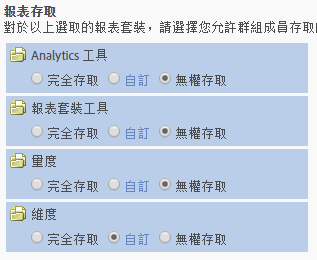

# 使用者和群組權限變更

>[!IMPORTANT]
>
>User and product management is moving to the [Admin Console](https://helpx.adobe.com/enterprise/using/admin-console.html). 輪到您移轉使用者時，Adobe 會通知您。After all customers have migrated, help content for **[!UICONTROL Analytics]** &gt; **[!UICONTROL Admin Tools]** &gt; **[!UICONTROL User Management]** will be retired.

## 變更為何? {#section_2C205DE94155441B9E9D3E4C46CCF2EE}

**[!UICONTROL 管理員]** &gt;使 **[!UICONTROL 用者管理]** &gt;群 **[!UICONTROL 組]**

> [!NOTE] 由於可用的權限組合數量龐大，我們無法提供說明每個權限組合中可使用之所有API方法的檔案。 一般來說，獲得網站服務存取權的非管理員，僅具有 API 方法的「讀取」存取權。他們並沒有該方法的「寫入」存取權。

由於 API 和介面使用相同的權限系統，因此無論管理員是否在介面 (Adobe 管理控制台) 中授權給特定非管理員，這些權限都會與使用者在 API 中具有的權限相同。

<table id="table_D1DB0DE37752450BBCCA44DB760BB505"> 
 <thead> 
  <tr> 
   <th colname="col1" class="entry"> 增強功能 </th> 
   <th colname="col2" class="entry"> 說明 </th> 
  </tr> 
 </thead>
 <tbody> 
  <tr> 
   <td colname="col1"> 
變更報表存取 (自訂群組) 
 </td> 
   <td colname="col2"> 
  新增群組 &gt; 報表存取 
 
定義使用者群組頁面上的報表存取區段已簡化為四個類別，讓您可以在精細層次自訂權限。 
 
 </img> 
 
先前包括的項目 
 
    <ul id="ul_16D5EF18D57D4608AEEDEC40D90D8828"> 
     <li id="li_F29E84C6228A464C8807F09205AEAAC6"> 
 <a href="/help/admin/user-management2/c-customize-report-access/groups-analytics-tools.md">分析工具</a>: 啟用「一般」項目 (帳單、日誌等)、公司管理、工具、網站服務存取、Report Builder 和 Data Connectors 整合的使用者權限。 
 
 <b>注意:</b> 來自自訂管理控制台類別的公司設定已移至分析工具。 
 </li> 
     <li id="li_A6EB788162A2455E94CE54B9279A854D"> 
 <a href="/help/admin/user-management2/c-customize-report-access/groups-report-suite-tools.md">報表套裝工具</a>: 為網站服務、報表套裝管理、工具和報告與控制面板項目啟用使用者權限。 
 </li> 
     <li id="li_EDB0255E009B4F1CAFAF53966B41363C"> 
 <a href="/help/admin/user-management2/c-customize-report-access/groups-metrics.md">量度</a>: 為流量、轉換、自訂事件、解決方案事件、內容感知等等啟用權限。 
 </li> 
     <li id="li_8DAE87D1DEF54803A9C6FE31C01F0FB0"> 
 <a href="/help/admin/user-management2/c-customize-report-access/groups-dimensions.md">維度</a>: 在粒度層級自訂使用者存取，包括 eVar、流量報表、解決方案報告和路徑報告。 
 </li> 
    </ul> 
例如，您可以建立群組，使其可取得多項 Analytics 工具 (Analysis Workspace、Reports &amp; Analytics 及 Report Builder)、具有特定量度和維度 (包括 eVar) 之權限，並具有區段或計算量度建立等功能。 
 </td> 
  </tr> 
  <tr> 
   <td colname="col1"> 
對預先定義的群組的變更 
 </td> 
   <td colname="col2"> 
 <b>管理員存取:</b> 管理員不再需要預先定義的群組。管理員現在可以存取所有項目 (工具、量度和維度)，以及網站服務存取、Report Builder、Activity Map 和 Ad Hoc Analysis。 
 
在此之後，群組的目的是授予或限制對非管理使用者的存取。 
 
 <b>自訂群組:</b> 自訂群組已取代預先定義的群組。現有預先定義的群組將使用相同群組名稱移轉至自訂群組。將保留您所建立的任何自訂群組，包括其設定。不過，您將注意到設定的位置將會移動。例如，公司設定 (自訂管理控制台中) 現在位於<a href="/help/admin/user-management2/c-customize-report-access/groups-analytics-tools.md">自訂分析工具</a>。 
 
 屬於「全部報  表存取權 」的使用者已移轉至具有下列存取權的自訂群組： 
 
    <ul id="ul_696A9243F5FD4AF187352C2F4B1CFDC2"> 
     <li id="li_683A0A3BB7214CFFBC61D5A4CD237F48">所有維度 </li> 
     <li id="li_D8FDBF6A32224731AB706315DEA0A03E">所有量度 </li> 
     <li id="li_65ABE5C95D43444D88E63EE95C9AED05">所有報表套裝 </li> 
     <li id="li_7ED1505590144B38B3B9851BAA6BBB49">頻道報表權限 </li> 
     <li id="li_F718FE1FCF9A4B05AB933CA3F105F3EC">異常偵測報表權限 </li> 
     <li id="li_527BD52007E846FE8B5F71AB3C12F695">即時報表權限 </li> 
     <li id="li_AFFB58C7FB644AC8A85E2D76BA7D51F5">Analysis Workspace 存取權限 </li> 
    </ul> 
管理員可以刪除自訂群組並建立自己的群組，因為先前在預先定義的群組中可使用的所有設定，皆可在位於「定義使用者群組」內的<a href="/help/admin/user-management2/c-user-groups/groups.md">「報表存取」</a>設定中自訂。 
 </td> 
  </tr> 
  <tr> 
   <td colname="col1"> 
維度層級權限 
 </td> 
   <td colname="col2"> 
您可以自訂權限來加入或排除對維度的存取 (除了量度以外)。 
 
    <ul id="ul_DA5A54223673474E9151AF979DA50659"> 
     <li id="li_C3E82F7BC07A4F2F83A85D3D511292CC"> 
自訂群組中的所有目前的維度和量度已自動遷移至新類別。如果現有群組已啟用量度，則將依預設為其指定所有新近獲得權限的維度 (eVars 和內容感知) 和量度。 
 </li> 
     <li id="li_CC56F9181CC14AB59318628E72F2E8C9"> Classifications Importer (即原 SAINT) 權限: 存取類別是由存取類別基準的<a href="https://marketing.adobe.com/resources/help/en_US/reference/c_classifications.html">變數</a>所決定。  </li> 
    </ul> 
See <a href="/help/admin/user-management2/c-customize-report-access/groups-dimensions.md"> Customize Dimension Permissions</a>. 
 </td> 
  </tr> 
  <tr> 
   <td colname="col1"> 
Admin Console 
 </td> 
   <td colname="col2"> 
僅新客戶或已在 <a href="https://marketing.adobe.com/resources/help/en_US/mcloud/core_services.html">Experience Cloud</a> 中佈建公司的客戶才建議使用。已計劃將現有 Analytics 客戶移轉至 Experience Cloud 識別管理系統。 
 
如需詳細資訊，請參閱「管 <a href="https://helpx.adobe.com/enterprise/using/manage-permissions-and-roles.html"> 理控制台」中的「管理產品權限」</a>。 
 </td> 
  </tr> 
 </tbody> 
</table>

## 關於權限變更常問的問題 {#section_02809EFC95054B40A089E6C6E4FACA13}

此處是新的和計劃的更新，以及它們如何影響您的管理環境的相關重要新資訊。

<table id="table_1E93F45C66E841E6882FB602509F30A3"> 
 <thead> 
  <tr> 
   <th colname="col1" class="entry"> 問題 </th> 
   <th colname="col2" class="entry"> 回答 </th> 
  </tr> 
 </thead>
 <tbody> 
  <tr> 
   <td colname="col1"><b>2016 年 7 月</b>發行中進行了什麼權限變更? </td> 
   <td colname="col2"> 
 <b>完全報表套裝存取</b> 
 
新增要納入群組的報表套裝時，您可以指定所有報表套裝存取。此設定會套用群組權限至所有目前和未來的報表套裝。 
 
若要啟用此功能，請瀏覽至「使用者管理 &gt; 群組 &gt; 新增使用者群組」，然後選取「所有報表套裝存取」。 
 
 
 </td> 
  </tr> 
  <tr> 
   <td colname="col1"> 
我是否應使用Admin console來管理使用者，或是現有的Analytics使用者管理？ 
 </td> 
   <td colname="col2"> 
「分析&gt;管理&gt;使用者管理」中所做的變更不會反映在「管理控制台」中。 因此，只有已使用Admin Console管理使用者和群組的新客戶才應繼續使用。 現有Analytics群組管理已規劃移轉至「管理控制台」。 
 </td> 
  </tr> 
  <tr> 
   <td colname="col1"> 
<b>2016 年 10 月</b>版本中有哪些權限變更項目? 
 </td> 
   <td colname="col2"> 
提供了對目前管理工具介面的下列增強功能: 
 
 
     <ul id="ul_2A31E8DC17A94B7FABDBA9C87C3947EF"> 
      <li id="li_AE2ECCA01CC64D30B109BE74379EE474">權限變更，如「管理變更- 2016 <a href="/help/admin/user-management2/c-user-management/permissions-changes.md"> 年秋季版」所述</a>。 </li> 
      <li id="li_33CB2B6A2E5F45BE97CC5E0983AF280E">移除已不在功能表中的預設流量報表。 </li> 
      <li id="li_57234CF27E1D405987DE89312CD62C52">分類權限：分類的存取權將由分類所用變數的存取權決定。 </li> 
     </ul> 
 </td> 
  </tr> 
  <tr> 
   <td colname="col1"> 
移轉使用者需要執行任何動作? 
 </td> 
   <td colname="col2"> 
沒有，所有權限移轉將透明地進行。 
 
 
     <ul id="ul_654F85286EC04416B3E0BA725EBE10AD"> 
      <li id="li_8050B8941F794103B82A0ADF0930D216">自訂群組中所有目前的流量報表將自動移轉至新維度類別。 </li> 
      <li id="li_B97079DB29A346B98D066F11AB7F94AF">如果自訂群組已啟用任何量度，則將自動提供它新近可獲得的所有維度 (eVar 和解決方案)。 </li> 
      <li id="li_F1219EF490DA473BA15F2B215F2995AE"> 具有至少一個量度的自訂群組將自動獲授予所有 eVar 和其他內容感知維度的存取，新提供的流量維度 (先前的流量報表)<b>除外</b>。 </li> 
      <li id="li_F494CE6144A04A6199CFBBA1D7BEA32B">每個預先定義的群組將變更為權限。這些新權限將新增至新的分析工具類別。 </li> 
      <li id="li_2FCD9254FC3C4FD7871EEF9453E5CE1E">具有任何量度的每個自訂群組，會將所有 Analytics 解決方案事件新增為新量度。 </li> 
      <li id="li_34C4560769B64F28A4E83BAE71065DCC">原來在所有報表存取中的每個使用者將新增至新的自訂群組。所有報表存取將不再存在。 </li> 
     </ul> 
 </td> 
  </tr> 
  <tr> 
   <td colname="col1"> 
維持不變的為何? 
 </td> 
   <td colname="col2"> 
訪客屬性將繼續為非許可權限。 
 </td> 
  </tr> 
 </tbody> 
</table>

## 權限快速參考 {#section_A3FDD8259F524B21A5489833533D1B28}

下表列出工作以及工作發生的位置 (視公司的狀態而定)。

> [!NOTE] A *`migrated user`* 和 *`Experience Cloud user`* 指已接受電子郵件邀請加入Experience cloud的使用者。 如果未接受電子郵件邀請，使用者仍為Analytics使用者，無法在「管理控制台」中管理。 (如果是使用[企業或同盟 ID](https://helpx.adobe.com/enterprise/using/set-up-identity.html) 進行移轉則為例外。在此情況下，使用者是在管理員以使用者為基礎移轉使用者時移轉。)

<table id="table_B68FD00FC5D24823A86BB69558C0327C"> 
 <thead> 
  <tr> 
   <th colname="col1" class="entry"> 任務 </th> 
   <th colname="col2" class="entry"> 非移轉登入公司 </th> 
   <th colname="col3" class="entry"> 目前移轉中的公司 </th> 
   <th colname="col4" class="entry"> 完成移轉登入公司 </th> 
  </tr> 
 </thead>
 <tbody> 
  <tr> 
   <td colname="col1"> 建立使用者 </td> 
   <td colname="col2"> 
Admin Console (creating a user and adding him or her to an Analytics <a href="https://marketing.adobe.com/resources/help/en_US/mcloud/admin_getting_started.html"> product configuration</a> also creates the user account in Analytics). 
 
 <a href="/help/admin/user-management2/c-user-management/t-add-user-account.md"> 管理工具</a> 
 </td> 
   <td colname="col3"> 
 <a href="https://adminconsole.adobe.com/enterprise/"> 管理控制台</a> 
 </td> 
   <td colname="col4"> 
 <a href="https://adminconsole.adobe.com/enterprise/"> 管理控制台</a> 
 </td> 
  </tr> 
  <tr> 
   <td colname="col1"> 編輯使用者 </td> 
   <td colname="col2"> 
 <a href="/help/admin/user-management2/c-user-management/t-add-user-account.md"> 管理工具</a> 
 </td> 
   <td colname="col3"> 
 <a href="https://adminconsole.adobe.com/enterprise/"> 管理控制台</a> 
 
 管理工具 - 在管理工具中針對移轉的使用者進行編輯，受限於 API 金鑰管理，以及刪除/傳送資產。 
 </td> 
   <td colname="col4"> 
 <a href="https://adminconsole.adobe.com/enterprise/"> 管理控制台</a> 
 
 管理工具 - 編輯受限於 API 金鑰管理，以及刪除/傳送資產。 
 </td> 
  </tr> 
  <tr> 
   <td colname="col1"> 刪除使用者 </td> 
   <td colname="col2"> 
管理控制台——適用於Experience cloud使用者 
 
管理工具 - 適用所有使用者，但對於 Experience Cloud 使用者，只會刪除對應的 Analytics 使用者，而不是 Experience Cloud 帳戶。 
 </td> 
   <td colname="col3"> 
管理控制台——適用於已移轉的使用者。 
 
管理工具 - 僅適用 Analytics 使用者。 
 </td> 
   <td colname="col4"> 
Admin Console 
 
 管理工具——刪除Experience cloud使用者或在Admin console中取消連結其帳戶後，您可以從「管理工具」刪除Analytics登入。 
 </td> 
  </tr> 
  <tr> 
   <td colname="col1"> 登入 Analytics </td> 
   <td colname="col2"> 
 <b>Experience Cloud: </b>marketing.adobe.com。僅適用 Experience Cloud 使用者。 
 
 <b>Analytics (舊版):</b> sc.omniture.com。僅適用 Analytics 使用者，並且適用具有其 Analytics 憑證的 Experience Cloud 使用者 
 </td> 
   <td colname="col3"> 
 marketing.adobe.com - 僅適用 Experience Cloud 使用者。 
 
 sc.omniture.com - 僅適用 Analytics 使用者，並且適用具有其 Analytics 憑證的 Experience Cloud 使用者。 
 
在移轉期間，管理員可以對特定使用者關閉 omniture.com 登入功能。 
 </td> 
   <td colname="col4"> 
Admin Console 
 </td> 
  </tr> 
  <tr> 
   <td colname="col1"> 建立群組 </td> 
   <td colname="col2"> 
管理控制台——在管理控制台中建立群組時，Analytics中的對應群組會顯示在「管理工具」中，但此對應群組的名稱無法從「管理工具」變更，或從「管理工具」刪除。 
 
管理工具. 
 </td> 
   <td colname="col3"> 
管理控制台(<a href="https://marketing.adobe.com/resources/help/en_US/mcloud/admin_getting_started.html"> 建立產品設定</a>) 
 </td> 
   <td colname="col4"> 
管理控制台(<a href="https://marketing.adobe.com/resources/help/en_US/mcloud/admin_getting_started.html"> 建立產品設定</a>) 
 </td> 
  </tr> 
  <tr> 
   <td colname="col1"> 編輯群組中的使用者 </td> 
   <td colname="col2"> 
管理控制台——僅適用於Experience cloud使用者 
 
管理工具 - 可以從管理工具同時編輯群組的僅 Analytics 使用者和 Experience Cloud 使用者成員資格。不過，如果Experience cloud使用者是Admin console中群組的一部分，則無法從「管理工具」的群組中移除這些使用者。 
 </td> 
   <td colname="col3"> 
管理控制台——僅限Experience cloud使用者 
 
 管理工具 - 僅 Analytics 登入仍可在管理工具中新增至群組/從群組移除。 
 </td> 
   <td colname="col4"> 
Admin Console 
 </td> 
  </tr> 
  <tr> 
   <td colname="col1"> 編輯群組的權限 </td> 
   <td colname="col2"> 
管理控制台——您可以編輯在管理控制台中建立的群組。 
 
管理工具 - 您可以編輯任何群組的權限。 
 </td> 
   <td colname="col3"> 
管理控制台 
 </td> 
   <td colname="col4"> 
管理控制台 
 </td> 
  </tr> 
  <tr> 
   <td colname="col1"> 刪除群組 </td> 
   <td colname="col2"> 
管理控制台——您只能刪除在管理控制台中建立的群組。 
 
管理工具 - 您僅可以刪除從管理工具建立的群組。 
 </td> 
   <td colname="col3"> 
管理控制台 
 </td> 
   <td colname="col4"> 
管理控制台 
 </td> 
  </tr> 
  <tr> 
   <td colname="col1"> 變更使用者的管理狀態 </td> 
   <td colname="col2"> 
管理控制台——僅適用於Experience cloud使用者。 
 
管理工具 
 </td> 
   <td colname="col3"> 
管理控制台——僅適用於Experience cloud使用者。 
 
管理工具 - 僅適用 Analytics 使用者。 
 </td> 
   <td colname="col4"> 
Admin Console 
 </td> 
  </tr> 
 </tbody> 
</table>
