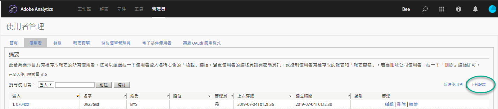
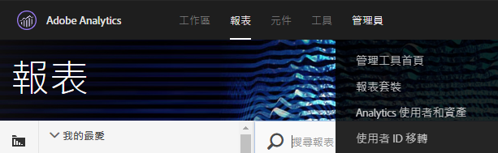
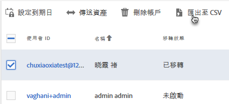
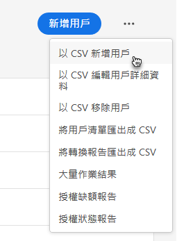
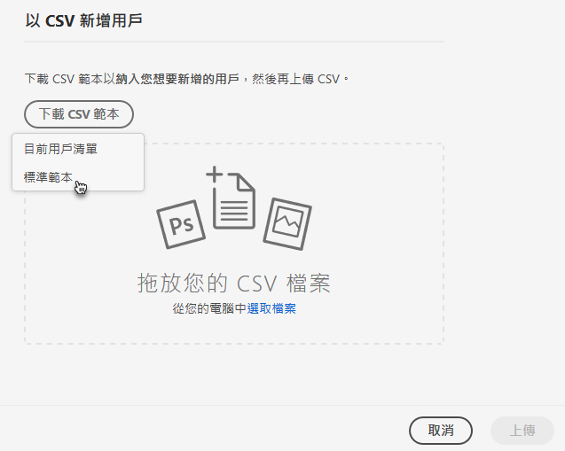
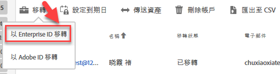

# 移轉 Enterprise 與 Federated ID 的 Analytics 使用者帳戶{#migrate-analytics-user-accounts-for-enterprise-and-federated-ids}

如何以 Enterprise 或 Federated ID 將 Analytics 使用者帳戶移轉至 Admin Console。

## 必備條件 {#concept-e60d8deb3fc54a1a81f1f47a26658de3}

透過 Admin Console 管理使用者的必備條件。

如需新網域和目錄，請依照以下步驟操作:

* 設定目錄
* 設定網域
* 將網域連結至目錄

如需說明，請參閱[設定身分系統](https://helpx.adobe.com/enterprise/using/set-up-identity.html)。

如果其他組織已有另一個業務單位或團隊建立目錄，請依照[目錄信任](https://helpx.adobe.com/enterprise/using/set-up-identity.html#Directorytrusting)所述步驟，在您預計由 Analytics 使用的組織中建立目錄。

## 移轉 Enterprise 和 Federated ID 的使用者帳戶 {#task-0cfb3e4400fd4ab58e4d9704528b05fa}

此程序中，您需要完成以下步驟:

* Download a user login list from **[!UICONTROL Analytics]** &gt; **[!UICONTROL Analytics Users &amp; Assets]**.

* Download a current users list from the **[!UICONTROL Admin Console]** &gt; **[!UICONTROL Users]**.

* 比較兩份清單 (尋找重複項目，以免覆寫 Admin Console 中的帳戶資料)。
* Upload a finished [!DNL .csv] (from **[!UICONTROL Admin Console]** &gt; **[!UICONTROL Users]**) with Enterprise ID or Federated ID users to the Admin Console.

如果您需要將現有的 Adobe ID 使用者帳戶移轉到 Enterprise ID 或 Federated ID，請聯絡 Adobe 客戶服務並提出[大量使用者身分切換](https://helpx.adobe.com/enterprise/using/bulk-operations.html)申請。

**移轉使用者帳戶**

1. 使用下列其中一種方法 (視您是否已移轉使用者而定)，從 Analytics「使用者管理」下載 Analytics 使用者登入檔案 ([!DNL User Logins List.tab])。
   1. *在移轉之前，* 導覽至 **[!UICONTROL 「管理員]** &gt; **[!UICONTROL 使用者管理(舊版)]** &gt; **[!UICONTROL 編輯使用者]**」，然後按一下 **[!UICONTROL 「下載報表]**」。

      

      唯有尚未移轉使用者的客戶，才能在畫面上看見「下載報表」連結。

   1. *如果已移轉使用者，* 請導覽至 **[!UICONTROL Analytics]** &gt; **[!UICONTROL Analytics使用者和資產]**。

      

   1. On the [!DNL Users] page, select users, then click **[!UICONTROL Export to CSV]**.

      

   1. Open the downloaded [!DNL User List.csv] file in Excel.

      Be prepared to copy the *`Email`*, *`First Name`*, and *`Last Name`* values to a [!DNL sample.csv] file (described in the next step).

      >[!IMPORTANT]
      >
      >CSV檔案中的值必須以逗號分隔。

      **秘訣**: 此步驟中，建議您簡化使用者清單，以確保 Enterprise 或 Federated ID 移轉作業只會包含具有效電子郵件 ID 的使用者。

1. 在 Admin Console 中，下載 Admin Console 使用者清單:

   1. Navigate to [Admin Console](http://adminconsole.adobe.html/#) &gt; **[!UICONTROL Users]**, then click [Export users list to CSV](https://helpx.adobe.com/enterprise/using/users.html).

      

   1. Compare the two files: the existing Admin Console users in the exported [!DNL .csv] file ( [!DNL sample.csv], in this example) with the users in the Analytics [!DNL User Logins List.csv] file.

      >[!IMPORTANT]
      >
      >If you find duplicates, delete them from the Analytics [!DNL User Logins List.csv] file. 這麼做可防止覆寫 Admin Console 中的現有 Experience Cloud 使用者權限，並提供您要移轉的帳戶清單。

1. 從 Admin Console 下載 CSV 範本:
   1. On the Users tab, click **[!UICONTROL Add users by CSV]**, then **[!UICONTROL Download CSV Template]**.

      

   1. Choose **[!UICONTROL Standard Template]**.

      如此即可下載 [!DNL sample.csv] 範本檔案。

      

1. Copy the *`Email`*, *`First Name`*, and *`Last Name`* column values from [!DNL User Logins List.tab] to the corresponding columns in the [!DNL sample.csv] template.

   **範本檔案範例**

   

1. 在範本 ([!DNL sample.csv]) 中，完成下列必填欄位:

<table id="table_1B5EEFDB5BD8436EB760BE5FFAB1CF02"> 
 <thead> 
  <tr> 
   <th colname="col1" class="entry"> 欄位 </th> 
   <th colname="col2" class="entry"> 說明 </th> 
  </tr>
 </thead>
 <tbody> 
  <tr> 
   <td colname="col1"> 
電子郵件 
 </td> 
   <td colname="col2"> 
從 User Logins List.tab 中複製。 
 </td> 
  </tr> 
  <tr> 
   <td colname="col1"> 
「名字」 
 </td> 
   <td colname="col2"> 
從 User Logins List.tab 中複製。 
 </td> 
  </tr> 
  <tr> 
   <td colname="col1"> 
「姓氏」 
 </td> 
   <td colname="col2"> 
從 User Logins List.tab 中複製。 
 </td> 
  </tr> 
  <tr> 
   <td colname="col1"> 
身分類型 
 </td> 
   <td colname="col2"> 
 Federated ID 或  Enterprise ID。 
 </td> 
  </tr> 
  <tr> 
   <td colname="col1"> 
網域 
 </td> 
   <td colname="col2"> 
確認 網域 和  電子郵件 欄會比對 <a href="../c-migration-tool/migrate-enterprise.md#concept-e60d8deb3fc54a1a81f1f47a26658de3" format="dita" scope="local"> 在必要</a>條件下建立的網域。 
 </td> 
  </tr> 
  <tr> 
   <td colname="col1"> 
國家/地區代碼 
 </td> 
   <td colname="col2"> </td> 
  </tr> 
 </tbody> 
</table>

For more information about the fields in the [!DNL .csv] file, see [CSV file format](https://helpx.adobe.com/enterprise/using/users.html).

>[!NOTE]
>
>Other columns, such as *`Product Configurations`* and *`Admin Roles`* can be blank.

1. On the Users tab in the Admin Console, upload the template file by clicking **[!UICONTROL Add users by CSV]** (as shown in [Step 3](../c-migration-tool/migrate-enterprise.md#step-190321c6025947e38b195daed122c063).).
1. In Analytics, run the migration tool (as described in [Migrate Analytics user accounts](../c-migration-tool/t-migrate-users.md#task-f3355f3b14a340feae58cfa04c0ba1c9)).
1. Click **[!UICONTROL Migrate]** &gt; **[!UICONTROL Migrate as Enterprise IDs]**.

   

   When you click **[!UICONTROL Migrate]**, user are linked to the Enterprise ID/Federated ID account in Admin Console. The permissions of the legacy user account in Analytics will match the permissions granted to the Enterprise/Federated ID login in **[!UICONTROL Admin Console]** &gt; **[!UICONTROL Analytics]** &gt; **[!UICONTROL Product Profiles]**. 使用者 ID 會顯示在「完成移轉程序」區塊中。您可以停用其舊版 [!DNL my.omniture.com] 存取權。

   After migrating users, the status under the Migration Status column changes from *`Not Initiated`* to *`Migrated`*.

   移轉工具中顯示的 Adobe ID 使用者也可透過此程序移轉。切換身分之前，使用者仍需使用其 Adobe ID 登入。如需身分切換的相關說明，請聯絡 Adobe 客戶服務。
