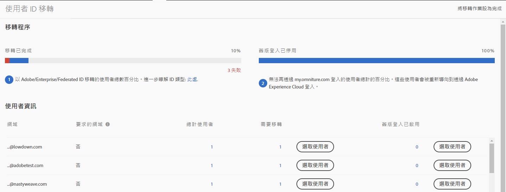
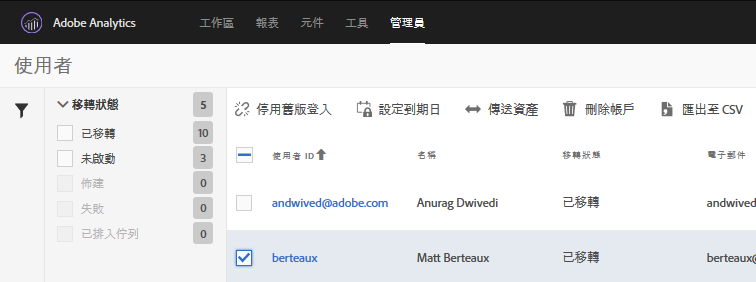

# 移轉 Adobe ID 的 Analytics 使用者帳戶{#migrate-analytics-user-accounts-for-adobe-ids}

將使用者從舊版 Analytics 使用者管理系統移轉至 Admin Console。

## 移轉 Adobe ID 的 Analytics 使用者帳戶 {#task-f3355f3b14a340feae58cfa04c0ba1c9}

將使用者從舊版 Analytics 使用者管理系統移轉至 Admin Console

>[!NOTE]
>
>如果未透過Experience Cloud登入的管理員嘗試存取使用者ID移轉工具，則會重新導向至Experience Cloud登入頁面。

**移轉 Analytics 使用者:**

1. Navigate to **[!UICONTROL Analytics]** &gt; **[!UICONTROL Admin]** &gt; **[!UICONTROL User ID Migration]**.

   

   「使用者 ID 移轉」頁面有&#x200B;*「移轉程序」*&#x200B;和&#x200B;*「使用者資訊」*&#x200B;等兩個區段。

   **「移轉程序」**

<table id="table_F9F1CFF762C745E198CB075A02BA2DDA"> 
 <thead> 
  <tr> 
   <th colname="col1" class="entry"> 階段 </th> 
   <th colname="col2" class="entry"> 說明 </th> 
  </tr>
 </thead>
 <tbody> 
  <tr> 
   <td colname="col1"> 
完成移轉程序 
 </td> 
   <td colname="col2"> 
使用者已接受邀請。 
 </td> 
  </tr> 
  <tr> 
   <td colname="col1"> 
停用舊版登入 
 </td> 
   <td colname="col2"> 
使用公司 ID 的舊版登入已停用。使用者現可使用 Adobe ID 或 Enterprise ID 存取 Experience Cloud。所有使用者均已達到這個階段後，移轉程序便告完成。 
 
在移轉期間，舊版登入會停用。Users are redirected to  experiencecloud.adobe.com and must log in using the Adobe ID or Enterprise ID. 
 
See <a href="../c-migration-tool/t-disable-legacy-login.md#task-c9262e469814473c8a3ff3971c95570b" format="dita" scope="local"> Disable Legacy Logins</a> for more information. 
 </td> 
  </tr> 
 </tbody> 
</table>

**使用者資訊**

「使用者資訊」摘述貴組織的使用者 (以網域名稱區隔)。

<table id="table_3822E27AF81E4A188562FEB5131548A5"> 
 <thead> 
  <tr> 
   <th colname="col1" class="entry"> 元素 </th> 
   <th colname="col2" class="entry"> 說明 </th> 
  </tr>
 </thead>
 <tbody> 
  <tr> 
   <td colname="col1"> 
網域 
 </td> 
   <td colname="col2"> 
網域必須是目前 Analytics 使用者群的電子郵件 ID 所專屬。網域只能由單一組織申請，而且只有系統管理員可以申請網域。如需詳細資訊，請參閱<a href="https://helpx.adobe.com/enterprise/help/request-access-to-claimed-domain.html" format="html" scope="external">要求已申請之網域的存取權</a>。 
 </td> 
  </tr> 
  <tr> 
   <td colname="col1"> 
申請的網域 
 </td> 
   <td colname="col2"> 
若要以 Enterprise 或 Federated ID 移轉使用者，您必須是「系統管理員」，並在移轉使用者前透過 Admin Console 申請可用網域。如需更多詳情，請參閱<a href="https://helpx.adobe.com/enterprise/help/identity.html" format="html" scope="external">此處</a>。 
 
如果您不想申請 Enterprise 或 Federated ID 的網域，請跳過此步驟，並以 Adobe ID 移轉使用者。如需有關 ID 類型的詳細資訊，請參閱<a href="https://helpx.adobe.com/enterprise/help/identity.html" format="html" scope="external">此處</a>。 
 </td> 
  </tr> 
 </tbody> 
</table>

1. Locate the domain containing the user IDs you want to migrate, then, under **[!UICONTROL Requiring Migration]**, click **[!UICONTROL Select Users]**.
1. On the [!DNL Users] page, select the users you want to migrate, then click **[!UICONTROL Migrate]**.

   When you click **[!UICONTROL Migrate]**, users receive an invitation (Migration Initiated) and must accept it. 此動作會將使用者 ID 移動到「完成移轉程序」。接著，您就可以關閉其 [!DNL my.omniture.com] 的舊版存取權。

   

1. 指定您要移轉使用者的 ID 類型 ([Adobe ID 或 Enterprise ID](https://helpx.adobe.com/enterprise/help/identity.html))。

   After migrating users, the status under the column Migration Status changes from *`Not Initiated`* to *`Migrated`*.

   *`Failed`* 如果顯示，請將滑鼠指標暫留在圖示上，以瞭解移轉失敗的原因。
