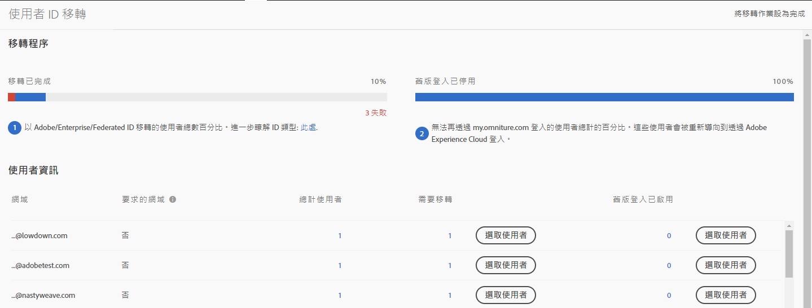
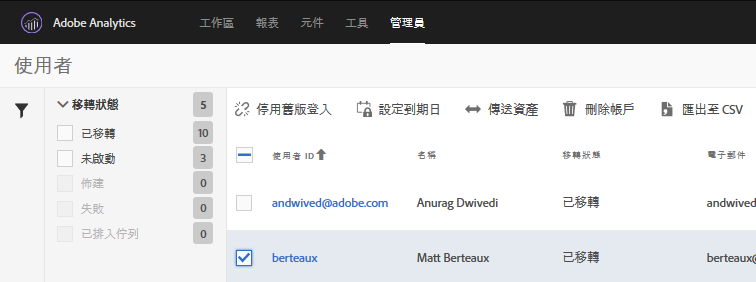

# 移轉 Adobe ID 的 Analytics 使用者帳戶{#migrate-analytics-user-accounts-for-adobe-ids}

將使用者從舊版 Analytics 使用者管理系統移轉至 Admin Console。

## 移轉 Adobe ID 的 Analytics 使用者帳戶 {#task-f3355f3b14a340feae58cfa04c0ba1c9}

將使用者從舊版 Analytics 使用者管理系統移轉至 Admin Console。

>[!NOTE] 如果未透過 Experience Cloud 登入的管理員嘗試存取「使用者 ID 移轉」工具，系統會將他們重新導向至 Experience Cloud 登入頁面。

**移轉 Analytics 使用者：**

1. 導覽至 **[!UICONTROL Analytics]** > **[!UICONTROL Admin]** > **[!UICONTROL User ID Migration]**。

   

   「用戶ID遷移」頁包含兩個部分：移 *轉進度* 和 *使用者資訊*。

   **遷移進度**

   <table id="table_F9F1CFF762C745E198CB075A02BA2DDA"> 
   <thead> 
   <tr> 
      <th colname="col1" class="entry"> 相位 </th> 
      <th colname="col2" class="entry"> 說明 </th> 
   </tr>
   </thead>
   <tbody> 
   <tr> 
      <td colname="col1"> 
遷移已完成 
 </td> 
      <td colname="col2"> 
使用者接受邀請。 
 </td> 
   </tr> 
   <tr> 
      <td colname="col1"> 
舊版登入已停用 
 </td> 
      <td colname="col2"> 
使用公司ID的舊版登入已停用。 使用者現在可以使用其Adobe ID或Enterprise ID來存取Experience Cloud。 當所有使用者都到達此階段時，您就完成移轉。 
 
舊版登入會在移轉過程中遭到停用。系統會將使用者重新導向至 experiencecloud.adobe.com，且必須使用 Adobe ID 或 Enterprise ID 登入。 
 </td> 
   </tr> 
   </tbody> 
   </table>

   **使用者資訊**

   「使用者資訊」會概述貴組織中的使用者，並依網域名稱分隔。

   <table id="table_3822E27AF81E4A188562FEB5131548A5"> 
   <thead> 
   <tr> 
      <th colname="col1" class="entry"> 元素 </th> 
      <th colname="col2" class="entry"> 說明 </th> 
   </tr>
   </thead>
   <tbody> 
   <tr> 
      <td colname="col1"> 
網域 
 </td> 
      <td colname="col2"> 
網域是目前Analytics使用者群的電子郵件ID專屬。 網域只能由單一組織申請，而且只有系統管理員可以申請網域。如需詳細資訊，請參閱<a href="https://helpx.adobe.com/tw/enterprise/help/request-access-to-claimed-domain.html">要求已申請之網域的存取權</a>。 
 </td> 
   </tr> 
   <tr> 
      <td colname="col1"> 
申請的網域 
 </td> 
      <td colname="col2"> 
若要以 Enterprise 或 Federated ID 移轉使用者，您必須是「系統管理員」，並在移轉使用者前透過 Admin Console 申請可用網域。如需更多詳情，請參閱<a href="https://helpx.adobe.com/tw/enterprise/help/identity.html">此處</a>。 
 
如果您不想申請 Enterprise 或 Federated ID 的網域，請跳過此步驟，並以 Adobe ID 移轉使用者。如需有關 ID 類型的詳細資訊，請參閱<a href="https://helpx.adobe.com/tw/enterprise/help/identity.html">此處</a>。 
 </td> 
   </tr> 
   </tbody> 
   </table>

1. Locate the domain containing the user IDs you want to migrate, then, under **[!UICONTROL Requiring Migration]**, click **[!UICONTROL Select Users]**.
1. On the [!DNL Users] page, select the users you want to migrate, then click **[!UICONTROL Migrate]**.

   When you click **[!UICONTROL Migrate]**, users receive an invitation (Migration Initiated) and must accept it. 此動作會將使用者 ID 移動到「完成移轉程序」。接著，您就可以關閉 `[!DNL my.omniture.com].` 的舊版存取權

   

1. 指定您要移轉使用者的 ID 類型 (Adobe ID 或 Enterprise ID)

   移轉使用者後，「移轉狀態」欄下方的狀態會從 *`Not Initiated`* 變更為 *`Migrated`*。

   如果顯示 *`Failed`*，將游標停留在圖示上方就會顯示移轉失敗的原因。
